# 近期成果展示

## 公园区域

### 大公园

图片中空白区域块以及内部的弯折的小路被视为大公园

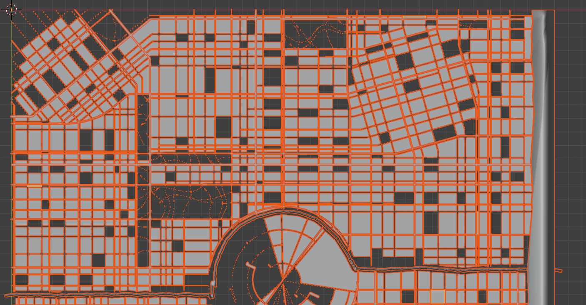

大公园放大后效果如下

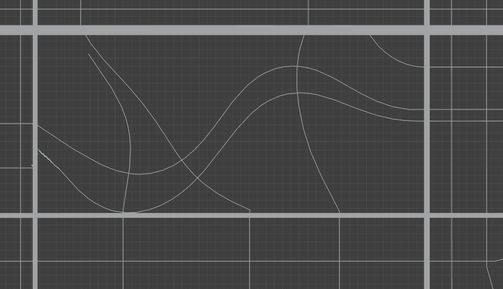

### 小公园

小公园选取小的单元直接视为公园，没有道路会经过内容

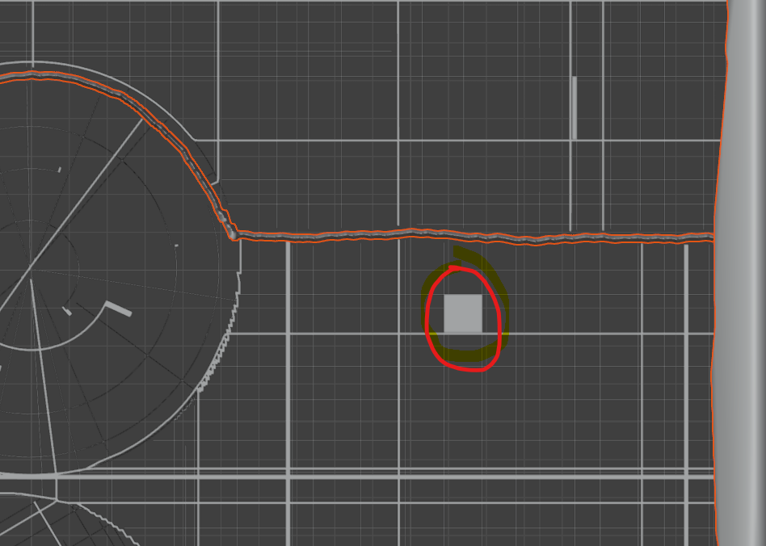


## 交互编辑-二维平面

1. 包括svg绘制（矩形和闭合路径两种）
2. svg编辑-点拖动
3. svg属性（轮廓粗细和颜色+内部填充颜色）
4. svg轮廓的层次关系构建(改进交互，通过拖动几何改变层次关系树)
5. svg路径数据的试试右侧展示并且可以展示导出


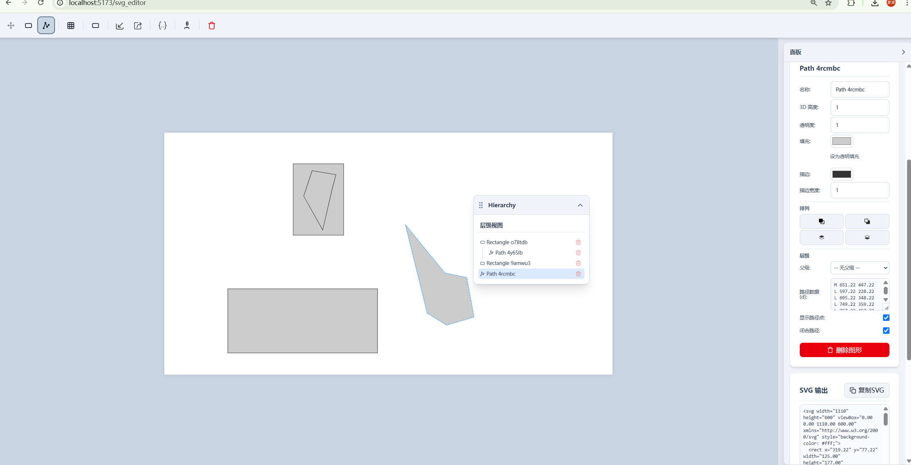

### svg编辑

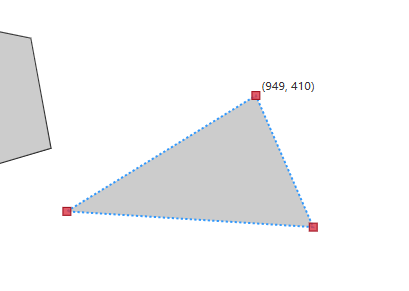

### 层次关系构建

#### 交互

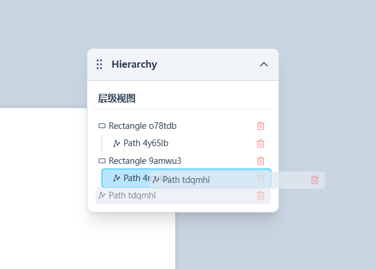

#### 层次数据管理

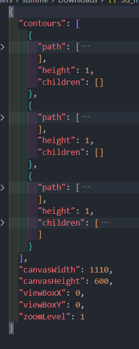
### svg路径数据展示

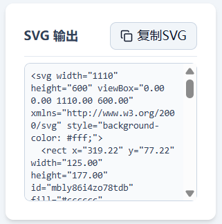
## 轮廓到模型生成算法完善

### 支持多层嵌套

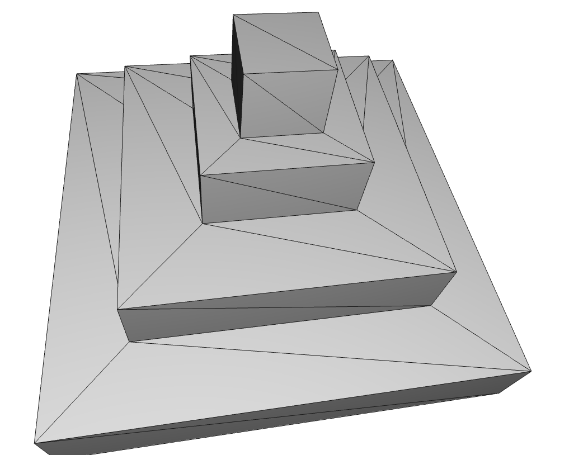


### 内外高度起伏

支持内外高度起伏以及凹形内嵌轮廓

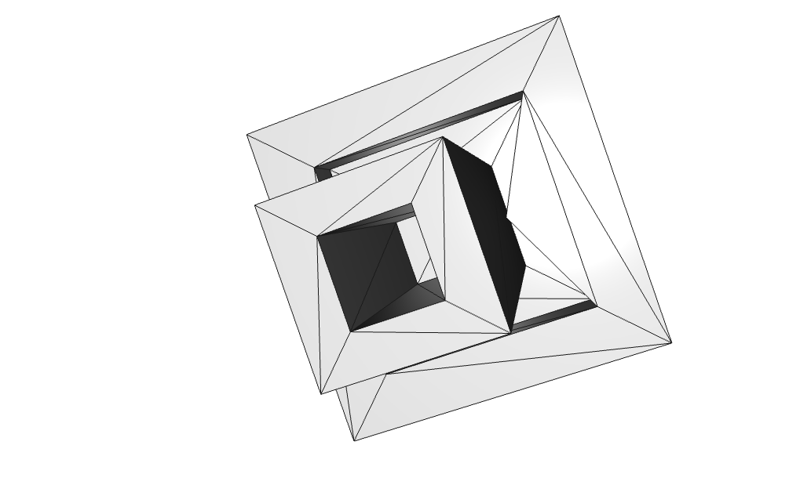

### 兄弟内部轮廓

内嵌轮廓支持多个兄弟内部轮廓，兼容内陷区域和外凸区域

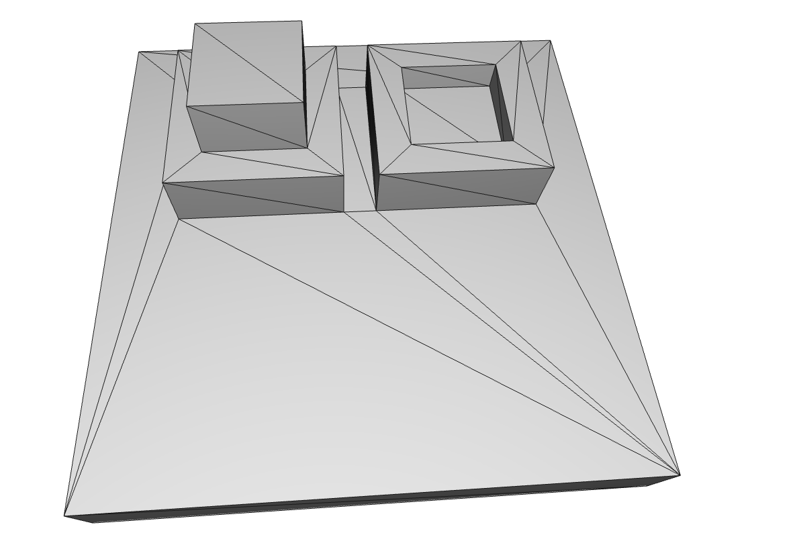

### 极端情况

1. 多个凹三角顶点
2. 并且形状较为不规则
3. 内嵌轮廓形状不规则

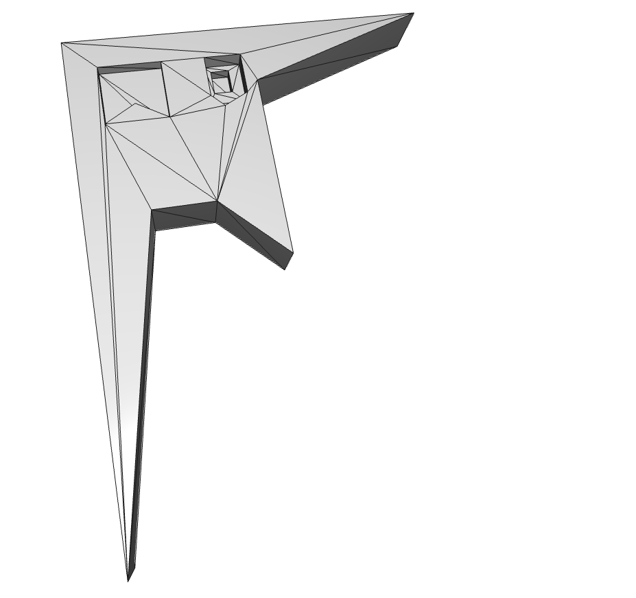

# 实现细节-数学解释

1. 底座是二维**正交张量场**，张量加权叠加决定总体布局走向
2. 在**参数约束**下的**随机**过程进行实际的布局细节生成

## Custom_struct目录代码文档

### 1. vector.py

#### 全局作用

定义二维向量结构、运算

#### 实现的类

##### （1）Vector类

**作用**：二维向量结构、运算

| 成员类型 | 名称 | 访问权限 | 描述               |
| -------- | ---- | -------- | ------------------ |
| 属性     | x, y | 公有     | 向量的x分量和y分量 |

**1. 静态工厂方法**

| 成员类型 | 名称        | 访问权限 | 描述                     |
| -------- | ----------- | -------- | ------------------------ |
| 静态方法 | zero_vector | 公有     | 创建零向量(0,0)          |
| 静态方法 | from_scalar | 公有     | 创建具有相同分量值的向量 |

**2. 基本向量运算**

| 成员类型 | 名称            | 访问权限 | 描述         | 数学原理                 |
| -------- | --------------- | -------- | ------------ | ------------------------ |
| 方法     | add             | 公有     | 向量加法     | v₁ + v₂ = (x₁+x₂, y₁+y₂) |
| 方法     | sub             | 公有     | 向量减法     | v₁ - v₂ = (x₁-x₂, y₁-y₂) |
| 方法     | multiply        | 公有     | 向量分量乘法 | v₁ * v₂ = (x₁*x₂, y₁*y₂) |
| 方法     | divide          | 公有     | 向量分量除法 | v₁ / v₂ = (x₁/x₂, y₁/y₂) |
| 方法     | multiply_scalar | 公有     | 标量乘法     | k*v = (k*x, k*y)         |
| 方法     | divide_scalar   | 公有     | 标量除法     | v/k = (x/k, y/k)         |
| 方法     | negate          | 公有     | 向量取反     | -v = (-x, -y)            |

**3. 几何运算**

| 成员类型 | 名称          | 访问权限 | 描述             | 数学原理                                         |
| -------- | ------------- | -------- | ---------------- | ------------------------------------------------ |
| 方法     | length        | 公有     | 计算向量长度     | ‖v‖ = √(x² + y²)                                 |
| 方法     | length_sq     | 公有     | 计算向量长度平方 | ‖v‖² = x² + y²                                   |
| 方法     | normalize     | 公有     | 向量归一化       | v̂ = v/‖v‖                                        |
| 方法     | dot           | 公有     | 向量点积         | v₁·v₂ = x₁x₂ + y₁y₂                              |
| 方法     | cross         | 公有     | 向量叉积         | v₁×v₂ = x₁y₂ - y₁x₂                              |
| 方法     | angle         | 公有     | 计算与x轴夹角    | θ = arctan2(y,x)                                 |
| 静态方法 | angle_between | 公有     | 计算两向量夹角   | θ = arctan2(v₂.y,v₂.x) - arctan2(v₁.y,v₁.x)      |
| 静态方法 | is_left       | 公有     | 判断点在直线左侧 | 通过叉积判断：(p-p₀)×d < 0                       |
| 方法     | rotate_around | 公有     | 绕点旋转         | 使用旋转矩阵R(θ) = [[cosθ, -sinθ], [sinθ, cosθ]] |

**4. 距离计算**

| 成员类型 | 名称                | 访问权限 | 描述                 | 数学原理                   |
| -------- | ------------------- | -------- | -------------------- | -------------------------- |
| 方法     | distance_to         | 公有     | 计算到另一向量的距离 | d = √[(x₂-x₁)² + (y₂-y₁)²] |
| 方法     | distance_to_squared | 公有     | 计算距离平方         | d² = (x₂-x₁)² + (y₂-y₁)²   |

**5. 工具方法**

| 成员类型 | 名称       | 访问权限 | 描述             |
| -------- | ---------- | -------- | ---------------- |
| 方法     | clone      | 公有     | 创建向量副本     |
| 方法     | copy       | 公有     | 复制另一向量的值 |
| 方法     | equals     | 公有     | 判断向量相等     |
| 方法     | set        | 公有     | 设置向量分量     |
| 方法     | set_x      | 公有     | 设置x分量        |
| 方法     | set_y      | 公有     | 设置y分量        |
| 方法     | set_length | 公有     | 设置向量长度     |
| 方法     | __repr__   | 公有     | 字符串表示       |

### 2. tensor.py

#### 全局作用

实现二维张量数学运算，支持场叠加、旋转和方向计算。张量表示为2×2对称矩阵，用于描述向量场的局部方向和强度。

#### 实现的类

##### （1）Tensor类

**作用**：二维张量运算

**1. 基本属性**

| 成员类型 | 名称   | 访问权限 | 描述         | 数学表示           |
| -------- | ------ | -------- | ------------ | ------------------ |
| 属性     | r      | 公有     | 张量模长     | ‖T‖                |
| 属性     | matrix | 私有     | 张量矩阵数据 | [cos(2θ), sin(2θ)] |
| 属性     | _theta | 私有     | 主方向角度   | θ                  |

**2. 静态工厂方法**

| 成员类型 | 名称        | 访问权限 | 描述             | 数学原理               |
| -------- | ----------- | -------- | ---------------- | ---------------------- |
| 静态方法 | from_angle  | 公有     | 根据角度创建张量 | T = [cos(4θ), sin(4θ)] |
| 静态方法 | from_vector | 公有     | 根据向量创建张量 | T = [x²-y², 2xy]       |
| 静态方法 | zero        | 公有     | 创建零张量       | T = [0, 0]             |

**3. 张量运算**

| 成员类型 | 名称   | 访问权限 | 描述         | 数学原理        |
| -------- | ------ | -------- | ------------ | --------------- |
| 方法     | add    | 公有     | 张量叠加运算 | T = r₁T₁ + r₂T₂ |
| 方法     | scale  | 公有     | 张量缩放     | T' = sT         |
| 方法     | rotate | 公有     | 张量旋转     | T' = R(θ)TR(θ)ᵀ |

**4. 方向计算**

| 成员类型 | 名称             | 访问权限 | 描述           | 数学原理                     |
| -------- | ---------------- | -------- | -------------- | ---------------------------- |
| 方法     | get_major        | 公有     | 获取主方向向量 | v = (cos θ, sin θ)           |
| 方法     | get_minor        | 公有     | 获取次方向向量 | v = (cos(θ+π/2), sin(θ+π/2)) |
| 方法     | _calculate_theta | 私有     | 计算主方向角度 | θ = atan2(T₁₂, T₁₁)/2        |

### 3. basis_field.py

#### 全局作用

实现张量场基础结构，提供网格场和径向场的数学建模，用于生成矢量场的基础元素。张量场用于描述空间中每个点的局部方向和强度分布。

#### 实现的类

##### （1）BasisField类（抽象类）

**作用**：张量场基类，定义场的基本属性和行为

**1. 基本属性**

| 成员类型 | 名称    | 访问权限 | 描述                   | 数学表示     |
| -------- | ------- | -------- | ---------------------- | ------------ |
| 属性     | _center | 私有     | 场中心点（Vector对象） | c = (cx, cy) |
| 属性     | _size   | 私有     | 作用范围半径           | R            |
| 属性     | _decay  | 私有     | 衰减系数               | α            |

**2. 属性访问器**

| 成员类型   | 名称   | 访问权限 | 描述              | 实现方式              |
| ---------- | ------ | -------- | ----------------- | --------------------- |
| 属性访问器 | center | 公有     | 获取/设置中心点   | 深拷贝返回/浅拷贝设置 |
| 属性访问器 | size   | 公有     | 获取/设置作用范围 | 直接访问              |
| 属性访问器 | decay  | 公有     | 获取/设置衰减系数 | 直接访问              |

**3. 张量计算方法**

| 成员类型 | 名称                | 访问权限 | 描述             | 数学原理             |
| -------- | ------------------- | -------- | ---------------- | -------------------- |
| 抽象方法 | get_tensor          | 公有     | 获取指定点的张量 | 由子类实现具体计算   |
| 方法     | get_weighted_tensor | 公有     | 获取加权张量     | T(p) = w(p)·T₀(p)    |
| 方法     | _get_tensor_weight  | 私有     | 计算权重函数     | w(p) = f(‖p-c‖/R, α) |

**4. 交互方法**

| 成员类型 | 名称               | 访问权限 | 描述           | 实现方式    |
| -------- | ------------------ | -------- | -------------- | ----------- |
| 方法     | drag_move_listener | 公有     | 拖动更新中心点 | c' = c + Δp |

##### （2）Grid类（继承BasisField）

**作用**：实现网格场，生成具有固定方向的张量场

| 成员类型   | 名称       | 访问权限 | 描述              | 数学原理               |
| ---------- | ---------- | -------- | ----------------- | ---------------------- |
| 属性       | _theta     | 私有     | 网格旋转角度      | θ                      |
| 属性访问器 | theta      | 公有     | 获取/设置旋转角度 | 直接访问               |
| 方法       | get_tensor | 公有     | 生成方向性张量    | T = [cos(2θ), sin(2θ)] |

##### （3）Radial类（继承BasisField）

**作用**：实现径向场，生成以中心点为基准的辐射状张量场

| 成员类型 | 名称       | 访问权限 | 描述         | 数学原理                                         |
| -------- | ---------- | -------- | ------------ | ------------------------------------------------ |
| 方法     | get_tensor | 公有     | 生成径向张量 | T = [(y²-x²), -2xy], 其中(x,y)为相对中心点的位移 |

**权重计算说明**

1. 归一化距离：d = ‖p-c‖/R
2. 平滑模式（smooth=true）：w = d^(-α)
3. 线性模式（smooth=false）：
    - 当 α=0 且 d≥1 时：w = 0
    - 否则：w = max(0, (1-d))^α

### 4. streamline_interface.py

#### 全局作用

实现流线生成的核心接口，包括流线积分、参数配置和噪声控制。该模块为道路网络和水体边界生成提供基础支持。

#### 实现的类

##### （1）StreamlineIntegration类

**作用**：流线积分接口，负责处理单条流线的生成过程

**1. 基本属性**

| 成员类型 | 名称               | 访问权限 | 描述           | 数学原理              |
| -------- | ------------------ | -------- | -------------- | --------------------- |
| 属性     | seed               | 公有     | 流线起始点     | s₀ = (x₀, y₀)         |
| 属性     | original_dir       | 公有     | 初始方向向量   | v₀ = (dx₀, dy₀)       |
| 属性     | streamline         | 公有     | 流线点列表     | L = {p₁, p₂, ..., pₙ} |
| 属性     | previous_direction | 公有     | 上一步方向     | vₖ₋₁ = (dxₖ₋₁, dyₖ₋₁) |
| 属性     | previous_point     | 公有     | 上一步位置     | pₖ₋₁ = (xₖ₋₁, yₖ₋₁)   |
| 属性     | valid              | 公有     | 积分有效性标志 | 布尔值                |

**2. 积分原理**
流线积分采用欧拉法进行数值求解：

1. 从种子点s₀开始，使用初始方向v₀
2. 对于每一步k：
    - 位置更新：pₖ = pₖ₋₁ + vₖ₋₁·Δt
    - 方向更新：vₖ = T(pₖ)·vₖ₋₁，其中T为张量场
3. 当到达边界或满足终止条件时停止

##### （2）StreamlineParams类

**作用**：流线生成的控制参数配置

**1. 距离参数**

| 成员类型 | 名称        | 访问权限 | 描述           | 数学意义                       |
| -------- | ----------- | -------- | -------------- | ------------------------------ |
| 属性     | dsep        | 公有     | 种子点分离距离 | 控制流线密度：d_min ≥ dsep     |
| 属性     | dtest       | 公有     | 积分分离距离   | 流线间最小距离：d_test ≥ dtest |
| 属性     | dstep       | 公有     | 积分步长       | 欧拉法步长：Δt = dstep         |
| 属性     | dcirclejoin | 公有     | 圆连接搜索距离 | 端点连接阈值：d_join ≤ 2·dstep |
| 属性     | dlookahead  | 公有     | 前向探测距离   | 避免相交检测范围               |

**2. 控制参数**

| 成员类型 | 名称               | 访问权限 | 描述           | 数学意义               |
| -------- | ------------------ | -------- | -------------- | ---------------------- |
| 属性     | collide_early      | 公有     | 提前碰撞检测   | 优化性能的布尔标志     |
| 属性     | joinangle          | 公有     | 连接角度阈值   | 端点连接最大角度(弧度) |
| 属性     | path_iterations    | 公有     | 最大迭代次数   | 积分步数上限 N         |
| 属性     | seed_tries         | 公有     | 种子点尝试次数 | 采样优化参数           |
| 属性     | simplify_tolerance | 公有     | 简化容差       | 道格拉斯-普克算法阈值  |

##### （3）NoiseStreamlineParams类

**作用**：流线噪声控制参数

| 成员类型 | 名称          | 访问权限 | 描述     | 数学原理         |
| -------- | ------------- | -------- | -------- | ---------------- |
| 属性     | noise_enabled | 公有     | 启用噪声 | 控制是否添加扰动 |
| 属性     | noise_size    | 公有     | 噪声幅度 | 扰动最大位移：δr |
| 属性     | noise_angle   | 公有     | 噪声角度 | 扰动最大角度：δθ |

##### （4）WaterParams类

**作用**：水体生成参数配置，继承自StreamlineParams

| 成员类型 | 名称            | 访问权限 | 描述       | 数学原理               |
| -------- | --------------- | -------- | ---------- | ---------------------- |
| 属性     | coast_noise     | 公有     | 海岸线噪声 | 海岸线形态控制         |
| 属性     | river_noise     | 公有     | 河流噪声   | 河流曲率控制           |
| 属性     | river_bank_size | 公有     | 河岸宽度   | 河流边界缓冲区：w_bank |
| 属性     | river_size      | 公有     | 河流宽度   | 主河道宽度：w_river    |

### 5. params.py 

#### 全局作用

定义项目参数验证体系，采用pydantic模型实现配置参数的强类型校验和序列化。采用BaseModel作为基类，实现参数的类型检查、默认值设置和JSON序列化/反序列化。

#### 实现的类

##### （1）PolygonParams

**作用**：多边形参数配置，用于控制建筑和公园多边形的生成

| 成员类型 | 名称             | 访问权限 | 描述           | 约束/默认值 |
| -------- | ---------------- | -------- | -------------- | ----------- |
| 属性     | max_length       | 公有     | 多边形最大边长 | > 0         |
| 属性     | min_area         | 公有     | 最小区域面积   | > 0         |
| 属性     | shrink_spacing   | 公有     | 收缩间距       | ≥ 0         |
| 属性     | chance_no_divide | 公有     | 不分割概率     | [0,1]       |

##### （2）GridFieldParams

**作用**：网格场参数配置，继承自BaseModel

| 成员类型 | 名称         | 访问权限 | 描述        | 约束/默认值  |
| -------- | ------------ | -------- | ----------- | ------------ |
| 属性     | id           | 公有     | 场标识符    | 可选         |
| 属性     | type         | 公有     | 场类型      | 可选         |
| 属性     | arrays_index | 公有     | 数组索引    | 可选，整数   |
| 属性     | x            | 公有     | 中心点x坐标 | 必需，浮点数 |
| 属性     | y            | 公有     | 中心点y坐标 | 必需，浮点数 |
| 属性     | size         | 公有     | 作用范围    | > 0          |
| 属性     | decay        | 公有     | 衰减系数    | ≥ 0          |
| 属性     | theta        | 公有     | 旋转角度    | 可选，弧度制 |

##### （3）RadialFieldParams

**作用**：径向场参数配置，继承自BaseModel

| 成员类型 | 名称         | 访问权限 | 描述        | 约束/默认值  |
| -------- | ------------ | -------- | ----------- | ------------ |
| 属性     | id           | 公有     | 场标识符    | 可选         |
| 属性     | type         | 公有     | 场类型      | 可选         |
| 属性     | arrays_index | 公有     | 数组索引    | 可选，整数   |
| 属性     | x            | 公有     | 中心点x坐标 | 必需，浮点数 |
| 属性     | y            | 公有     | 中心点y坐标 | 必需，浮点数 |
| 属性     | size         | 公有     | 作用范围    | > 0          |
| 属性     | decay        | 公有     | 衰减系数    | ≥ 0          |

##### （4）WaterDevParams

**作用**：水体开发参数配置，继承自BaseModel

| 成员类型 | 名称            | 访问权限 | 描述           | 约束/默认值 |
| -------- | --------------- | -------- | -------------- | ----------- |
| 属性     | dsep            | 公有     | 种子点分离距离 | > 0         |
| 属性     | dtest           | 公有     | 积分分离距离   | > 0         |
| 属性     | path_iterations | 公有     | 最大迭代次数   | > 0, 整数   |
| 属性     | seed_tries      | 公有     | 种子点尝试次数 | > 0, 整数   |
| 属性     | dstep           | 公有     | 积分步长       | > 0         |
| 属性     | dlookahead      | 公有     | 前向探测距离   | > 0         |
| 属性     | dcirclejoin     | 公有     | 圆连接搜索距离 | > 0         |
| 属性     | joinangle       | 公有     | 连接角度阈值   | [0,2π]      |

##### （5）RiverCoastlineParams

**作用**：河流和海岸线参数配置，继承自BaseModel

| 成员类型 | 名称          | 访问权限 | 描述     | 约束/默认值 |
| -------- | ------------- | -------- | -------- | ----------- |
| 属性     | noise_enabled | 公有     | 启用噪声 | 布尔值      |
| 属性     | noise_size    | 公有     | 噪声幅度 | ≥ 0         |
| 属性     | noise_angle   | 公有     | 噪声角度 | [0,2π]      |

##### （6）MapWaterParams

**作用**：地图水体参数配置，继承自BaseModel

| 成员类型 | 名称               | 访问权限 | 描述       | 约束/默认值          |
| -------- | ------------------ | -------- | ---------- | -------------------- |
| 属性     | simplify_tolerance | 公有     | 简化容差   | ≥ 0                  |
| 属性     | coastline          | 公有     | 海岸线参数 | RiverCoastlineParams |
| 属性     | river              | 公有     | 河流参数   | RiverCoastlineParams |
| 属性     | dev_params         | 公有     | 开发参数   | WaterDevParams       |
| 属性     | river_bank_size    | 公有     | 河岸宽度   | > 0                  |
| 属性     | river_size         | 公有     | 河流宽度   | > 0                  |

##### （7）MainMajorMinorDevParams

**作用**：主要和次要道路开发参数配置，继承自BaseModel

| 成员类型 | 名称               | 访问权限 | 描述           | 约束/默认值 |
| -------- | ------------------ | -------- | -------------- | ----------- |
| 属性     | path_iterations    | 公有     | 最大迭代次数   | > 0, 整数   |
| 属性     | seed_tries         | 公有     | 种子点尝试次数 | > 0, 整数   |
| 属性     | dstep              | 公有     | 积分步长       | > 0         |
| 属性     | dlookahead         | 公有     | 前向探测距离   | > 0         |
| 属性     | dcirclejoin        | 公有     | 圆连接搜索距离 | > 0         |
| 属性     | joinangle          | 公有     | 连接角度阈值   | [0,2π]      |
| 属性     | simplify_tolerance | 公有     | 简化容差       | ≥ 0         |
| 属性     | collide_early      | 公有     | 提前碰撞检测   | 布尔值      |

##### （8）MainMajorMinorParams

**作用**：主要和次要道路参数配置，继承自BaseModel

| 成员类型 | 名称       | 访问权限 | 描述           | 约束/默认值             |
| -------- | ---------- | -------- | -------------- | ----------------------- |
| 属性     | dsep       | 公有     | 种子点分离距离 | > 0                     |
| 属性     | dtest      | 公有     | 积分分离距离   | > 0                     |
| 属性     | dev_params | 公有     | 开发参数       | MainMajorMinorDevParams |

##### （9）MapParksParams

**作用**：地图公园参数配置，继承自BaseModel

| 成员类型 | 名称              | 访问权限 | 描述         | 约束/默认值 |
| -------- | ----------------- | -------- | ------------ | ----------- |
| 属性     | cluster_big_parks | 公有     | 大型公园聚类 | 布尔值      |
| 属性     | num_big_parks     | 公有     | 大型公园数量 | ≥ 0, 整数   |
| 属性     | num_small_parks   | 公有     | 小型公园数量 | ≥ 0, 整数   |

##### （10）MapBuildingsParams

**作用**：地图建筑参数配置，继承自BaseModel

| 成员类型 | 名称             | 访问权限 | 描述       | 约束/默认值 |
| -------- | ---------------- | -------- | ---------- | ----------- |
| 属性     | max_length       | 公有     | 最大边长   | > 0         |
| 属性     | min_area         | 公有     | 最小面积   | > 0         |
| 属性     | shrink_spacing   | 公有     | 收缩间距   | ≥ 0         |
| 属性     | chance_no_divide | 公有     | 不分割概率 | [0,1]       |

##### （11）MapParams

**作用**：地图全局参数配置，继承自BaseModel

| 成员类型 | 名称          | 访问权限 | 描述         | 约束/默认值          |
| -------- | ------------- | -------- | ------------ | -------------------- |
| 属性     | animate       | 公有     | 启用动画     | 布尔值               |
| 属性     | animate_speed | 公有     | 动画速度     | > 0                  |
| 属性     | water         | 公有     | 水体参数     | MapWaterParams       |
| 属性     | main          | 公有     | 主干道参数   | MainMajorMinorParams |
| 属性     | major         | 公有     | 主要道路参数 | MainMajorMinorParams |
| 属性     | minor         | 公有     | 次要道路参数 | MainMajorMinorParams |
| 属性     | parks         | 公有     | 公园参数     | MapParksParams       |
| 属性     | buildings     | 公有     | 建筑参数     | MapBuildingsParams   |

##### （12）StyleParams

**作用**：样式参数配置，继承自BaseModel

| 成员类型 | 名称            | 访问权限 | 描述      | 约束/默认值 |
| -------- | --------------- | -------- | --------- | ----------- |
| 属性     | colour_scheme   | 公有     | 配色方案  | 字符串      |
| 属性     | zoom_buildings  | 公有     | 建筑缩放  | 布尔值      |
| 属性     | building_models | 公有     | 建筑模型  | 布尔值      |
| 属性     | show_frame      | 公有     | 显示边框  | 布尔值      |
| 属性     | orthographic    | 公有     | 正交投影  | 布尔值      |
| 属性     | cameraX         | 公有     | 相机X坐标 | 浮点数      |
| 属性     | cameraY         | 公有     | 相机Y坐标 | 浮点数      |

##### （13）OptionsParams

**作用**：选项参数配置，继承自BaseModel

| 成员类型 | 名称        | 访问权限 | 描述       | 约束/默认值 |
| -------- | ----------- | -------- | ---------- | ----------- |
| 属性     | draw_center | 公有     | 绘制中心点 | 布尔值      |
| 属性     | highDPI     | 公有     | 高DPI支持  | 布尔值      |

##### （14）DownloadParams

**作用**：下载参数配置，继承自BaseModel

| 成员类型 | 名称        | 访问权限 | 描述         | 约束/默认值  |
| -------- | ----------- | -------- | ------------ | ------------ |
| 属性     | image_scale | 公有     | 图像缩放比例 | > 0          |
| 属性     | type        | 公有     | 下载类型     | 可选，字符串 |

##### （15）TensorFieldParams

**作用**：张量场参数配置，继承自BaseModel

| 成员类型 | 名称            | 访问权限 | 描述           | 约束/默认值             |
| -------- | --------------- | -------- | -------------- | ----------------------- |
| 属性     | smooth          | 公有     | 平滑模式       | 布尔值                  |
| 属性     | grids           | 公有     | 网格场参数列表 | List[GridFieldParams]   |
| 属性     | radials         | 公有     | 径向场参数列表 | List[RadialFieldParams] |
| 属性     | set_recommended | 公有     | 使用推荐设置   | 布尔值                  |

##### （16）ALLParams（主配置）

**作用**：全局参数配置，继承自BaseModel，实现单例模式

| 成员类型 | 名称                    | 访问权限 | 描述               | 约束/默认值       |
| -------- | ----------------------- | -------- | ------------------ | ----------------- |
| 属性     | world_dimensions        | 公有     | 世界坐标系尺寸     | List[float]       |
| 属性     | origin                  | 公有     | 原点坐标           | List[float]       |
| 属性     | zoom                    | 公有     | 缩放比例           | > 0               |
| 属性     | tensor_field            | 公有     | 张量场参数         | TensorFieldParams |
| 属性     | map                     | 公有     | 地图参数           | MapParams         |
| 属性     | style                   | 公有     | 样式参数           | StyleParams       |
| 属性     | options                 | 公有     | 选项参数           | OptionsParams     |
| 属性     | download                | 公有     | 下载参数           | DownloadParams    |
| 属性     | park_polygons           | 公有     | 公园多边形参数     | PolygonParams     |
| 静态方法 | from_file               | 公有     | 从JSON文件加载配置 | 返回ALLParams实例 |
| 静态方法 | get_all_params_instance | 公有     | 获取全局唯一实例   | 线程安全单例模式  |

### 6. util.py

#### 全局作用

实现通用工具函数集合，提供随机数生成、字符串处理等基础功能支持。

#### 实现的类

##### （1）Util类

**作用**：工具类，提供静态工具方法

**1. 随机数生成**

| 成员类型 | 名称         | 访问权限 | 描述                   | 数学原理                        |
| -------- | ------------ | -------- | ---------------------- | ------------------------------- |
| 静态方法 | random_range | 公有     | 生成指定范围内的随机数 | 使用均匀分布U(min_val, max_val) |

**实现说明**

1. 参数验证
    - max_val：随机数的上界
    - min_val：随机数的下界，默认为0
2. 返回值
    - 返回[min_val, max_val]范围内的随机浮点数
3. 实现细节
    - 使用Python标准库random.uniform()生成均匀分布的随机数
    - 保证生成的随机数在指定范围内均匀分布
    - 支持浮点数范围


## 三、Service目录代码文档

### 1. buildings.py

#### 实现的类

##### （1）BuildingModel类

**作用**：表示单个3D建筑模型，管理建筑的几何数据和渲染属性

**1. 基本属性**

| 成员类型 | 名称       | 访问权限 | 描述                       | 数学原理                              |
| -------- | ---------- | -------- | -------------------------- | ------------------------------------- |
| 属性     | height     | 公有     | 建筑高度                   | h = 20 + 20 * (hash(lot) % 100) / 100 |
| 属性     | lot_world  | 公有     | 世界坐标系中的建筑底面轮廓 | 多边形顶点列表                        |
| 属性     | lot_screen | 公有     | 屏幕坐标系中的建筑底面     | 2D投影变换结果                        |
| 属性     | roof       | 公有     | 建筑屋顶轮廓               | 高度投影变换结果                      |
| 属性     | sides      | 公有     | 建筑侧面多边形列表         | 连接底面和屋顶的四边形                |

##### （2）BuildingModels类

**作用**：管理多个3D建筑模型的集合，处理建筑群的批量操作

**1. 基本属性**

| 成员类型 | 名称             | 访问权限 | 描述         | 实现方式             |
| -------- | ---------------- | -------- | ------------ | -------------------- |
| 属性     | _building_models | 私有     | 建筑模型列表 | 字典列表，按高度排序 |

**2. 属性访问器**

| 成员类型 | 名称            | 访问权限 | 描述             | 返回类型   |
| -------- | --------------- | -------- | ---------------- | ---------- |
| 属性     | building_models | 公有     | 获取建筑模型列表 | List[dict] |

**3. 建筑处理方法**

| 成员类型 | 名称                | 访问权限 | 描述               | 数学原理               |
| -------- | ------------------- | -------- | ------------------ | ---------------------- |
| 静态方法 | _get_building_sides | 公有     | 生成建筑侧面多边形 | 连接相邻顶点形成四边形 |

##### （3）Buildings类

**作用**：建筑生成系统的主类，负责建筑物的查找、创建和整体管理

**1. 基本属性**

| 成员类型 | 名称            | 访问权限 | 描述         | 实现方式               |
| -------- | --------------- | -------- | ------------ | ---------------------- |
| 属性     | g               | 公有     | 建筑图结构   | Graph对象              |
| 属性     | tensor_field    | 公有     | 张量场       | TensorField对象        |
| 属性     | dstep           | 公有     | 网格步长     | 浮点数                 |
| 属性     | _animate        | 私有     | 动画标志     | 布尔值                 |
| 属性     | all_streamlines | 公有     | 所有流线     | 向量列表               |
| 属性     | building_params | 公有     | 建筑参数     | MapBuildingsParams对象 |
| 属性     | polygon_finder  | 公有     | 多边形查找器 | PolygonFinder对象      |
| 属性     | _models         | 私有     | 建筑模型集合 | BuildingModels对象     |

**2. 属性访问器**

| 成员类型 | 名称   | 访问权限 | 描述         | 返回类型            |
| -------- | ------ | -------- | ------------ | ------------------- |
| 属性     | lots   | 公有     | 获取建筑地块 | List[List[Vector]]  |
| 属性     | models | 公有     | 获取建筑模型 | List[BuildingModel] |

**3. 建筑生成方法**

| 成员类型 | 名称       | 访问权限 | 描述       | 实现步骤                                                     |
| -------- | ---------- | -------- | ---------- | ------------------------------------------------------------ |
| 方法     | generate   | 公有     | 生成建筑群 | 1. 调用前置回调\n2. 创建多边形\n3. 收缩处理\n4. 分割优化\n5. 创建建筑模型\n6. 调用后置回调 |
| 方法     | get_blocks | 公有     | 获取建筑块 | 1. 创建图结构\n2. 设置参数\n3. 查找多边形\n4. 收缩处理       |

**4. 状态管理方法**

| 成员类型 | 名称                | 访问权限 | 描述         | 实现方式         |
| -------- | ------------------- | -------- | ------------ | ---------------- |
| 方法     | reset               | 公有     | 重置建筑系统 | 清空多边形和模型 |
| 方法     | update              | 公有     | 更新建筑状态 | 更新多边形查找器 |
| 方法     | set_all_streamlines | 公有     | 设置流线数据 | 更新流线列表     |

**5. 回调管理方法**

| 成员类型 | 名称                       | 访问权限 | 描述           | 参数类型           |
| -------- | -------------------------- | -------- | -------------- | ------------------ |
| 方法     | set_pre_generate_callback  | 公有     | 设置生成前回调 | Callable[[], None] |
| 方法     | set_post_generate_callback | 公有     | 设置生成后回调 | Callable[[], None] |

### 2. graph.py

#### 全局作用

实现道路网络的图结构构建和管理，包括流线交点检测、节点连接关系建立和空间索引优化。该模块是道路网络生成的核心组件，为后续的多边形划分和建筑布局提供基础支持。

#### 实现的类

##### （1）Segment类

**作用**：表示一条线段，用于流线的分段表示

| 成员类型 | 名称     | 访问权限 | 描述     | 数学表示      |
| -------- | -------- | -------- | -------- | ------------- |
| 属性     | from_vec | 公有     | 线段起点 | p₁ = (x₁, y₁) |
| 属性     | to_vec   | 公有     | 线段终点 | p₂ = (x₂, y₂) |

##### （2）Intersection类

**作用**：表示两条线段的交点

| 成员类型 | 名称     | 访问权限 | 描述           | 数学表示   |
| -------- | -------- | -------- | -------------- | ---------- |
| 属性     | point    | 公有     | 交点坐标       | p = (x, y) |
| 属性     | segments | 公有     | 相交的线段列表 | [s₁, s₂]   |

##### （3）Node类

**作用**：表示道路网络中的节点，管理节点的邻接关系和关联线段

| 成员类型 | 名称      | 访问权限 | 描述           | 实现方式     |
| -------- | --------- | -------- | -------------- | ------------ |
| 属性     | value     | 公有     | 节点坐标       | Vector对象   |
| 属性     | segments  | 公有     | 关联的线段集合 | Set[Segment] |
| 属性     | neighbors | 公有     | 邻接节点集合   | Set[Node]    |
| 属性     | adj       | 公有     | 邻接节点列表   | List[Node]   |

**1. 节点操作方法**

| 成员类型 | 名称         | 访问权限 | 描述         | 实现方式     |
| -------- | ------------ | -------- | ------------ | ------------ |
| 方法     | add_segment  | 公有     | 添加关联线段 | 集合添加操作 |
| 方法     | add_neighbor | 公有     | 添加邻接节点 | 双向关联建立 |

##### （4）Graph类

**作用**：构建和管理道路网络的图结构，实现流线到图的转换

**1. 基本属性**

| 成员类型 | 名称          | 访问权限 | 描述         | 实现方式     |
| -------- | ------------- | -------- | ------------ | ------------ |
| 属性     | nodes         | 公有     | 图中所有节点 | List[Node]   |
| 属性     | intersections | 公有     | 所有交点坐标 | List[Vector] |

**2. 图构建方法**

| 成员类型 | 名称               | 访问权限 | 描述         | 数学原理/实现步骤          |
| -------- | ------------------ | -------- | ------------ | -------------------------- |
| 方法     | find_intersections | 公有     | 查找线段交点 | 1. 使用R树空间索引加速查找 |

**3. 空间优化方法**

| 成员类型 | 名称               | 访问权限 | 描述         | 实现原理        |
| -------- | ------------------ | -------- | ------------ | --------------- |
| 方法     | fuzzy_add_to_nodes | 公有     | 模糊节点添加 | 1. 设定容差半径 |

**4. 辅助计算方法**

| 成员类型 | 名称                   | 访问权限 | 描述             | 数学原理                  |
| -------- | ---------------------- | -------- | ---------------- | ------------------------- |
| 静态方法 | fuzzy_segments_equal   | 公有     | 判断线段近似相等 | 使用容差比较端点坐标      |
| 静态方法 | dot_product_to_segment | 公有     | 计算点到线段投影 | 使用点积计算投影距离      |
| 静态方法 | vectors_to_segment     | 公有     | 创建线段         | 从两个向量构造Segment对象 |

### 3. grid_storage.py

#### 全局作用

实现高效的空间索引数据结构，采用笛卡尔网格划分空间，用于加速流线生成过程中的近邻点查询。该模块通过将连续空间离散化为网格单元，实现了O(1)时间复杂度的空间点查询，是流线积分和碰撞检测的性能优化基础。

#### 实现的类

##### （1）GridStorage类

**作用**：笛卡尔网格加速数据结构，提供高效的空间点索引和近邻查询

**1. 基本属性**

| 成员类型 | 名称             | 访问权限 | 描述             | 数学原理             |
| -------- | ---------------- | -------- | ---------------- | -------------------- |
| 属性     | world_dimensions | 公有     | 世界空间尺寸     | 定义计算域范围       |
| 属性     | origin           | 公有     | 世界坐标原点     | 坐标系变换基准点     |
| 属性     | dsep             | 公有     | 样本点分离距离   | 网格单元大小基准     |
| 属性     | dsep_sq          | 公有     | 分离距离平方     | 用于距离比较优化     |
| 属性     | grid_dimensions  | 公有     | 网格尺寸         | 网格划分：D = W/dsep |
| 属性     | grid             | 私有     | 三维列表存储结构 | [x][y][samples]      |

**2. 空间变换方法**

| 成员类型 | 名称              | 访问权限 | 描述                     | 数学原理          |
| -------- | ----------------- | -------- | ------------------------ | ----------------- |
| 方法     | world_to_grid     | 公有     | 世界坐标转网格坐标       | g = w - origin    |
| 方法     | grid_to_world     | 公有     | 网格坐标转世界坐标       | w = g + origin    |
| 方法     | get_sample_coords | 公有     | 获取样本点对应的网格索引 | i = floor(g/dsep) |

**3. 样本管理方法**

| 成员类型 | 名称         | 访问权限 | 描述                   | 实现原理             |
| -------- | ------------ | -------- | ---------------------- | -------------------- |
| 方法     | add_sample   | 公有     | 添加单个样本点         | 直接存入对应网格单元 |
| 方法     | add_polyline | 公有     | 添加折线所有顶点       | 遍历添加每个顶点     |
| 方法     | add_all      | 公有     | 合并另一个网格中的样本 | 递归遍历添加所有点   |

**4. 空间查询方法**

| 成员类型 | 名称                    | 访问权限 | 描述                   | 数学原理               |
| -------- | ----------------------- | -------- | ---------------------- | ---------------------- |
| 方法     | is_valid_sample         | 公有     | 验证样本点的有效性     | 检查与邻近点的最小距离 |
| 方法     | get_nearby_points       | 公有     | 获取给定范围内的近邻点 | 使用正方形近似圆形范围 |
| 静态方法 | vector_far_from_vectors | 公有     | 检查点与点集的距离关系 | 使用平方距离优化计算   |
| 静态方法 | vector_out_of_bounds    | 公有     | 检查点是否超出边界     | 边界条件判断           |

**性能优化说明**

1. 空间划分：
    - 使用均匀网格划分空间，网格大小基于分离距离(dsep)设置
    - 每个网格单元维护其包含的样本点列表
    - 实现O(1)时间复杂度的空间点定位

2. 距离计算：
    - 使用平方距离避免开方运算
    - 仅检查目标点所在网格及其相邻网格
    - 采用列表推导式和any函数优化循环

3. 近邻查询：
    - 使用正方形近似圆形查询范围
    - 直接计算网格范围，避免边界检查
    - 列表推导式优化多重循环

### 4. integrator.py

#### 全局作用

实现张量场的数值积分系统，提供欧拉积分器和四阶龙格库塔积分器两种积分方法。该模块是流线生成的核心组件，负责计算流线的轨迹，通过高精度数值积分确保流线的平滑性和准确性。

#### 实现的类

##### （1）FieldIntegrator类

**作用**：积分器抽象基类

| 成员类型 | 名称      | 访问权限 | 描述         |
| -------- | --------- | -------- | ------------ |
| 抽象方法 | integrate | 公有     | 积分算法接口 |

##### （2）EulerIntegrator类

**作用**：欧拉积分法实现

| 成员类型 | 名称      | 访问权限 | 描述             |
| -------- | --------- | -------- | ---------------- |
| 方法     | integrate | 公有     | 执行单步欧拉积分 |

### 5. polygon_finder.py

#### 全局作用

实现多边形查找和处理系统，是建筑生成系统的核心组件之一。该模块负责从节点图中识别和提取多边形区域，并通过收缩和分割操作优化多边形形状，为后续的建筑生成提供基础几何结构。结合张量场信息进行地形适应性分析，确保建筑布局符合地形特征。

#### 实现的类

##### （1）PolygonFinder类

**作用**：多边形查找和处理器，提供多边形识别、收缩和分割功能

**1. 基本属性**

| 成员类型 | 名称              | 访问权限 | 描述           | 实现方式          |
| -------- | ----------------- | -------- | -------------- | ----------------- |
| 属性     | nodes             | 公有     | 节点列表       | 图结构节点集合    |
| 属性     | params            | 公有     | 多边形参数     | PolygonParams对象 |
| 属性     | tensor_field      | 公有     | 张量场         | 用于地形判断      |
| 属性     | _polygons         | 私有     | 原始多边形列表 | 顶点数组列表      |
| 属性     | _shrunk_polygons  | 私有     | 收缩后的多边形 | 处理后的多边形    |
| 属性     | _divided_polygons | 私有     | 分割后的多边形 | 最终多边形集合    |

**2. 多边形查找方法**

| 成员类型 | 名称                     | 访问权限 | 描述           | 数学原理       |
| -------- | ------------------------ | -------- | -------------- | -------------- |
| 方法     | find_polygons            | 公有     | 查找多边形     | 右手法则遍历   |
| 方法     | recursive_walk           | 私有     | 递归遍历节点   | 深度优先搜索   |
| 静态方法 | get_rightmost_node       | 私有     | 获取最右节点   | 向量夹角最小值 |
| 方法     | filter_polygons_by_water | 私有     | 过滤水域多边形 | 张量场地形判断 |

**3. 多边形处理方法**

| 成员类型 | 名称        | 访问权限 | 描述       | 数学原理     |
| -------- | ----------- | -------- | ---------- | ------------ |
| 方法     | shrink      | 公有     | 收缩多边形 | 边界内移     |
| 方法     | step_shrink | 私有     | 单步收缩   | 等距离偏移   |
| 方法     | divide      | 公有     | 分割多边形 | 面积阈值分割 |
| 方法     | step_divide | 私有     | 单步分割   | 随机概率控制 |

**4. 状态管理方法**

| 成员类型   | 名称     | 访问权限 | 描述       | 实现方式       |
| ---------- | -------- | -------- | ---------- | -------------- |
| 方法       | reset    | 公有     | 重置状态   | 清空多边形数据 |
| 方法       | update   | 公有     | 更新状态   | 处理队列操作   |
| 属性访问器 | polygons | 公有     | 获取多边形 | 优先级返回     |

**数学原理说明**

1. 右手法则多边形查找：
    - 使用向量夹角计算确定转向
    - 选择最小右转角度的下一个节点
    - 通过atan2计算向量方向角
    - 角度范围归一化到[0, 2π]

2. 多边形收缩算法：
    - 计算多边形边界等距离偏移
    - 保持边之间的平行关系
    - 处理凹点和自交情况
    - 验证收缩结果的有效性

3. 多边形分割优化：
    - 基于最小面积阈值判断
    - 使用随机概率控制分割
    - 保持分割后形状的合理性
    - 避免产生过小或畸形多边形

4. 地形适应性分析：
    - 计算多边形平均点位置
    - 使用张量场判断地形类型
    - 过滤水域和公园区域
    - 确保建筑位置合理性

### 6. polygon_util.py

#### 全局作用

提供多边形处理的核心工具类，实现了一系列几何运算和空间变换算法。该模块是建筑生成系统的基础设施，为建筑轮廓生成、地块划分和三维建模提供关键的几何运算支持。通过高效的多边形处理算法，实现了建筑外形的精确控制和空间布局的优化。

#### 实现的类

##### （1）PolygonUtil类

**作用**：多边形工具类，提供多种几何操作方法

**1. 矩形处理方法**
| 成员类型 | 名称 | 访问权限 | 描述 | 数学原理 |
|----------|------|----------|------|----------|
| 静态方法 | slice_rectangle | 公有 | 切割矩形返回最小多边形 | 使用线段切割算法，基于Shapely的split操作 |
| 静态方法 | line_rectangle_polygon_intersection | 公有 | 创建海洋多边形 | 线段与矩形边界求交，多边形化处理 |
| 静态方法 | point_in_rectangle | 公有 | 判断点是否在矩形内 | 坐标范围检查：x∈[x₁,x₂], y∈[y₁,y₂] |

**2. 多边形变换方法**
| 成员类型 | 名称 | 访问权限 | 描述 | 数学原理 |
|----------|------|----------|------|----------|
| 静态方法 | subdivide_polygon | 公有 | 递归分割多边形 | 基于最长边中点分割，使用形状指数控制 |
| 静态方法 | resize_geometry | 公有 | 缩放多边形 | 使用buffer操作实现均匀内/外扩 |

**3. 空间计算方法**
| 成员类型 | 名称 | 访问权限 | 描述 | 数学原理 |
|----------|------|----------|------|----------|
| 静态方法 | calc_polygon_area | 公有 | 计算多边形面积 | 使用有向面积公式：A = ∑(x_i·y_{i+1} - x_{i+1}·y_i)/2 |
| 静态方法 | average_point | 公有 | 计算多边形平均点 | 顶点坐标算术平均：c = (∑v_i)/n |
| 静态方法 | inside_polygon | 公有 | 判断点是否在多边形内 | 射线法，统计射线与边的交点数 |

**4. 三维建模方法**
| 成员类型 | 名称 | 访问权限 | 描述 | 数学原理 |
|----------|------|----------|------|----------|
| 静态方法 | polygon_to_mesh | 公有 | 生成3D网格模型 | 三角剖分+高度挤出，生成完整三维网格 |
| 静态方法 | polygon_to_shape_to_mesh | 公有 | 生成简化3D网格 | 使用trimesh库进行多边形挤出 |

**性能优化说明**
1. 几何运算优化：
   - 使用Shapely库进行高效的多边形操作
   - 采用三角剖分优化复杂多边形处理
   - 实现缓存机制避免重复计算

2. 空间划分优化：
   - 递归分割策略控制子多边形大小
   - 使用形状指数优化分割质量
   - 避免生成过小或畸形多边形

3. 三维建模优化：
   - 自动处理多边形方向
   - 优化三角面片生成
   - 支持不同高度的建筑生成

### 7. streamlines.py

#### 全局作用

实现道路网络流线生成系统，通过张量场积分生成连续道路网络。该模块整合网格空间索引和数值积分算法，实现流线生成、碰撞检测和几何简化三大核心功能，支撑建筑布局的路径规划。

#### 实现的类

##### （1）StreamlineGenerator类

**作用**：流线生成器，管理张量场积分和道路网络生成

**1. 流线积分算法**

| 成员类型 | 名称                        | 访问权限 | 描述             | 数学原理                                |
| -------- | --------------------------- | -------- | ---------------- | --------------------------------------- |
| 方法     | integrate_streamline        | 公有     | 双向积分生成流线 | 龙格库塔法：k₁=Δtf(yₙ), k₂=Δtf(yₙ+½k₁)  |
| 方法     | streamline_integration_step | 私有     | 单步积分         | yₙ₊₁ = yₙ + Δt(½k₁ + ½k₂)               |
| 方法     | points_between              | 公有     | 生成离散路径点   | 线性插值：p(t) = p₀ + t(p₁-p₀), t∈[0,1] |

**2. 几何简化算法**

| 成员类型 | 名称                | 访问权限 | 描述           | 数学原理                                                     |
| -------- | ------------------- | -------- | -------------- | ------------------------------------------------------------ |
| 方法     | simplify_streamline | 公有     | 简化流线顶点   | 道格拉斯-普克算法：d=(y₂-y₁)x-(x₂-x₁)y+x₂y₁-y₂x₁)/√((x₂-x₁)²+(y₂-y₁)²) |
| 方法     | get_best_next_point | 私有     | 寻找最优连接点 | 角度筛选：θ=arccos(v₁·v₂/(‖v₁‖‖v₂‖))                         |

**3. 碰撞优化算法**

| 成员类型 | 名称                    | 访问权限 | 描述           | 数学原理                             |
| -------- | ----------------------- | -------- | -------------- | ------------------------------------ |
| 方法     | is_valid_sample         | 公有     | 验证样本有效性 | 平方距离比较：d²=(Δx)²+(Δy)² < dsep² |
| 方法     | vector_far_from_vectors | 静态     | 距离关系判断   | 平方范数优化：‖v₁-v₂‖² > 4dsep²      |

**4. 种子管理机制**

| 成员类型 | 名称                | 访问权限 | 描述         | 实现原理                     |
| -------- | ------------------- | -------- | ------------ | ---------------------------- |
| 属性     | candidateSeedsMajor | 私有     | 主种子队列   | 优先队列管理端点种子         |
| 属性     | candidateSeedsMinor | 私有     | 次种子队列   | 轮询机制保障均匀分布         |
| 方法     | get_seed            | 私有     | 获取候选种子 | 蒙特卡洛采样结合空间哈希校验 |

**性能优化说明**

1. 积分过程优化：
    - 使用双向积分避免圆形连接误差
    - 采用平方距离计算避免开方运算
    - 实现网格空间索引加速近邻查询

2. 几何简化优化：
    - 应用simplification库的Ramer-Douglas-Peucker算法
    - 设置简化容差参数控制形状保真度
    - 预处理排除自相交流线

3. 种子管理优化：
    - 维护主次两个候选种子队列
    - 结合端点采样和随机采样
    - 实施碰撞提前检测机制（collide_early）

### 8. tensor_field.py

#### 全局作用

实现张量场合成系统，通过基础场叠加和噪声扰动生成道路方向场。该模块整合网格场、径向场的数学合成，以及噪声场的随机扰动，为流线生成提供方向场数据支撑。

#### 实现的类

##### （1）TensorField类

**作用**：张量场合成器，管理基础场叠加和噪声扰动

| 成员类型 | 名称                 | 访问权限 | 描述           | 数学原理                             |
| -------- | -------------------- | -------- | -------------- | ------------------------------------ |
| 方法     | sample_point         | 公有     | 点采样合成张量 | T = Σ(w_i·R(θ)·B_i) + N(σ,θ)         |
| 方法     | add_grid             | 公有     | 添加网格场     | B(x,y)=[cos2θ, sin2θ; sin2θ, -cos2θ] |
| 方法     | add_radial           | 公有     | 添加径向场     | B(r)=[x²-y², 2xy; 2xy, y²-x²]/r²     |
| 静态方法 | get_rotational_noise | 公有     | 生成旋转噪声   | θ_noise = Simplex(x/s,y/s)·θ_max     |

**张量合成公式**

```
T = ∑_{i=1}^n w_i(p) · R(θ_i) · B_i(p) 
+ α·R(Simplex(p/σ)·θ_max)
```

**可视化系统算法**

1. 网格生成：

```
Δx = Δy = TENSOR_LINE_DIAMETER/zoom
n_hor = ceil(W/Δx), n_ver = ceil(H/Δy)
```

2. 方向向量计算：

```
v_major = normalize(T.eigenvec_major) * r*Δx/2
v_minor = normalize(T.eigenvec_minor) * r*Δx/2
```

**性能优化**

1. 噪声预计算：使用OpenSimplex替代Perlin噪声
2. 向量运算优化：采用平方距离判断替代开方运算
3. 矩阵运算优化：缓存旋转矩阵计算结果
4. 可视化加速：使用NumPy批量生成采样点

### 9. water_generator.py

#### 全局作用

整合折线生成系统，通过噪声叠加和几何变换生成海岸线与河流。该模块管理张量场噪声参数、实现流线扩展算法，并为水域多边形生成提供几何运算支持。

#### 实现的类

##### （1）WaterGenerator类
**作用**：水体生成器，管理海岸线和河流生成的全生命周期

| 成员类型 | 名称 | 访问权限 | 描述 | 数学原理 |
|----------|------|----------|------|----------|
| 方法 | create_coast | 公有 | 生成海岸线 | T' = T + α·R(Simplex(p/σ)·θ_max) 噪声叠加公式 |
| 方法 | create_river | 公有 | 生成河流 | v' = v + Δt(½k₁ + ½k₂) 龙格库塔积分步骤 |
| 方法 | extend_streamline | 私有 | 流线端点扩展 | p' = p₀ ± (p₁-p₀).normalize()·5dstep 向量延长公式 |
| 方法 | complexify_streamline | 私有 | 流线细分 | p(t) = p₀ + t(p₁-p₀), t∈[0,1] 线性插值公式 |
| 方法 | get_sea_polygon | 私有 | 生成海洋多边形 | A' = buffer(A, δ) 多边形缓冲操作 |
| 方法 | vector_off_screen | 私有 | 屏幕边界检测 | x' = x - x₀, 判断 x'∉[0,W] ∨ y'∉[0,H] 坐标变换 |

**数学实现系统**

1. 噪声场叠加原理：
```
T_noise = α·R( Simplex(p/σ) )·θ_max
T_total = ∑w_iR(θ_i)B_i + T_noise
```
2. 流线扩展算法：
```
Δp = 0.5Δt(k₁ + k₂)
k₁ = f(yₙ)
k₂ = f(yₙ + Δt·k₁/2)
```
3. 多边形缓冲运算：
```
A_buffer = { p | min(d(p,∂A)) ≤ δ } = A ⊕ D(δ)
```
4. 屏幕坐标系变换：
```
x' = x - x₀
y' = y - y₀
判定条件：x' < 0 ∨ x' > W ∨ y' < 0 ∨ y' > H
```
**关键算法说明**

1. 噪声合成系统：
```
T' = ∑w_iR(θ_i)B_i + αR( Simplex(p/σ)·θ_max )
```
2. 流线扩展算法：
```
Δp = 0.5Δt(k₁ + k₂) 
其中 k₁=f(yₙ), k₂=f(yₙ+Δt·k₁/2)
```
3. 多边形缓冲公式：
```
A' = {p | d(p,∂A) ≤ δ} 使用Minkowski和实现
```
