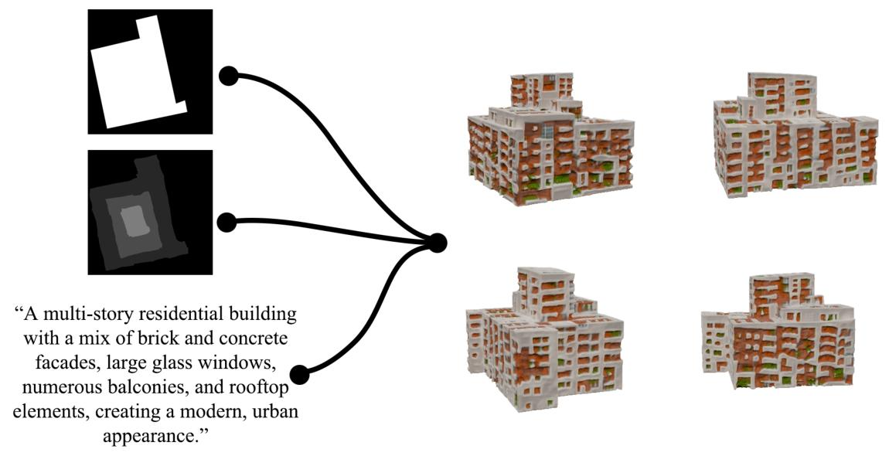
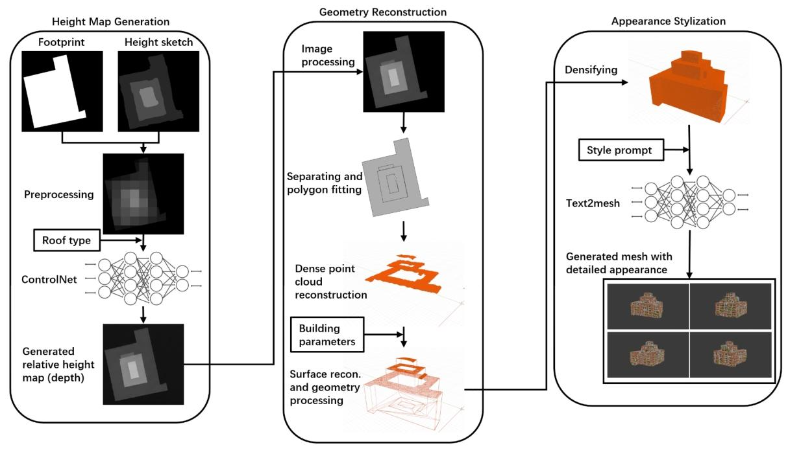
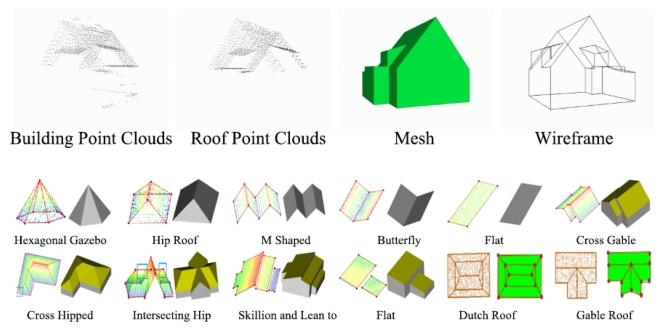
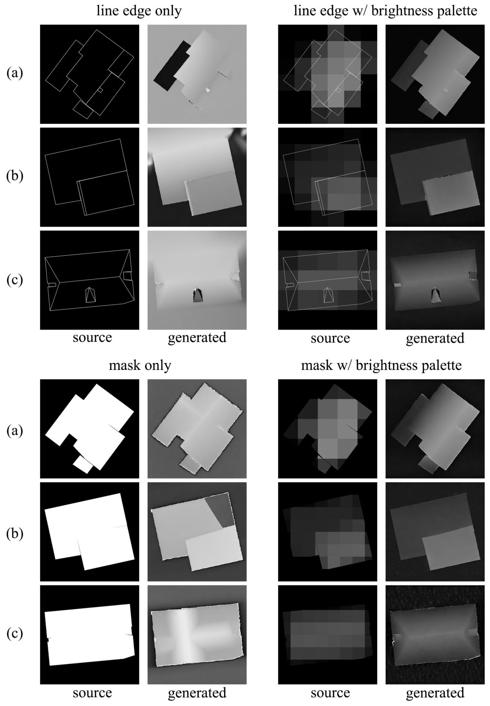
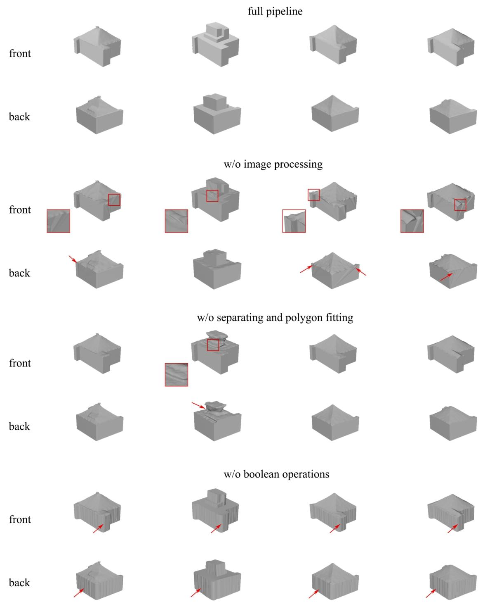
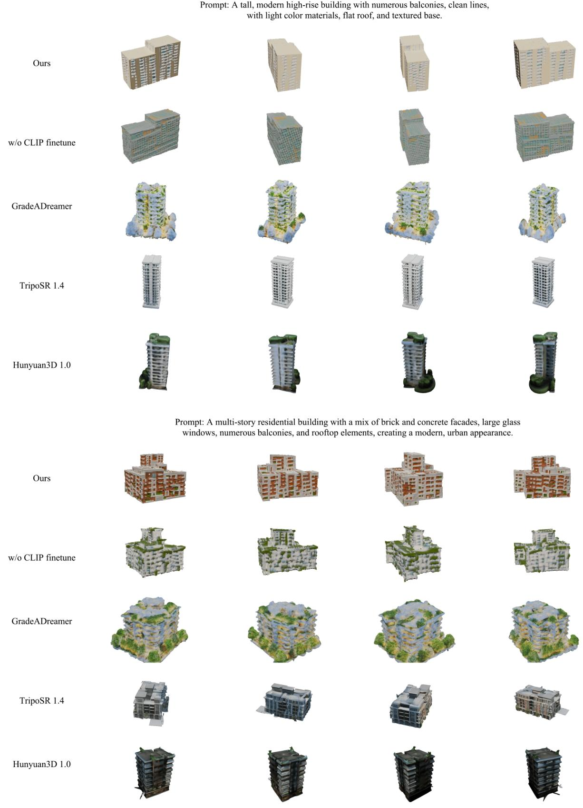

# GeoTexBuild: 基于地图足迹的3D建筑模型生成

# 目录

1. 背景与意义
2. 核心技术概念
3. 主要流程效果概述
4. pipeline-管道图
5. 实验概览
   1. 有效性验证（一）- FootPrint到高度贴图不同控制组合
   2. 有效性验证（二）- 几何重建消融实验
   3. 有效性验证（三）- Text2Mesh
6.  局限性与展望
   

# GeoTexBuild: 基于地图足迹的3D建筑模型生成

## 背景与意义
- 建筑模型在城市规划、旅游、游戏、影视、虚拟现实等领域至关重要。
- 传统CAD手工建模耗时费力，现有3D重建方法难以生成新建筑且数据成本高。
- 现有3D生成技术多依赖单张照片或文本提示，缺乏几何精度与可控性。

核心技术概念

  

  

    <h4 class="font-bold mb-2">ControlNet</h4>
      
<b>原理：</b>ControlNet 是一种用于提升文本到图像扩散模型可控性的神经网络架构,通过引入边缘图、关键点、深度图等条件，增强生成过程的几何约束。

      
<b>GeoTexBuild应用：</b>结合建筑足迹和手绘高度草图，生成可控的屋顶高度图，实现建筑几何结构的精确控制。

  

  

    <h4 class="font-bold mb-2">Text2Mesh</h4>
      
<b>原理：</b> Text2Mesh 是一种通过自然语言或图像调节来设置给定粗网格样式的方法。

      
<b>GeoTexBuild应用：</b>根据文本提示为建筑模型添加纹理和细节，提升外观真实感和语义丰富度。

  

主要流程效果概述

  
  

    <ul>
      <li>以<strong>建筑足迹（ControlNet）</strong>作为几何控制参数，结合<strong>手绘草图（ControlNet）</strong>和<strong>文本提示（Text2Mesh）</strong>，极大提升可控性与灵活性。</li>
      <li>三阶段模块化生成框架：</li>
      <ol class="list-decimal ml-6">
        <li><strong>高度图生成</strong>（ControlNet）：融合足迹与手绘高度草图，实现屋顶结构可控生成。</li>
        <li><strong>几何重建</strong>：从高度图重建建筑整体几何，得到无纹理模型。</li>
        <li><strong>外观风格化</strong>（Text2Mesh）：为模型赋予详细几何与颜色，生成完整纹理化建筑。</li>
      </ol>
    </ul>
  

# pipeline-管道图

  

    
  

  

    

      GeoTexBuild三大核心模块：
      <ol class="list-decimal ml-6 mt-2 space-y-1">
        <li>
          高度图生成（ControlNet）：输入建筑足迹和手绘高度草图，利用 ControlNet 输出规则且平滑的高度贴图，为后续几何重建提供基础。
        </li>
        <li>
          几何重建：对高度图进行去噪、分割与多边形拟合，重建屋顶点云和曲面，并结合建筑参数生成完整三维结构，修复表面缺陷，得到干净的建筑白模。
        </li>
        <li>
          外观风格化（Text2Mesh）：通过 Text2Mesh 和文本提示，为三维模型添加丰富的纹理和细节，实现风格化与语义增强，输出标准3D格式。
        </li>
      </ol>
    

    
  

# 实验概览
验证各阶段有效性(**高度图生成的可控性** **几何重建的准确性** **外观风格化的语义匹配度**) ,对比现有方法验证其优势

  

  

    <h4 class="font-bold ">ControlNet 训练</h4>
    <ul class="list-disc ">
      <li>数据集：使用 Building3D 数据集（3.2万+建筑点云、网格等），渲染屋顶结构深度图和轮廓掩码构建配对样本。</li>
      <li>数据增强：旋转、翻转、随机裁剪等，提升模型泛化能力。</li>
      <li>训练细节：基于 SD 1.5 微调，训练26万张图像。</li>
    </ul>
  

  

    <h4 class="font-bold ">Text2Mesh 微调</h4>
    <ul class="list-disc ">
      <li>数据集：手动筛选800+高质量建筑图像，去除背景，仅保留建筑主体，搭配 GPT-4 生成的文本描述。</li>
      <li>训练细节：微调 CLIP 模型（ViT-B/32），使用 <b>OpenCLIP</b>框架。</li>
    </ul>
  

# 有效性验证（一）-FootPrint到高度贴图不同控制组合

  

    
  

  

    

      仅线边缘（图 a）：
      生成的高度图缺乏明确的高度分层，屋顶结构模糊，边缘内外区域难以区分（线边缘无法传递高度语义）。
    

    

      线边缘 + 亮度 palette（图 b）：
      高度分布与草图亮度匹配度提升，但线边缘可能引入“内部/外部”歧义（如斜线可能被误判为屋顶边界），导致局部结构混乱。
    

    

      仅掩码（图 c）：
      高度图完全随机，无具体结构（掩码仅定义轮廓边界，无高度控制）。
    

    

      掩码 + 亮度 palette（图 d）：
      高度图清晰反映亮度 palette 的分层（亮区对应高屋顶，暗区对应低屋顶），边缘整齐，内部结构（如斜坡）与文本提示（“简单斜坡”“复杂斜坡”）高度吻合。
    

    

      关键结论：
      <ul class="list-disc ml-5">
        <li><b>掩码</b>相比线边缘，能更明确约束建筑外轮廓，避免几何歧义。</li>
        <li><b>亮度 palette</b>缺失时，模型无法生成有语义的高度分布。</li>
        <li><b>掩码 + 亮度 palette</b>组合既能精准控制轮廓边界，又能通过亮度传递高度语义，生成的高度图噪声少、结构清晰，更适合后续几何重建。</li>
      </ul>
    

  

# 有效性验证（二）-几何重建消融实验 

通过移除几何重建流程中的关键步骤，验证各步骤对模型精度的影响
  

  

    

      完整流程（图中第一行）：
      屋顶结构清晰，边缘光滑，多图层分界明确（如烟囱、阁楼等细节保留完整）。
    

    

      无图像预处理（图中第二行）：
      边缘噪声导致屋顶结构模糊，多图层融合出错。
    

    

      无多边形拟合（图中第三行）：
      屋顶各部分无法分离，重建表面过度平滑或出现“面包状”边界。
    

    

      无布尔运算（图中第四行）：
      墙面出现裂缝和条纹状缺陷。
    

    

      结论：
      各步骤（滤波、拟合、布尔运算）对几何精度至关重要。
    

  

  

    
  

# 有效性验证（三）-Text2Mesh

  

    
  

 

  <table class="w-2/3 text-xs text-left border border-gray-200">
    <thead>
      <tr class="bg-gray-100">
        <th class="px-2 py-1 border">模型</th>
        <th class="px-2 py-1 border">语义匹配度</th>
        <th class="px-2 py-1 border">背景混淆</th>
        <th class="px-2 py-1 border">几何细节</th>
      </tr>
    </thead>
    <tbody>
      <tr>
        <td class="py-1 border font-bold">Ours</td>
        <td class="px-2 py-1 border">准确生成砖-混凝土混合立面、屋顶烟囱等，材质过渡自然。</td>
        <td class="px-2 py-1 border">无背景元素，仅聚焦建筑主体。</td>
        <td class="px-2 py-1 border">阳台隔板、窗框分割线等细粒度结构清晰，无网格噪声。</td>
      </tr>
      <tr>
        <td class="px-2 py-1 border font-bold">w/o CLIP finetune</td>
        <td class="px-2 py-1 border">立面材质单一，玻璃窗户模糊，阳台数量减少。</td>
        <td class="px-2 py-1 border">可能误将提示中的“urban appearance”关联为背景绿植，出现在墙面。</td>
        <td class="px-2 py-1 border">几何结构平滑但缺乏细节-阳台栏杆简化为平板。</td>
      </tr>
      <tr>
        <td class="px-2 py-1 border font-bold">GradeADreamer</td>
        <td class="px-2 py-1 border">材质语义偏差，阳台布局混乱。</td>
        <td class="px-2 py-1 border">背景“urban”被错误渲染为墙面涂鸦/植被图案。</td>
        <td class="px-2 py-1 border">表面噪声明显，窗框线条扭曲。</td>
      </tr>
      <tr>
        <td class="px-2 py-1 border font-bold">TripoSR 1.4</td>
        <td class="px-2 py-1 border">基本符合“现代高层”特征，但材质纹理重复。</td>
        <td class="px-2 py-1 border">无背景混淆（单视图重建不涉及复杂语义）。</td>
        <td class="px-2 py-1 border">几何结构完整但细节粗糙，如基座纹理与主体材质分界不明显。</td>
      </tr>
      <tr>
        <td class="px-2 py-1 border font-bold">Hunyuan3D 1.0</td>
        <td class="px-2 py-1 border">建筑轮廓扭曲，材质语义混乱（浅色材质误判为金属反光）。</td>
        <td class="px-2 py-1 border">背景“skyline”被映射为墙面渐变色彩，干扰主体。</td>
        <td class="px-2 py-1 border">表面网格存在孔洞，阳台和屋顶结构缺失（如无烟囱或设备间）。</td>
      </tr>
    </tbody>
  </table>

  <h3 class="font-bold text-base mb-2">局限性与展望</h3>
  <ul class="list-disc ml-5 space-y-1">
    <li><b>几何与算力：</b>模块化流程降低了数据和算力门槛，但复杂结构仍需人工调整，端到端模型在细节上更优但资源消耗大。</li>
    <li><b>语义控制：</b>CLIP 微调提升了风格匹配，但极端风格或复杂材质的可控性仍有限。</li>
    <li><b>输入依赖：</b>高度草图和文本提示质量影响最终效果，城市级建筑群生成有待扩展。</li>
  </ul>

  <h3 class="font-bold text-base mb-2">未来方向</h3>
  <ul class="list-disc ml-5 space-y-1">
    <li>探索端到端轻量化3D生成，减少误差传递。</li>
    <li>支持多模态输入（如照片、BIM），提升易用性。</li>
    <li>扩展到城市级自动建模与优化。</li>
    <li>跨领域协同设计，实现外观与空间一体化生成。</li>
  </ul>

  <h3 class="font-bold text-base mb-2">总结</h3>
  <ul class="list-disc ml-5 space-y-1">
    <li>GeoTexBuild 提出三阶段模块化流程，实现高效、可控的3D建筑生成。</li>
    <li>结合 ControlNet 和 Text2Mesh，兼顾几何精度与外观多样性。</li>
    <li>实验验证了模型在结构、细节和语义上的优越性，资源消耗远低于端到端大模型。</li>
    <li>为建筑设计、城市规划等领域提供了高效自动化工具，具备良好扩展性和应用前景。</li>
  </ul>

