# 概念理解


## 什么是数据治理？为什么要做数据治理

### 什么是数据治理

数据治理的核心工作： 在企业的数据建设进程中，保障企业的[数据资产](https://zhida.zhihu.com/search?content_id=214283193&content_type=Article&match_order=1&q=%E6%95%B0%E6%8D%AE%E8%B5%84%E4%BA%A7&zhida_source=entity)得到正确有效地管理。数据从外部或者内部产生后，经过大数据手段处理，流转到不同的业务端，为企业的上层应用提供数据赋能。

### 为什么做数据治理

在使用数据时候会出现如下问题：

- 数据监管力度不够，出现脏数据
- 数据体系逐渐规模变大，管理混乱
- 数据的血缘丢失，无法回溯旧、老的数据

提前做好数据治理规划，会节省后续的改造成本，避免过程冗余重构或者推倒重来等情况的发生。

数据治理可以有效保障数据建设过程在一个合理高效的监管体系下进行，最终提供`高质量`、`安全`、`流程可追溯`的业务数据。

## 数据治理体系

企业数据治理体系包括：

1. 数据质量管理
2. 元数据管理
3. 主数据管理
4. 数据资产管理
5. 数据安全数据标准
6. ......

### 数据质量

一般采用业内常用的标准来衡量数据质量的好坏：`完整性`、`准确性`、`一致性`和`及时性`。

- 完整性：数据的记录和信息是否完整，是否存在缺失情况
- 准确性：数据汇总记录的信息和数据是否准确，是否存在异常或者错误
- 一致性：多个业务数仓间的公共数据，必须在各个数据仓库中保持一致
- 及时性：数据能及时产出和预警


### 元数据管理

#### 元数据

是描述数据的数据，包含`技术元数据`和`业务元数据`。可以帮助数据分析人员清楚了解企业拥有什么数据，它们存储在哪里，如何抽取、清理、维护z这类数据，也即**数据血缘**。

#### 元数据管理的意义

- 帮助构建业务知识体系，确立数据业务含义可解释性
- 提升数据整合和溯源能力，血缘关系可维护
- 建立数据质量稽核体系，分类管理监控

### 主数据管理

#### 主数据

企业主数据指**企业内一致并共享的业务主体**，大白话理解就是各专业公司和业务系统间**共享**的数据。

常见的主数据比如公司的`员工`、`客户数据`、`机构信息`、`供应商信息`等。这些数据具有权威性和全局性，可归约至公司的企业资产。

#### 主数据管理

- **管理和监管**主数据的访问
- **定期**进行主数据**评估**
- 组织相关人员和机构，统一完善**主数据建设**
- 提供**技术和业务**流程支持

### 数据资产管理

在构建企业资产时一般会考虑不同角度，即**业务角度**和**技术角度**，合并输出统一的`数据资产分析`，向外提供统一的**数据资产查询服务**。

### 数据安全

定时对数据进行**核查**、敏感字段**加密**、访问**权限控制**，确保数据能够被安全地使用

### 数据标准

要在组织内定义一套关于**数据的规范**

## 企业数据治理实施过程

### 数据治理实施框架

key：**规范、一致**

**数据治理体系**是为了规范业务数据规范、数据标准、数据质量和数据安全中的各类管理任务活动

通过一个常态化的数据治理组织，建立数据集中管理长效机制，规范数据管控流程，提升数据质量，促进数据标准一致，保障数据共享与使用安全，从而提高企业运营效率和管理水平。

### 数据治理组织架构

企业数据治理体系除了在**技术**方面的**实施架构**，还需要**管理**方面的**组织架构**支撑。

一般在数据治理建设初期，集团会先成立数据治理管理委员会。从上至下由**决策层**、**管理层**、**执行层构成**。决策层决策、管理层制定方案、执行层实施。层级管理、统一协调。


#### 组织架构


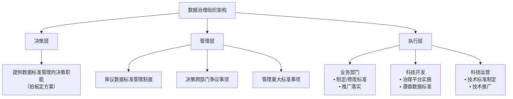


#### 管理层职责

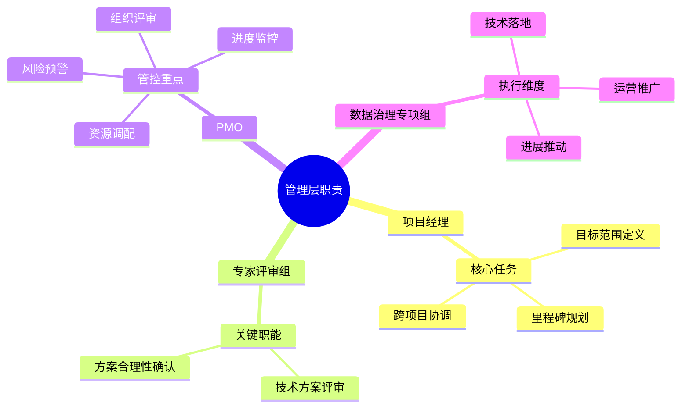

#### 执行层职责

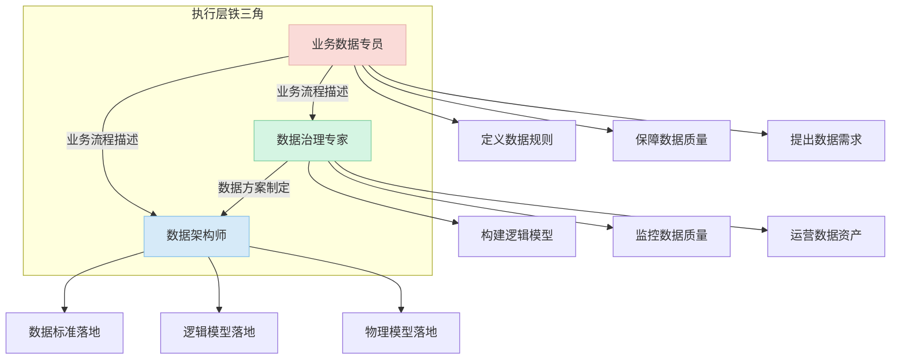

### 数据治理平台

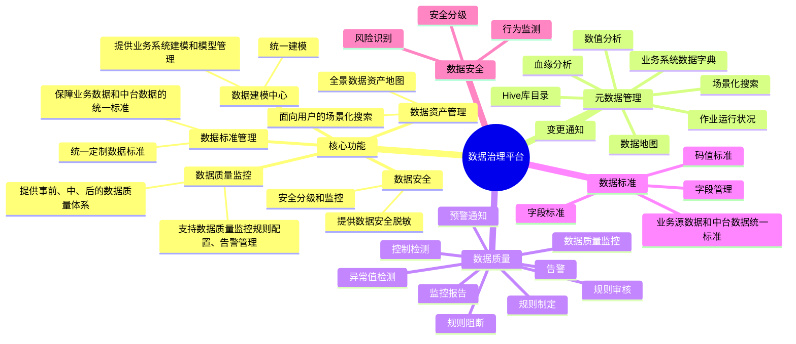


### 数据治理评估

#### 基本标准

1. 数据是否可以消除"脏、乱、差"的现象  
2. 数据资产是否最大价值化  
3. 所有数据的血缘是否完整可追溯

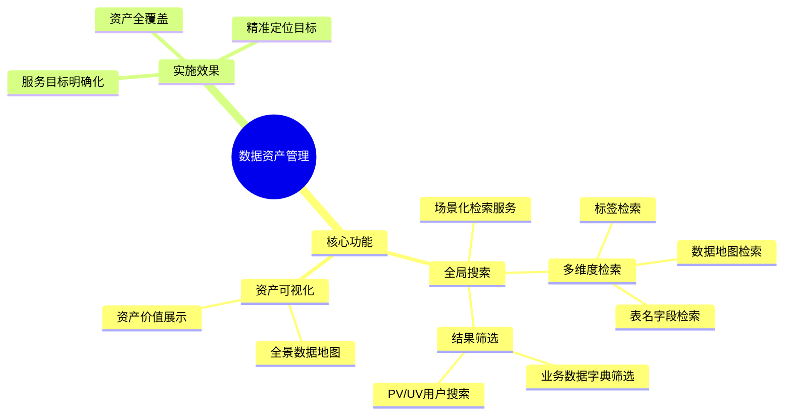

#### 数据资产

- 实现全局搜索，面向用户提供场景化检索服务
- 支持标签、数据地图、表名和字段名等多种检索维度
- 支持进行数据地图，源业务数据字典的结果筛选
- 比如支持PV/UV用户搜索和资产展示，明确服务目标

#### 数据标准

- 实现数据标准库100%拉通
- 智能识别数据标准和引用
- 客户端同步更新数据标准、词根

#### 数据安全

保持`事前制度建设`、`事中技术管控`、`事后监控审计`的原则建立全流程数据安全管控体系。

- 安全等级管控
- 安全规则配置
- 安全行为监督
- 安全流程把控


#### 数据质量

- 数据完整性：查看数据项信息是否全面、完整无缺失
- 告警响应程度：日常管理、应急响应、降低影响；避免数据损毁和丢失
- 监控覆盖程度：确保数据遵循统一的数据标准和规范要求
- 作业稳定性：监控作业稳定性，是否存在作业异常等问题
- 作业时效性：检查任务对应的数据项信息获取是否满足预期要求

## 常见误区与应对策略

| 误区      | 应对策略                                                           |
| ------- | -------------------------------------------------------------- |
| 大而全一步到位 | 建议先根据自身的数据状况分阶段进行，避免盲目铺开规模，过程中可调整。  <br>                       |
| 纯技术项目   | 应该是整个集团一起协作完成。其中就包括各业务线以及其他管理组织，没有一个好的实施方案和协作机制，往往事倍功半         |
| 工具万能论   | 先有体系再选工具：工具和技术手段目前市面上很成熟，先把理论给铺垫好，再选择匹配的平台。                    |
| 短期见效    | 数据治理是个长期过程，随着企业数据的规模和数仓规划的变更同步调整，部分功能可能会在短期内卓有成效，完整体系搭建短期很难实现。 |


# 数据录入DeepSeek尝试

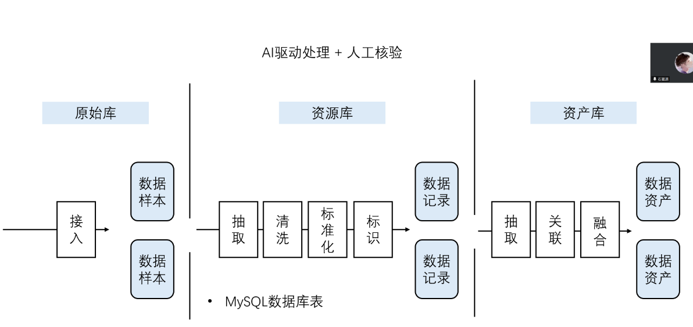

## 数据来源

数据网站：

https://www.kaggle.com/datasets/michaelmatta0/global-development-indicators-2000-2020

下载数据：


## LLM提示词处理流程

1. Excel表格识别/抽取(指定哪些列、行)
2. 数值校验、补全等
3. Text2SOl-插入数据库任务

# 数据分析与处理方案

### 1. 数据结构识别与抽取

#### 数据结构概述

该数据集是一个全球发展指标数据集，时间跨度为2000-2020年，包含以下主要信息：

- **时间维度**：年份(year)
- **地理维度**：国家代码(country_code)、国家名称(country_name)、地区(region)、收入群体(income_group)
- **经济指标**：GDP(usd)、人均GDP(gdp_per_capita)、通货膨胀率(inflation_rate)、失业率(unemployment_rate)、FDI占GDP比例(fdi_pct_gdp)
- **环境指标**：CO2排放量(co2_emissions_kt)、人均能源使用(energy_use_per_capita)、可再生能源比例(renewable_energy_pct)、森林覆盖率(forest_area_pct)
- **社会发展指标**：电力普及率(electricity_access_pct)、预期寿命(life_expectancy)、儿童死亡率(child_mortality)、中学入学率(school_enrollment_secondary)
- **医疗指标**：医疗支出占比(health_expenditure_pct_gdp)、医院床位(per 1000人)、医生数量(per 1000人)
- **技术指标**：互联网使用率(internet_usage_pct)、移动电话订阅量(per 100人)
- **综合指数**：人类发展指数(human_development_index)、气候脆弱性指数(climate_vulnerability_index)等

#### 需要抽取的列

1. year
2. country_code
3. country_name
4. region
5. income_group
6. gdp_usd
7. population
8. gdp_per_capita
9. inflation_rate
10. unemployment_rate
11. co2_emissions_kt
12. renewable_energy_pct
13. life_expectancy
14. child_mortality
15. internet_usage_pct
16. human_development_index

### 2. 数据校验与补全

#### 数据校验
1. **范围校验**：
   - GDP、人口等值应为正数
   - 百分比指标(0-100)
   - 年份范围(2000-2020)

2. **逻辑校验**：
   - 人均GDP ≈ GDP/人口
   - 儿童死亡率与预期寿命负相关

3. **缺失值检查**：
   - 2020年部分指标缺失(疫情原因)
   - 某些区域早期数据缺失

#### 数据补全策略

1. **时间序列补全**：对连续指标(如GDP)可使用线性插值
2. **区域平均值补全**：对缺失的国家数据使用区域平均值
3. **趋势外推**：对最近年份缺失数据基于历史趋势估算

### 3. Text2SQL 数据库插入流程

#### 数据库表设计

##### 插入语句

```sql
CREATE TABLE global_development_indicators (
    id INT AUTO_INCREMENT PRIMARY KEY,
    year INT NOT NULL,
    country_code VARCHAR(10) NOT NULL,
    country_name VARCHAR(100),
    region VARCHAR(100),
    income_group VARCHAR(100),
    gdp_usd DECIMAL(20,2),
    population DECIMAL(20,2),
    gdp_per_capita DECIMAL(20,2),
    inflation_rate DECIMAL(10,2),
    unemployment_rate DECIMAL(10,2),
    co2_emissions_kt DECIMAL(20,2),
    renewable_energy_pct DECIMAL(10,2),
    life_expectancy DECIMAL(10,2),
    child_mortality DECIMAL(10,2),
    internet_usage_pct DECIMAL(10,2),
    human_development_index DECIMAL(10,4),
    last_updated TIMESTAMP DEFAULT CURRENT_TIMESTAMP
);
```

##### 插入结果

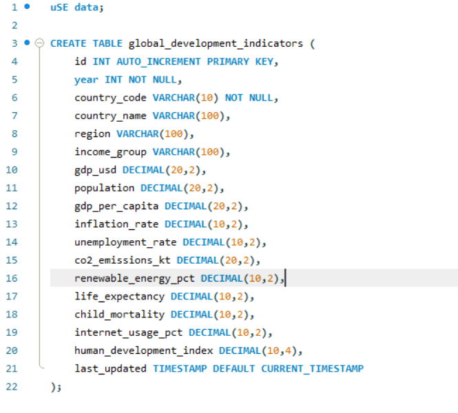
#### 数据插入SQL

```sql
INSERT INTO global_development_indicators (
    year, country_code, country_name, region, income_group,
    gdp_usd, population, gdp_per_capita, inflation_rate,
    unemployment_rate, co2_emissions_kt, renewable_energy_pct,
    life_expectancy, child_mortality, internet_usage_pct,
    human_development_index
) VALUES (
    2020, 'AFE', 'Africa Eastern and Southern', '', '',
    920792331527.746, 677243299.0, 1359.61822418526, 5.19145571718405,
    7.56318685370141, NULL, NULL,
    NULL, NULL, NULL,
    NULL
);
```

#### 处理流程

##### 数据清洗

使用Python pandas处理缺失值和异常值

   ```python
   import pandas as pd
   
   # 读取数据
   df = pd.read_csv('Global_Development_Indicators_2000_2020.csv')
   
   # 处理缺失值
   df.fillna(method='ffill', inplace=True)  # 前向填充
   df.fillna(method='bfill', inplace=True)  # 后向填充
   
   # 验证人均GDP计算
   df['calculated_gdp_per_capita'] = df['gdp_usd'] / df['population']
   ```

##### 生成SQL

将清洗后的数据转换为SQL插入语句

   ```python
   def generate_sql(row):
       return f"""
       INSERT INTO global_development_indicators (
           year, country_code, country_name, region, income_group,
           gdp_usd, population, gdp_per_capita, inflation_rate,
           unemployment_rate, co2_emissions_kt, renewable_energy_pct,
           life_expectancy, child_mortality, internet_usage_pct,
           human_development_index
       ) VALUES (
           {row['year']}, '{row['country_code']}', '{row['country_name']}', 
           '{row['region']}', '{row['income_group']}',
           {row['gdp_usd']}, {row['population']}, {row['gdp_per_capita']}, 
           {row['inflation_rate']}, {row['unemployment_rate']}, 
           {row['co2_emissions_kt']}, {row['renewable_energy_pct']},
           {row['life_expectancy']}, {row['child_mortality']}, 
           {row['internet_usage_pct']}, {row['human_development_index']}
       );
       """
   
   sql_scripts = df.apply(generate_sql, axis=1)
   ```


### 业务应用-区域经济发展对比

#### 数据清洗语句

##### 创建语句

```python
import pandas as pd
import numpy as np

# 读取原始数据
df = pd.read_csv('Global_Development_Indicators_2000_2020.csv')

# 选择区域经济发展分析所需的列
economic_columns = [
    'year', 'country_code', 'country_name', 'region', 'income_group',
    'gdp_usd', 'population', 'gdp_per_capita', 'inflation_rate',
    'unemployment_rate', 'fdi_pct_gdp'
]

# 创建专门用于区域经济分析的数据集
economic_df = df[economic_columns].copy()

# 数据清洗步骤
# 1. 处理缺失值 - 使用区域中位数填充
economic_df['gdp_usd'] = economic_df.groupby(['region', 'year'])['gdp_usd'].apply(
    lambda x: x.fillna(x.median())
)

economic_df['gdp_per_capita'] = economic_df.groupby(['region', 'year'])['gdp_per_capita'].apply(
    lambda x: x.fillna(x.median())
)

# 2. 计算区域经济总量和平均值
region_economic = economic_df.groupby(['region', 'year']).agg({
    'gdp_usd': 'sum',
    'population': 'sum',
    'gdp_per_capita': 'mean',
    'inflation_rate': 'mean',
    'unemployment_rate': 'mean',
    'fdi_pct_gdp': 'mean'
}).reset_index()

# 3. 计算人均GDP (区域总和GDP/区域总人口)
region_economic['region_gdp_per_capita'] = region_economic['gdp_usd'] / region_economic['population']

# 4. 计算经济增长率 (按区域)
region_economic = region_economic.sort_values(['region', 'year'])
region_economic['gdp_growth_rate'] = region_economic.groupby('region')['gdp_usd'].pct_change() * 100

# 5. 处理异常值 - 限制在合理范围内
region_economic['inflation_rate'] = region_economic['inflation_rate'].clip(-5, 50)
region_economic['unemployment_rate'] = region_economic['unemployment_rate'].clip(0, 30)
region_economic['fdi_pct_gdp'] = region_economic['fdi_pct_gdp'].clip(0, 20)

# 6. 添加区域经济规模分类
conditions = [
    (region_economic['gdp_usd'] < 1e12),
    (region_economic['gdp_usd'] >= 1e12) & (region_economic['gdp_usd'] < 5e12),
    (region_economic['gdp_usd'] >= 5e12)
]
choices = ['Small', 'Medium', 'Large']
region_economic['economic_size'] = np.select(conditions, choices, default='Medium')

# 保存清洗后的数据
region_economic.to_csv('cleaned_region_economic_data.csv', index=False)
```

##### 创建结果

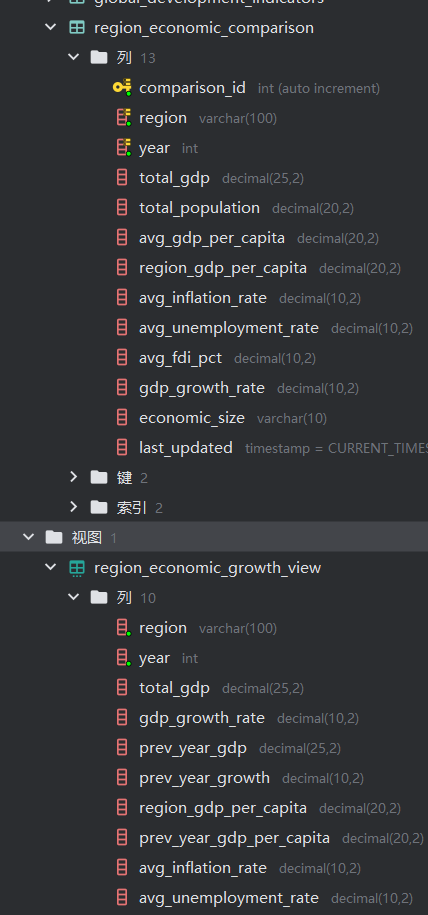

#### 数据库表设计语句

```sql
-- 创建区域经济对比分析专用表
CREATE TABLE region_economic_comparison (
    comparison_id INT AUTO_INCREMENT PRIMARY KEY,
    region VARCHAR(100) NOT NULL,
    year INT NOT NULL,
    total_gdp DECIMAL(25,2) COMMENT '区域GDP总量(美元)',
    total_population DECIMAL(20,2) COMMENT '区域总人口',
    avg_gdp_per_capita DECIMAL(20,2) COMMENT '区域平均人均GDP',
    region_gdp_per_capita DECIMAL(20,2) COMMENT '区域总GDP/总人口计算的人均GDP',
    avg_inflation_rate DECIMAL(10,2) COMMENT '平均通货膨胀率(%)',
    avg_unemployment_rate DECIMAL(10,2) COMMENT '平均失业率(%)',
    avg_fdi_pct DECIMAL(10,2) COMMENT '平均FDI占GDP比例(%)',
    gdp_growth_rate DECIMAL(10,2) COMMENT 'GDP年增长率(%)',
    economic_size VARCHAR(10) COMMENT '经济规模分类(Small/Medium/Large)',
    last_updated TIMESTAMP DEFAULT CURRENT_TIMESTAMP ON UPDATE CURRENT_TIMESTAMP,
    UNIQUE KEY (region, year)
);

-- 创建区域经济指标年度对比视图
CREATE VIEW region_economic_growth_view AS
SELECT 
    region,
    year,
    total_gdp,
    gdp_growth_rate,
    LAG(total_gdp, 1) OVER (PARTITION BY region ORDER BY year) AS prev_year_gdp,
    LAG(gdp_growth_rate, 1) OVER (PARTITION BY region ORDER BY year) AS prev_year_growth,
    region_gdp_per_capita,
    LAG(region_gdp_per_capita, 1) OVER (PARTITION BY region ORDER BY year) AS prev_year_gdp_per_capita,
    avg_inflation_rate,
    avg_unemployment_rate
FROM region_economic_comparison
ORDER BY region, year;
```

#### 数据插入SQL语句

```sql
-- 批量插入清洗后的区域经济数据
INSERT INTO region_economic_comparison (
    region, year, total_gdp, total_population, avg_gdp_per_capita,
    region_gdp_per_capita, avg_inflation_rate, avg_unemployment_rate,
    avg_fdi_pct, gdp_growth_rate, economic_size
) VALUES
('Africa Eastern and Southern', 2000, 283952504751.70, 398113044.00, 713.25, 713.25, 8.60, 7.72, 1.56, NULL, 'Small'),
('Africa Eastern and Southern', 2001, 258843211433.20, 408522129.00, 633.61, 633.61, 5.84, 7.73, 4.84, -8.84, 'Small'),
('Africa Western and Central', 2000, 140407973778.93, 267214544.00, 525.45, 525.45, 2.53, 4.92, 1.82, NULL, 'Small'),
('Africa Western and Central', 2001, 148012003011.17, 274433894.00, 539.34, 539.34, 4.36, 4.87, 2.18, 5.41, 'Small'),
('Arab World', 2000, 816038849805.68, 282344141.00, 2890.23, 2890.23, 1.85, 12.60, 0.47, NULL, 'Medium'),
('Arab World', 2001, 798525022054.76, 288432153.00, 2768.50, 2768.50, 1.77, 12.47, 1.12, -2.15, 'Medium');

-- 更新GDP增长率 (示例更新语句)
UPDATE region_economic_comparison t1
JOIN region_economic_comparison t2 ON t1.region = t2.region AND t1.year = t2.year + 1
SET t1.gdp_growth_rate = ((t1.total_gdp - t2.total_gdp) / t2.total_gdp) * 100
WHERE t1.gdp_growth_rate IS NULL;
```

#### 区域经济对比分析查询示例

```sql
-- 各区域GDP总量对比(最新年份)
SELECT 
    region,
    year,
    total_gdp,
    ROUND(total_gdp / 1000000000000, 2) AS gdp_trillions,
    RANK() OVER (ORDER BY total_gdp DESC) AS gdp_rank
FROM region_economic_comparison
WHERE year = (SELECT MAX(year) FROM region_economic_comparison)
ORDER BY total_gdp DESC;

```

#### 查询结果示例

各个区域GDP总量对比

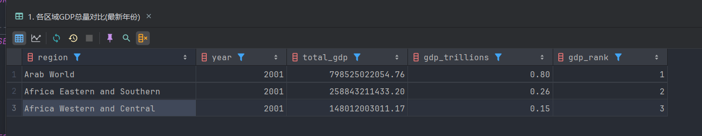

## 使用总结

1. 使用LLM模型进行数据抽取、处理等过程在**少量、多次**的情况下，生成语句或者代码一般可直接在调教后进行执行。
2. 对专业编程能力需求小，只需要对结果**进行检验，确保数据可用**。
3. 产生形成**提示词模板**后可以快速进行数据资产构建。

# llm数据治理尝试第二版

主线是使用llm产出的**代码程序**进行数据处理，而不是使用模型直接处理数据。

## 提示词工程流程

1. LLM加载数据文件
2. 表结构内容解析
3. 提供项目配置基本要求，搭建项目框架
4. 询问并执行简单数据清洗程序
5. 建表存储代码生成
6. 提出业务需求
7. 运行生成的处理需求的代码
8. 抽样数据进行验证
9. 根据验证结果持久化代码为应用/服务


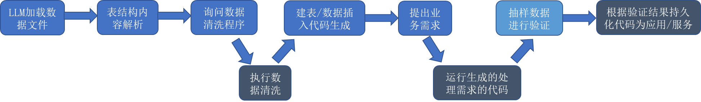

## 实践流程展示

### 提示词零 & 准备阶段-环境配置

这些都是基于我自己的知识进行直接询问/要求的，因为这里存在多次询问调整，我整理多次提示词输入如下：

#### 提示词-自定义目录结构配置

1. 源代码根目录
2. 资源目录位置
3. 构建目标文件位置
4. main入口类

#### 提示词-基本依赖工具配置

1. 构建工具使用**maven**
2. 语言使用Java
3. 需要使用阿帕奇的**csv处理依赖、mysql驱动依赖、slf4j日志依赖**
4. 分步骤进行
5. 在代码中提供基本的注释
6. 提供基本的java和数据库环境

#### LLM输出主要内容

1. maven编译打包命令
2. jar包执行命令
3. pom.xml文件内容
4. logback.xml日志配置文件内容

```cmd
mvn clean package
java -jar target/csv-database-importer-1.0-SNAPSHOT.jar
```

```xml
<project xmlns="http://maven.apache.org/POM/4.0.0"

         xmlns:xsi="http://www.w3.org/2001/XMLSchema-instance"

         xsi:schemaLocation="http://maven.apache.org/POM/4.0.0 http://maven.apache.org/xsd/maven-4.0.0.xsd">

    <modelVersion>4.0.0</modelVersion>

  

    <groupId>com.example</groupId>

    <artifactId>csv-database-importer</artifactId>

    <version>1.0-SNAPSHOT</version>

  

    <properties>

        <project.build.sourceEncoding>UTF-8</project.build.sourceEncoding>

        <maven.compiler.source>1.8</maven.compiler.source>

        <maven.compiler.target>1.8</maven.compiler.target>

        <main.class>CSVToDatabaseImporter</main.class>

        <!-- 新增一个属性来定义您的源文件夹 -->

        <custom.source.directory>${project.basedir}</custom.source.directory>

    </properties>

  

    <dependencies>

        <!-- ... 您的依赖项 ... -->

        <dependency>

            <groupId>com.mysql</groupId>

            <artifactId>mysql-connector-j</artifactId>

            <version>9.1.0</version>

        </dependency>

        <dependency>

            <groupId>org.apache.commons</groupId>

            <artifactId>commons-csv</artifactId>

            <version>1.10.0</version>

        </dependency>

         <dependency>

            <groupId>org.slf4j</groupId>

            <artifactId>slf4j-api</artifactId>

            <version>2.0.13</version> <!-- 您可以选择最新的稳定版本 -->

        </dependency>

        <!-- 添加 Logback Classic 作为 SLF4J 的实现 -->

        <dependency>

            <groupId>ch.qos.logback</groupId>

            <artifactId>logback-classic</artifactId>

            <version>1.5.6</version> <!-- 您可以选择最新的稳定版本 -->

        </dependency>

    </dependencies>

  

    <build>

        <!-- 指定源代码目录 -->

        <sourceDirectory>${custom.source.directory}</sourceDirectory>

        <!-- 如果您也有自定义的测试代码目录，可以类似地添加 <testSourceDirectory> -->

        <!-- <testSourceDirectory>${project.basedir}/tests</testSourceDirectory> -->

        <resources>

            <resource>

                <directory>${project.basedir}</directory> <!-- 指定项目根目录为资源目录 -->

                <includes>

                    <include>logback.xml</include> <!-- 只包含根目录下的 logback.xml 文件 -->

                </includes>

            </resource>

            <!-- 如果您还想使用 src/main/resources 目录存放其他资源文件，可以保留或添加以下配置 -->

            <!--

            <resource>

                <directory>src/main/resources</directory>

            </resource>

            -->

        </resources>

        <plugins>

            <plugin>

                <groupId>org.apache.maven.plugins</groupId>

                <artifactId>maven-compiler-plugin</artifactId>

                <version>3.13.0</version>

                <configuration>

                    <source>${maven.compiler.source}</source>

                    <target>${maven.compiler.target}</target>

                    <!-- 明确告知编译器插件源代码在哪里 -->

                    <!-- 注意：如果已经在 <build> 下全局设置了 <sourceDirectory>，这里通常不需要重复 -->

                    <!-- 但为了清晰，或者如果只想针对此插件设置，可以保留 -->

                    <!-- <sourceDirectory>${custom.source.directory}</sourceDirectory> -->

                </configuration>

            </plugin>

            <plugin>

                <groupId>org.apache.maven.plugins</groupId>

                <artifactId>maven-shade-plugin</artifactId>

                <version>3.2.4</version>

                <executions>

                    <execution>

                        <phase>package</phase>

                        <goals>

                            <goal>shade</goal>

                        </goals>

                        <configuration>

                            <transformers>

                                <transformer implementation="org.apache.maven.plugins.shade.resource.ManifestResourceTransformer">

                                    <mainClass>${main.class}</mainClass>

                                </transformer>

                            </transformers>

                        </configuration>

                    </execution>

                </executions>

            </plugin>

        </plugins>

    </build>

</project>
```


### 提示词一 &表结构内容解析

#### 提示词输入

给出java程序，解析表结构和行数、列数等基本信息的统计，并给出调用main函数，文件路径为C:\APP\CODE\temp\数据治理\Global_Development_Indicators_2000_2020.csv，输出信息在输出到控制台的同时保存为文本文件

#### 提示词主要结构

1. 编程语言选择
2. 解析内容
3. 代码基本格式要求
4. 文件路径
5. 输出要求

#### LLM提供的程序

```java
  

import java.io.FileWriter;

import java.io.IOException;

import java.io.PrintWriter;

import java.nio.file.Files;

import java.nio.file.Paths;

import java.util.List;

  

public class CSVAnalyzer {

  

    private static final org.slf4j.Logger logger = org.slf4j.LoggerFactory.getLogger(CSVAnalyzer.class);

  

    public CSVAnalyzer() {

        // 构造函数

        super(); // 显式调用父类 Object 的构造函数

    }

  

    ;

  

    public void CSV_analyzer_api() {

        String filePath = "C:\\APP\\CODE\\temp\\govern\\Global_Development_Indicators_2000_2020.csv";

        String outputPath = "C:\\APP\\CODE\\temp\\govern\\CSV_Analysis_Result.txt";

  

        try {

            // 读取CSV文件

            List<String> lines = Files.readAllLines(Paths.get(filePath));

  

            if (lines.isEmpty()) {

                System.out.println("CSV文件为空");

                logger.warn("CSV文件为空: {}", filePath);

                return;

            }

  

            // 获取列名（第一行）

            String[] headers = lines.get(0).split(",");

            int columnCount = headers.length;

            int rowCount = lines.size() - 1; // 减去标题行

  

            // 构建统计信息

            StringBuilder result = new StringBuilder();

            result.append("CSV文件分析结果:\n");

            result.append("文件路径: ").append(filePath).append("\n");

            result.append("总行数: ").append(rowCount).append("\n");

            result.append("总列数: ").append(columnCount).append("\n\n");

            result.append("列结构信息:\n");

            logger.info("列结构信息: 总行数={}, 总列数={}", rowCount, columnCount);

  

            // 添加列名和序号

            for (int i = 0; i < headers.length; i++) {

                result.append(i + 1).append(". ").append(headers[i]).append("\n");

                logger.info("列 {}: {}", i + 1, headers[i]);

            }

  

            // 输出到控制台

            System.out.println(result.toString());

  

            // 写入到文件

            try (PrintWriter writer = new PrintWriter(new FileWriter(outputPath))) {

                writer.println(result.toString());

                System.out.println("分析结果已保存到: " + outputPath);

                logger.info("分析结果已保存到: {}", outputPath);

            }

  

        } catch (IOException e) {

            System.err.println("处理文件时出错: " + e.getMessage());

            logger.error("处理文件时出错: {}", e.getMessage());

            e.printStackTrace();

        }

    }

}
```

#### 处理结果

1. 总行数: 5556  
2. 总列数: 47

经过和专业Excel工具的统计对比，程序运行结果正确

### 提示词二 &询问并执行简单数据清洗程序

#### 提示词输入

清理数据异常值，比如某一行全为空，并进行空值统计，清理后的数据和被清理的数据分别保存到两个文件中

#### 提示词主要结构

1. 清理要求
2. 输出要求

#### llm提供的程序

```java
  

import java.io.FileWriter;

import java.io.IOException;

import java.io.PrintWriter;

import java.nio.file.Files;

import java.nio.file.Paths;

import java.util.ArrayList;

import java.util.List;

  

import org.slf4j.Logger;

import org.slf4j.LoggerFactory;

  

public class CSVDataCleaner {

  

    private static final Logger logger = LoggerFactory.getLogger(CSVDataCleaner.class);

  

    public void data_cleaner_api() {

  

        String filePath = "C:\\APP\\CODE\\temp\\govern\\Global_Development_Indicators_2000_2020.csv";

        String cleanDataPath = "C:\\APP\\CODE\\temp\\govern\\Cleaned_Data.csv";

        String removedDataPath = "C:\\APP\\CODE\\temp\\govern\\Removed_Data.csv";

        String statsPath = "C:\\APP\\CODE\\temp\\govern\\Cleaning_Statistics.txt";

  

        try {

            // 读取CSV文件

            List<String> lines = Files.readAllLines(Paths.get(filePath));

  

            if (lines.isEmpty()) {

                System.out.println("CSV文件为空");

                logger.warn("CSV文件为空: {}", filePath);

                return;

            }

  

            String[] headers = lines.get(0).split(",");

            int columnCount = headers.length;

  

            List<String> cleanData = new ArrayList<>();

            List<String> removedData = new ArrayList<>();

            int[] columnNullCounts = new int[columnCount];

            int totalNullValues = 0;

            int totalRowsRemoved = 0;

  

            // 添加标题行到两个文件

            cleanData.add(lines.get(0));

            removedData.add(lines.get(0));

  

            // 分析数据

            for (int i = 1; i < lines.size(); i++) {

                String line = lines.get(i);

                String[] values = line.split(",");

  

                boolean isRowEmpty = true;

                boolean hasNullValues = false;

  

                // 检查行是否全空

                for (String value : values) {

                    if (!value.trim().isEmpty()) {

                        isRowEmpty = false;

                        break;

                    }

                }

  

                // 统计空值

                if (!isRowEmpty) {

                    for (int j = 0; j < values.length && j < columnCount; j++) {

                        if (values[j].trim().isEmpty()) {

                            columnNullCounts[j]++;

                            totalNullValues++;

                            hasNullValues = true;

                        }

                    }

                }

  

                // 分离数据

                if (isRowEmpty) {

                    removedData.add(line);

                    totalRowsRemoved++;

                } else {

                    cleanData.add(line);

                }

            }

  

            // 写入清理后的数据

            writeToFile(cleanData, cleanDataPath);

            // 写入被移除的数据

            writeToFile(removedData, removedDataPath);

  

            // 生成统计信息

            StringBuilder stats = new StringBuilder();

            stats.append("数据清理统计报告\n");

            stats.append("=================================\n");

            stats.append("原始文件: ").append(filePath).append("\n");

            stats.append("总行数(含标题): ").append(lines.size()).append("\n");

            stats.append("清理后数据行数: ").append(cleanData.size() - 1).append("\n");

            stats.append("移除的行数: ").append(totalRowsRemoved).append("\n");

            stats.append("总空值数量: ").append(totalNullValues).append("\n\n");

  

            stats.append("各列空值统计:\n");

            logger.info("各列空值统计:");

            logger.info("=================================");

            logger.info("原始文件: {}", filePath);

            logger.info("总行数(含标题): {}", lines.size());

            logger.info("清理后数据行数: {}", cleanData.size() - 1);

            logger.info("移除的行数: {}", totalRowsRemoved);

            logger.info("总空值数量: {}", totalNullValues);

            logger.info("各列空值统计:");

            // 输出各列空值统计

            logger.info("=================================");

            for (int i = 0; i < columnCount; i++) {

                stats.append(String.format("%-3d. %-30s: %d 空值",

                        i + 1,

                        headers[i].trim(),

                        columnNullCounts[i])).append("\n");

                logger.info("{}: {} 空值", headers[i].trim(), columnNullCounts[i]);

            }

  

            // 输出统计信息到控制台和文件

            System.out.println(stats.toString());

  

            try (PrintWriter writer = new PrintWriter(new FileWriter(statsPath))) {

                writer.println(stats.toString());

                System.out.println("统计信息已保存到: " + statsPath);

                logger.info("统计信息已保存到: {}", statsPath);

            }

  

            System.out.println("清理后的数据已保存到: " + cleanDataPath);

            logger.info("清理后的数据已保存到: {}", cleanDataPath);

            System.out.println("被移除的数据已保存到: " + removedDataPath);

            logger.info("被移除的数据已保存到: {}", removedDataPath);

        } catch (IOException e) {

            System.err.println("处理文件时出错: " + e.getMessage());

            logger.error("处理文件时出错: {}", e.getMessage());

            e.printStackTrace();

        }

    }

  

    private static void writeToFile(List<String> data, String filePath) throws IOException {

        try (PrintWriter writer = new PrintWriter(new FileWriter(filePath))) {

            for (String line : data) {

                writer.println(line);

            }

        }

    }

}
```
#### llm提供的程序运行结果

1. 总行数(含标题): 5557  
2. 清理后数据行数: 5556  
3. 移除的行数: 0  
4. 总空值数量: 34439

经过和专业Excel工具的统计对比，程序运行结果正确

### 提示词三 & 数据插入

#### 提示词输入

给出新的java程序以及编译命令，根据清理后的数据，清理后数据文件路径为

C:\APP\CODE\temp\数据治理\Cleaned_Data.csv

连接数据库，建表，规避重复建表，插入数据，数据库配置如下

- 数据库ip端口号：127.0.0.1:3306 
- 用户名称：root 
- 用户密码：helloworld 
- 数据库名称：data_govern

驱动位置（**其实可以删除**）C:\APP\CODE\temp\govern\mysql-connector-j-9.3.0.jar，

#### 提示词主要结构

1. 待插入数据文件指定
2. 数据库配置（包括hostname、数据库名称等）
3. 建表注意事项
4. 驱动文件位置(classpath)
5. 运行命令

这是直接使用单文件直接下载依赖，在命令中使用**类路径提供数据库依赖支持**的运行的方式。

```cmd

javac CSVToDatabaseImporter.java    

java -cp ".;C:\APP\CODE\temp\govern\mysql-connector-j-9.3.0.jar" CSVToDatabaseImporter

```

#### LLM提供的程序

```java
  

import java.io.Reader;

import java.nio.file.Files;

import java.nio.file.Paths;

import java.sql.Connection;

import java.sql.DatabaseMetaData;

import java.sql.DriverManager;

import java.sql.PreparedStatement;

import java.sql.ResultSet;

import java.sql.SQLException;

import java.sql.Statement;

import java.sql.Types;

import java.util.ArrayList;

import java.util.List;

  

import org.apache.commons.csv.CSVFormat;

import org.apache.commons.csv.CSVParser;

import org.apache.commons.csv.CSVRecord;

import org.slf4j.Logger;

import org.slf4j.LoggerFactory;

  

public class CSVToDatabaseImporter {

  

    private static final Logger logger = LoggerFactory.getLogger(CSVToDatabaseImporter.class);

  

    private static final String DB_URL = "jdbc:mysql://127.0.0.1:3306/data_govern";

    private static final String DB_USER = "root";

    private static final String DB_PASSWORD = "helloworld";

    private static final String CSV_FILE_PATH = "C:\\APP\\CODE\\temp\\govern\\Cleaned_Data.csv";

    private static final String DRIVER_CLASS = "com.mysql.cj.jdbc.Driver";

  

    public static void main(String[] args) {

        Connection connection = null;

        Statement statement = null;

        PreparedStatement insertPstmt = null;

        CSVAnalyzer step1 = new CSVAnalyzer();

        step1.CSV_analyzer_api(); // 调用CSV分析API

        CSVDataCleaner step2 = new CSVDataCleaner();

        step2.data_cleaner_api(); // 调用数据清理API

        logger.info("开始导入CSV数据到数据库...");

  

        try {

            Class.forName(DRIVER_CLASS);

  

            try ( // 使用 Apache Commons CSV 解析

                    Reader reader = Files.newBufferedReader(Paths.get(CSV_FILE_PATH)); CSVParser csvParser = new CSVParser(reader, CSVFormat.DEFAULT

                    .withFirstRecordAsHeader() // 将第一行视为表头

                    .withIgnoreHeaderCase()

                    .withTrim())) {

  

                List<String> headersList = csvParser.getHeaderNames();

                if (headersList == null || headersList.isEmpty()) {

  

                    logger.error("CSV文件没有表头或为空");

                    csvParser.close();

                    reader.close();

                    return;

                }

                String[] headers = headersList.toArray(new String[0]);

                String tableName = "global_development_indicators";

  

                connection = DriverManager.getConnection(DB_URL, DB_USER, DB_PASSWORD);

                connection.setAutoCommit(false);

                logger.info("成功连接到数据库: {}", DB_URL);

  

                statement = connection.createStatement();

                if (!tableExists(connection, tableName)) {

                    createTable(statement, tableName, headers);

                    logger.info("表 {} 创建成功", tableName);

                } else {

                    logger.info("表 {} 已存在，跳过创建", tableName);

                }

                connection.commit();

  

                String insertSQL = generateInsertSQL(tableName, headers);

                insertPstmt = connection.prepareStatement(insertSQL);

  

                short batchSize = 1000;

                int currentBatchCount = 0;

                int totalInsertedCount = 0;

                int totalSkippedCount = 0;

                long totalRecordsInCsv = 0;

  

                for (CSVRecord csvRecord : csvParser) {

                    totalRecordsInCsv++;

                    // CSVRecord 的大小应该与表头大小一致，因为它基于表头解析

                    // 如果CSV行比表头短，缺失的列会根据CSVFormat的策略处理（通常是null或空字符串）

                    // 如果CSV行比表头长，多余的列可能会被忽略，或导致错误，取决于CSVFormat配置

  

                    boolean recordExists = false;

                    if (headers.length > 0) {

                        StringBuilder selectSqlBuilder = new StringBuilder("SELECT 1 FROM ");

                        selectSqlBuilder.append(tableName).append(" WHERE ");

                        List<String> paramsForCheckQuery = new ArrayList<>();

  

                        for (int j = 0; j < headers.length; j++) {

                            String columnName = headers[j].trim().replaceAll("[^a-zA-Z0-9_]", "_");

                            selectSqlBuilder.append(columnName);

  

                            String value = null;

                            if (csvRecord.isSet(headers[j])) { // 检查列是否存在于记录中

                                value = csvRecord.get(headers[j]); // 按列名获取值

                            }

  

                            if (value != null && !value.isEmpty()) {

                                selectSqlBuilder.append(" = ?");

                                paramsForCheckQuery.add(value.trim());

                            } else {

                                // 如果值为 null 或空字符串，我们将其视为数据库中的 NULL

                                // 注意：如果CSV中的空字符串 "" 应该被视为 "" 而不是 NULL，则需要调整此逻辑

                                selectSqlBuilder.append(" IS NULL");

                            }

  

                            if (j < headers.length - 1) {

                                selectSqlBuilder.append(" AND ");

                            }

                        }

                        // System.out.println("Check SQL: " + selectSqlBuilder.toString()); // 调试用

                        // System.out.println("Check Params: " + paramsForCheckQuery); // 调试用

  

                        try (PreparedStatement checkStmt = connection.prepareStatement(selectSqlBuilder.toString())) {

                            for (int paramIdx = 0; paramIdx < paramsForCheckQuery.size(); paramIdx++) {

                                checkStmt.setString(paramIdx + 1, paramsForCheckQuery.get(paramIdx));

                            }

                            try (ResultSet rs = checkStmt.executeQuery()) {

                                if (rs.next()) {

                                    recordExists = true;

                                }

                            }

                        }

                    }

  

                    if (!recordExists) {

                        for (int k = 0; k < headers.length; k++) {

                            String value = null;

                            if (csvRecord.isSet(headers[k])) {

                                value = csvRecord.get(headers[k]);

                            }

  

                            if (value != null && !value.isEmpty()) {

                                insertPstmt.setString(k + 1, value.trim());

                            } else {

                                insertPstmt.setNull(k + 1, Types.VARCHAR);

                            }

                        }

                        insertPstmt.addBatch();

                        currentBatchCount++;

                        totalInsertedCount++;

  

                        if (currentBatchCount % batchSize == 0) {

                            insertPstmt.executeBatch();

                            connection.commit();

                            logger.info("已执行一批插入，处理 {} 条记录，累计插入 {} 条。", currentBatchCount, totalInsertedCount);

                            currentBatchCount = 0;

                        }

                    } else {

                        totalSkippedCount++;

                    }

                }

  

                if (currentBatchCount > 0) {

                    insertPstmt.executeBatch();

                    connection.commit();

                    logger.info("已执行最后一批插入，处理 {} 条记录，累计插入 {} 条。", currentBatchCount, totalInsertedCount);

                }

                logger.info("数据导入完成。共处理 {} 条CSV记录。实际插入 {} 条新记录。跳过 {} 条已存在的记录。",

                        totalRecordsInCsv, totalInsertedCount, totalSkippedCount);

  

            }

  

        } catch (Exception e) {

  

            logger.error("数据导入过程中发生错误: {}", e.getMessage(), e);

            if (connection != null) {

                try {

                    connection.rollback();

                } catch (SQLException se) {

  

                    logger.error("回滚失败: {}", se.getMessage(), se);

                }

            }

        } finally {

            try {

                if (insertPstmt != null) {

                    insertPstmt.close();

                }

                if (statement != null) {

                    statement.close();

                }

                if (connection != null) {

                    connection.setAutoCommit(true);

                    connection.close();

                }

            } catch (SQLException se) {

                se.printStackTrace();

            }

        }

    }

  

    private static boolean tableExists(Connection conn, String tableName) throws SQLException {

        DatabaseMetaData meta = conn.getMetaData();

        try (ResultSet rs = meta.getTables(null, null, tableName, new String[]{"TABLE"})) {

            return rs.next();

        }

    }

  

    private static void createTable(Statement stmt, String tableName, String[] headers) throws SQLException {

        StringBuilder sql = new StringBuilder("CREATE TABLE IF NOT EXISTS ");

        sql.append(tableName).append(" (");

  

        for (int i = 0; i < headers.length; i++) {

            String columnName = headers[i].trim().replaceAll("[^a-zA-Z0-9_]", "_");

            if (columnName.isEmpty()) {

                columnName = "column_" + (i + 1);

            }

            sql.append(columnName).append(" VARCHAR(255)");

            if (i < headers.length - 1) {

                sql.append(", ");

            }

        }

        sql.append(")");

        stmt.executeUpdate(sql.toString());

    }

  

    private static String generateInsertSQL(String tableName, String[] headers) {

        StringBuilder sql = new StringBuilder("INSERT INTO ");

        sql.append(tableName).append(" (");

        StringBuilder placeholders = new StringBuilder();

  

        for (int i = 0; i < headers.length; i++) {

            String columnName = headers[i].trim().replaceAll("[^a-zA-Z0-9_]", "_");

            if (columnName.isEmpty()) {

                columnName = "column_" + (i + 1);

            }

            sql.append(columnName);

            placeholders.append("?");

            if (i < headers.length - 1) {

                sql.append(", ");

                placeholders.append(", ");

            }

        }

        sql.append(") VALUES (").append(placeholders).append(")");

        return sql.toString();

    }

}
```


#### LLM程序运行输出结果

1. 成功连接到数据库
2. 表 global_development_indicators 创建成功
3. 已插入 1000 条记录
4. 已插入 2000 条记录
5. 已插入 3000 条记录
6. 已插入 4000 条记录
7. 已插入 5000 条记录
8. 数据导入完成，共插入 5556 条记录

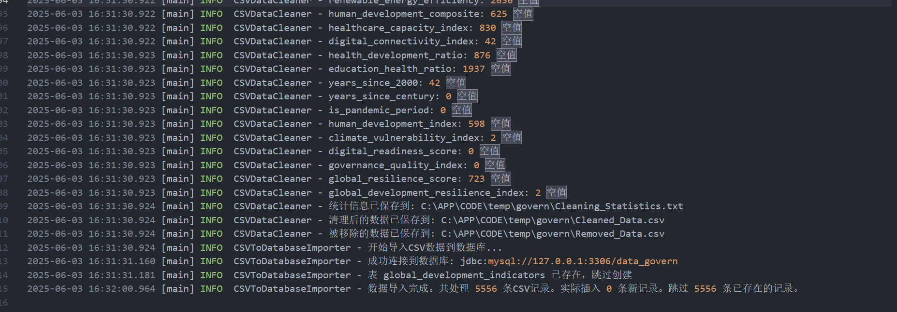

### 自己手动调整过程

#### 服务结构调整

在构建代码初期进行尝试，没有使用直接增量式的服务构建，而是使用分步骤隔离进行运行，每一步进行测试后询问下一个步骤。

因此在最后结合ai的文字提示调整几个java类的调用关系，**将三个独立运行的类合并为一个main服务分三步一次性依次调用**。

#### 依赖库的直接指定

在处理csv文件，ai不会主动使用成熟的依赖库，而是使用基本的字符串解析方法，会出现一些符号分割错误歧义。

需要在提供提示词的时候指定**使用成熟csv库的**。

#### 依赖版本老旧的问题

在ai生成中，一些依赖库比如mysql的驱动版本不一定是合适适配的，需要结合ide提示进行自己调整。

### 总结

1. DeepSeek模型幻觉较多，直接处理会对数据造成污染，对数据使用java程序进行处理较为稳妥，但需要后期人工抽样校验。
2. 日常使用deepseek经验之谈，deepseek长短期记忆使用并不可靠，在长度超出一定限制的时候，多次问答会让结果和初期要求产生偏差。最好每一步的提示词都相对隔离完善，避免LLM幻觉以及记忆偏差导致程序出错。
3. 本次实验并非从0开始构建，我的宿主机提供基本的环境配置，比如java、maven，并且我知晓基本的java项目构建模式，所以框架搭建和环境配置过程基本是单方面我做出要求甚至自己手动调整。而根据以往LLM使用的经验，由于信息的滞后性质，涉及服务器环境配置的问题，比如jdk安装、环境变量配置、服务器系统命令、软件包管理工具、构建工具安装等内容，其回答正确率不高，往往最后还是回归各大官方网站提供的文档。

