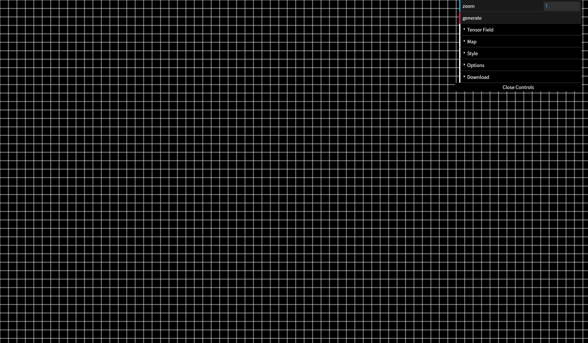
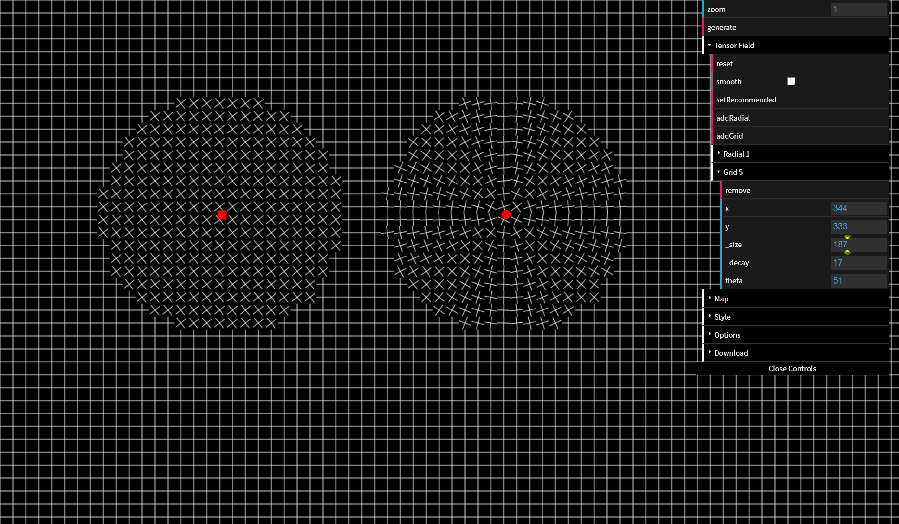
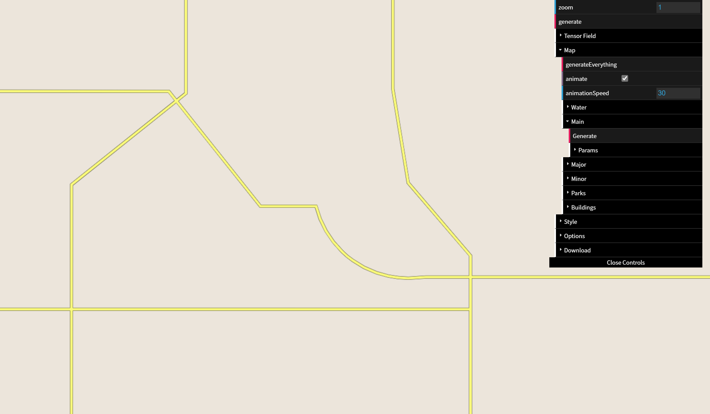
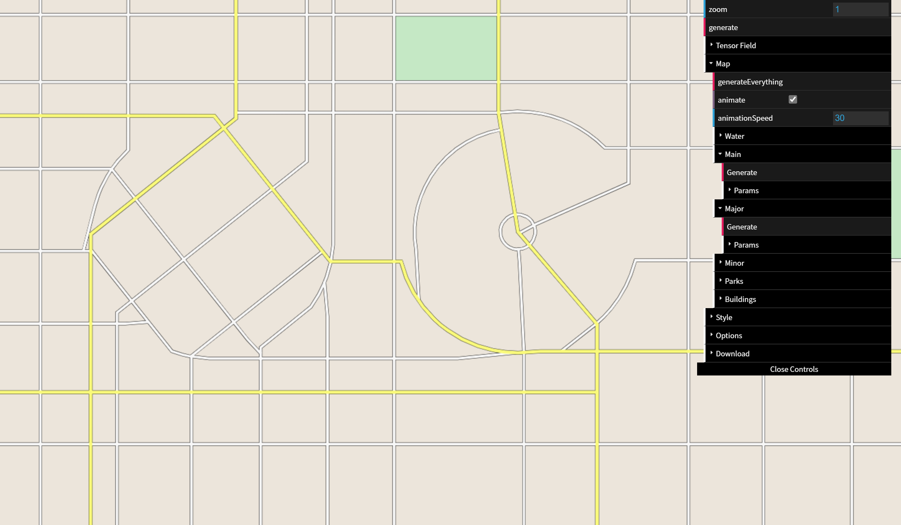
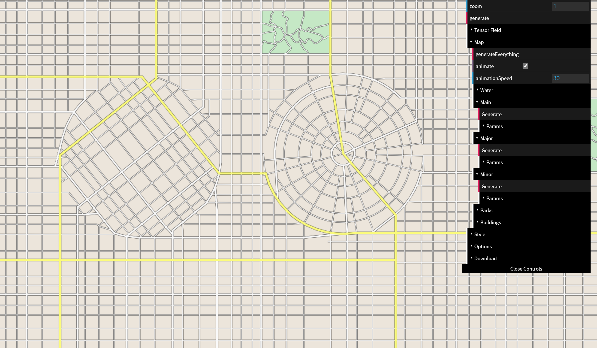
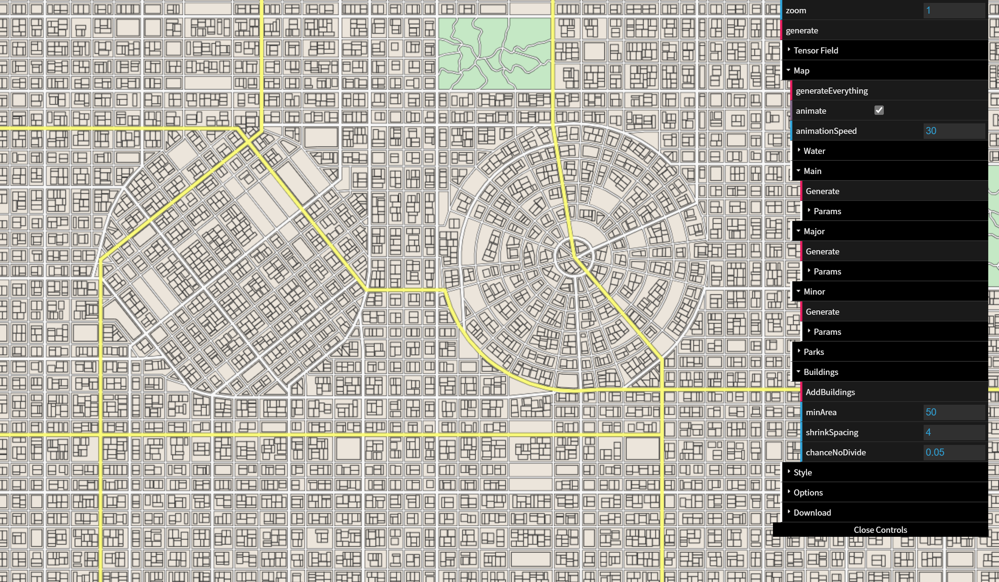
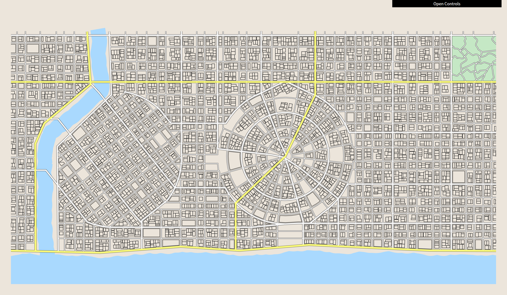

# map-generator 论文以及网站报告

## 一、生成器工作流程

1. 输入地形 / 人口密度图
2. 用户编辑张量图
3. 用户调整街道地图
4. 生成三维几何

## 张量图

张量图 = 原始图 @ 张量场

相当于给原始图做出了不同的变化，张量场就是描述原图中每一个点应该做什么变化的图。

### 张量与张量场

对于二维地图的一个点 $p$ (x, y) 定义其张量场函数 $T$

$$
T(p) = R
\begin{pmatrix}cos 2\theta & sin2\theta
\\ sin2\theta & -cos2\theta
\end{pmatrix}
$$

对于二维地图的某一个点 **$p_0$** (x, y)，其对应张量 **$t$**

$$
R \begin{pmatrix} cos2\theta&sin2\theta\\sin2\theta&-cos2\theta\end{pmatrix}
$$

根据**特征值分解**，**$t$** 可以被分解为两个特征向量（$\lambda_1 = R  \quad \lambda_2 = -R$）：

$$
major = \begin{pmatrix} cos\theta \\sin\theta\end{pmatrix}  minor = \begin{pmatrix} cos(\theta+\frac{\pi}{2}) \\ sin(\theta+\frac{\pi}{2})\end{pmatrix}
$$

其中 **$major$** 成为主特征向量（用来定义街道的“主要方向”），**$minor$** 成为次特征向量（定义“次要方向”），两个特征向量永远正交，方向上永远会形成90°夹角（会形成一个十字型符号，用于用户交互）。（以上所有 $\theta$ 均为主特征向量的方向）

# 张量场类别（1）-网格（grid）

用于生成正交的规则网络状街道（Major_eng：主街道，minor_eng：次街道）

#### 张量场函数：

$$
T(p) = e^{-d||p-p_0||^2}l\begin{pmatrix}cos2\theta&sin2\theta\\sin2\theta&-cos2\theta\end{pmatrix}
$$

#### 参数说明：

- $p_0$ ：参考点坐标（中心点）
- $e^{-d||p-p_0||}$ ：衰变常数，通过改变 $d$ 的大小来二次控制衰变速率，达到越远离中心点，张量场越小
- $l$ ：方向强度，$l = \sqrt{v_x^2+v_y^2}$ ，其中 $(v_x, v_y)$ 为初始方向向量，由用户自行指定，如果用户不指定（default）就默认为（1，1）
- $\theta$ ：主特征向量方向角，$\theta = arctan(\frac{v_y}{v_x})$

# 张量场类别（2）-径向（radial）

用于生成圆形（环形 + 放射形）道路

#### 张量场函数：

$$T(p) = e^{-d||p-p_0||^2}\begin{pmatrix}y^2-x^2&-2xy\\-2xy&-(y^2-x^2)\end{pmatrix}$$

#### 参数说明：

$x = x_p - x_0$,$y = y_p - y_0$  ：表示相对于中心点的坐标偏移

#### 生成原理：

- 原图在辐射范围内有一点$p=(a,b)$，那么他经过此张量场变换之后的点$p^`$  $=p$ @ $T(p)$
- 得：$p^`=(a(y^2-x^2)-2bxy,-2axy-b(y^2-x^2))$
- 现在我们固定一下$p^`$到$p_0$的距离，假设其距离为$k$，则$k=\sqrt{(a-x_0)^2+(b-y_0)^2}$即$k=\sqrt{x^2+y^2}$
- 根据上述式子可以化简得到$p^`$的坐标的平方和为$(a^2+b^2)k^4$，为常数
- 所以所有$p^`$所构成的点的集合为：以$p_0$为圆心，r在0至边界半径为半径的所有圆的集合

# 张量场类别（3）-边界（boundary）

用于沿自然或人造边界（海岸线、公园边界）生成平行道路

## 实现：

- 几何提取：将边界线表示为多个线段（Polyline），并分解为若干个相连的线段
- 对线段$\overline{AB}$，其方向向量$\vec{v}=\overrightarrow{AB}$
- 将方向向量$\vec{v}$分配到邻近三角形的顶点，若顶点属于多个三角形，则取平均值
- 通过插值或松弛算法（Laplacian平滑）将其平滑化
- 邻近三角形：CDT
- 拉普拉斯平滑：通过将每个顶点移动到其邻域顶点的平均位置，消除高频噪声

# 张量场类别（4）-高度场（heightfield）

用于根据地形$H(x,y)$的梯度方向生成道路，使其沿等高线或坡度分布

### 张量场函数: 

$$ 
T(p) = R \begin{pmatrix}
     cos 2\theta & sin2\theta
     \\ sin2\theta & -cos2\theta
            \end{pmatrix}
$$

### 参数说明：

- 梯度方向：$\nabla H=(\frac{\partial H}{\partial x},\frac{\partial H}{\partial y})$（主特征方向，次特征方向与梯度方向垂直） 

- 强度$R=\sqrt{(\frac{\partial H}{\partial x})^2+(\frac{\partial H}{\partial y})^2}$

# 张量场其它交互以及作用-不规则化（Irregularities）

#### 删除街道块：

- 把街道块合并
- 在正常道路上做一些小幅度的弯曲
- 其实是在下一层面，地图层面实现的这些操作

#### 层图案：

- 有一些完全没有规则的主干道添加：随机的起点与随机的终点

#### 噪声：

- 绝大部分街道都会有点歪歪扭扭，加入普林噪声来旋转或者改变张量场
- 普林噪声与街道方向扰动：
    对张量场的方向角 θ 添加Perlin噪声，生成不规则的街道布局：$θ_{noise}=θ+k⋅Perlin(x,y)$，$k$控制噪声强度，模拟现实中街道的非完全正交性

#### 裂纹（crack pattern） 

# 流线（从张量图到街道地图的工具）

## 1. 是什么

- 流线是向量场或张量场中与场方向处处相切的曲线
- 在张量场中：流线沿主或次特征向量方向生成

  $$\frac{dr}{dt}=e_{major}(r(t))$$

## 2. 流线生成算法

1. 种子点选择：  
   用户指定或系统自动生成初始点（如均匀分布或基于密度图）。
2. 方向追踪：  
   使用 Runge-Kutta 方法沿特征向量场积分：$r_{n+1}=r_n+h⋅v(r_n)$
   (*h* 为步长，*v(r_n)* 为当前点的主/次特征向量)。
3. 终止条件：
    - 流线离开定义域（如地图边界）。
    - 接近退化点（张量为零的点，方向无定义）。
    - 与已有流线的距离小于阈值 *dsep*（避免道路过密）。
    - 达到最大长度（防止无限延伸）。

## 3. 在街道建模中的应用

1. 主特征向量流线：生成主干道（Major Roads），方向由张量场主方向控制。
2. 次特征向量流线：生成次要道路（Minor Roads），与主干道正交。
3. 密度控制：通过调整种子点间距 *dsep* 实现道路密度渐变。

# 街道地图

1. **张量场编辑**：
    1. 基础场叠加：融合多个场（如网格+径向）生成复杂模式。
    2. 平滑操作：拉普拉斯平滑减少场复杂度。
    3. 拓扑编辑：增删退化点以调整交叉口布局。
    4. 笔刷工具：绘制曲线局部调整张量方向。
2. **街道图编辑**：
    1. 增删/移动道路段和顶点。
    2. 插入种子点生成新道路。
    3. 处理不连续区域（对称/非对称裁剪）。

# 三维几何生成（一）

**1. 从2D街道网络到3D几何的转换**

**输入**：2D街道图 G=(V,E)（节点为交叉口，边为街道段）。

**输出**：带有道路、交叉口、地块和建筑物的3D模型。

**(1) 道路几何生成**

- **横截面模板**：
    每条街道边关联一个参数化横截面模板，定义车道、人行道、绿化带等：
    - **主干道**：宽车道（如双向六车道）、绿化隔离带。
    - **次干道**：窄车道（如双向两车道）、简易人行道。
- **参数化控制**：
    用户可调整宽度、材质、路缘石高度等属性。

**(2) 交叉口建模**

- **自动拓扑连接**：
    根据街道类型（主/次）和交通规则生成交叉口几何：
    - 车道连接：主路车道优先延伸，次路车道平滑过渡。
    - 交通标志：添加斑马线、转向箭头、红绿灯。
- **模板化设计**：
    预定义交叉口模板（如十字形、T形），适配不同街道宽度。

**(3) 地块与建筑生成**

- **地块划分**：
    街道网络闭合形成的多边形区域作为地块（Parcels）。
- **程序化建筑**：
    使用形状语法（Shape Grammar）生成建筑：
    - 参数控制：高度、屋顶类型、立面风格。
    - 约束条件：地块面积、日照方向、容积率。

# 三维几何生成（二）

**2. 地形与街道的融合**

- **高度场适配**：
    - 道路网格顶点根据地形高程（Heightfield）调整垂直坐标。
    - 坡度限制：避免道路倾斜度过大（如通过拉普拉斯平滑地形）。
- **自适应路网**：
    陡坡区域生成盘山道路或阶梯（需扩展张量场约束）。

**3. 用户交互与细节控制**

- **实时编辑**：
    - 直接拖动3D道路顶点调整几何。
    - 刷取工具修改局部材质（如石板路 vs. 沥青路）。
- **约束优化**：
    - 物理约束：车辆转弯半径限制交叉口锐角。
    - 视觉约束：强制建筑对齐街道或避免遮挡。

# Generator演示

# 演示二-TensorField

先编辑张量图，有两个操作 addGrid 和 addRadial，参数如下：

- **x, y**：中心参考点坐标
- **size**：辐射大小
- **decay**：衰变系数 d
- **theta**：初始方向向量夹角

# 演示三-Map层编辑

1. **Water**：直接生成一滩水和利用边界算法生成一个主干道。
2. **Main**、**Major**、**Minor**：编辑主路和次路。
3. **Parks**：生成公园区域。
4. **Buildings**：生成建筑物。

# 演示三-Map-Main：生成主路中的主干道

合理猜测（论文未提及）：种子随机+主特征向量流线

# 演示三-Map-Major：生成主路，同时生成parks

# 演示三-Map-Minor：生成次路

# 添加建筑物

论文提及但未实现：Brush操作和一些用户自行合并等操作没有在generator中实现出来、3D建模细节没有实现

