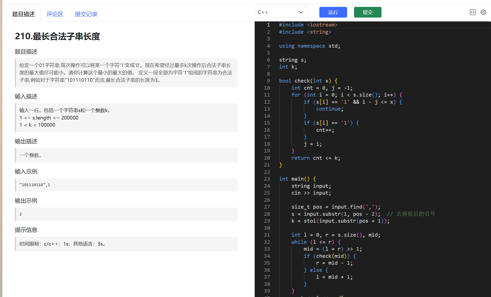

# 场景问题

## 背包问题

### 场景

背包道具持久化时机，为什么不能退出/掉线的时候进行持久化

## 内存一致性问题

### 场景

嗯，我现在需要解决的是两个内存区域保持数据一致性的问题。用户提到之前的方法是让两个内存块都持有指向同一块内存的指针，但这种方法可能有问题。我得仔细想想为什么这个方案欠妥，然后找一个更完善的解决方案。
首先，原来的方案是两个内存块都有指针指向同一个地方。假设这两个指针都指向同一个对象，那么当修改那个对象时，这两个指针指向的内容自然都会变，对吧?但可能用户遇到的问题不是这样，可能这两个指针本身被修改了，比如重新指向其他地方，这样就会导致两个内存块中的指针不再同步。比如，假设内存块A和B各自保存-个指针，指向同一个数据对象。如果通过内存块A的指针修改了数据，那么通过B的指针访问时，数据应该已经改变，这没问题，但如果其中一个指针被重新指向另一个地址，另一个指针并不会跟着变，这时候两个内存块中的指针就不一致了。这可能就是原方案的缺陷,

### 解决

问题在于：**两个内存块只是各自保存了一个指针，这两个指针本身是独立的**。一旦有一方把自己的指针指向了新的内存区域，另一方并不会感知到这种变化，导致数据不一致。

#### 主要问题


- 指针本身的变动不会同步。
- 只同步了“内容”，没有同步“指向关系”。

#### 1. 使用“间接指针”或“指针的指针”

让两个内存块都持有**指向同一个指针的指针**（即二级指针），这样只要这个指针被修改，所有持有指针的地方都能感知到变化。

**示例：**
```cpp

int *data = new int(42);   // 实际数据
int **pA = &data;          // A持有指向data的指针的指针
int **pB = &data;          // B也持有指向data的指针的指针

// 修改指针指向
* pA = new int(100);       // 改变指针指向
// 此时pB看到的也是新地址

// 访问数据
std::cout << **pA << std::endl;
std::cout << **pB << std::endl;

```

#### 2. 使用智能指针（如 `std::shared_ptr`）

C++11 及以上推荐用 `std::shared_ptr`，这样多个对象可以共享同一份数据和生命周期管理。

**示例：**
```cpp
int main() {
    auto data = std::make_shared<int>(42);
    std::shared_ptr<int> a = data;
    std::shared_ptr<int> b = data;

    // 修改数据
    *a = 100;

    std::cout << *a << std::endl; // 100
    std::cout << *b << std::endl; // 100

    // 如果要让a和b都能感知“指向对象”的变化，可以用shared_ptr<shared_ptr<T>>
    // 但一般业务场景下，直接共享数据即可
    return 0;
}

```


# 背包问题

https://www.hello-algo.com/chapter_dynamic_programming/knapsack_problem/


1.  **0-1 背包问题 (0-1 Knapsack Problem)**:
    *   **特点**: 每种物品只有一件，对于每件物品，你可以选择**放**入背包或者**不放**。
    *   **目标**: 在不超过背包总容量的前提下，使得放入背包的物品总价值最大。
    *   **关键**: 每件物品只有两种状态（选或不选），不能分割。

2.  **完全背包问题 (Unbounded Knapsack Problem)**:
    *   **特点**: 每种物品有无限件（或者说数量足够多），对于每件物品，你可以选择**不放**，或者**放一件**，或者**放多件**。
    *   **目标**: 在不超过背包总容量的前提下，使得放入背包的物品总价值最大。
    *   **关键**: 每种物品可以重复选择。

3.  **多重背包问题 (Bounded Knapsack Problem / Multiple Knapsack Problem)**:
    *   **特点**: 每种物品有固定的件数（例如，物品 A 有 3 件，物品 B 有 5 件）。对于每种物品，你可以选择**不放**，或者**放 k 件**（k 不超过该物品的总件数）。
    *   **目标**: 在不超过背包总容量的前提下，使得放入背包的物品总价值最大。
    *   **关键**: 每种物品有数量上限。

4.  **分组背包问题 (Group Knapsack Problem)**:
    *   **特点**: 物品被分成若干组，每组中的物品是互斥的，即每组中**最多只能选择一件**物品放入背包。
    *   **目标**: 在不超过背包总容量的前提下，使得放入背包的物品总价值最大。
    *   **关键**: 同一组内的物品相互竞争。

## 动态规划

对于背包问题，通常会定义一个 `dp` 数组（或表），其中 `dp[i][w]` 或 `dp[w]` 表示在某种约束条件下（例如，考虑前 `i` 个物品，当前背包容量为 `w` 时）可以获得的最大价值。

### 0-1 背包问题

#### 基本思路

逆序、表结构max取值

当前考虑的物体的容量独立占用，剩余容量留给上一物体进行查询表，找出在这个剩余容量下的最大价值+放入当前物体的质量，然后和不放当前物体的当前容量的最大价值也就是正上方的值

使用一维数组是因为要在计算放入当前物体的剩余容量的最大价值的时候，其位于数组前方，属于上一行的值；当前考虑物体之后的值就是属于更新后当前行的值。如果是顺序就会把上一行的值-位于数组前部的数据都给更新了，放入当前物品后的剩余价值的

回溯的时候，因为价值是**大于**才会放入，则放入的时候，价值一定会变换。同一列如果价值不变，则不放入；如果价值增大，则放入，往上回溯的时候，减去当前物体的容量进行回溯。

#### 二维数组

*   **定义状态**: `dp[i][w]` 表示从前 `i` 个物品中选择，放入容量为 `w` 的背包中所能获得的最大总价值。
*   **状态转移方程**: 对于第 `i` 个物品，有两种选择：
*   **不放入背包**：最大价值与只考虑前 `i-1` 个物品，容量仍为 `w` 时相同，即 `dp[i-1][w]`。
*   **放入背包**（前提是当前背包容量 `w` 大于等于物品 `i` 的重量 `weight[i]`）：最大价值为物品 `i` 的价值 `value[i]` 加上从前 `i-1` 个物品中选择，放入剩余容量为 `w - weight[i]` 的背包中所能获得的最大价值，即 `value[i] + dp[i-1][w - weight[i]]`。
因此，`dp[i][w] = max(dp[i-1][w], value[i] + dp[i-1][w - weight[i]])` (如果 `w >= weight[i]`)。
如果 `w < weight[i]`，则 `dp[i][w] = dp[i-1][w]`。

#### 一维数组-优化

可以使用一维数组 `dp[w]` 进行空间优化。此时，遍历物品的循环在外层，遍历背包容量的循环在内层，并且容量的遍历需要**从大到小（逆序）**，以保证在计算 `dp[w]` 时，`dp[w - weight[i]]` 存储的是上一轮（即不包含当前物品 `i`）的结果。
	`dp[w] = max(dp[w], value[i] + dp[w - weight[i]])` (对于每个物品 `i`，`w` 从 `max_weight` 遍历到 `weight[i]`)。

### 完全背包问题

#### 个人思路

##### 区分0-1以及计算过程

由于物体没有数量限制，在放入物品，查询剩余容量最大价值的时候，不是去找上一行（上一个物体所在行价值），而是在本行查询剩余容量的最大价值

但是并不是说，背包无法做到多种物品组合，其与上一行比较取最大值，会不断继承传递当前背包容量的最佳组合方式，也就是说上一行的价值可能来自上上或者其它之前层级的物品，也会参与到本行的求和价值计算。

##### 优化

容量是从小到大遍历，因为是放入物品取同一行(即是说同一个物品)比较，所以需要让左侧（容量更小）内容为同一级别物品的最优价值

##### 回溯

不放-》上一行，同容量。

再对比放入，然后查询同一行剩余容量价值+放入价值能佛符合当前价值。

如果放入就转移到同一行的剩余价值位置，因为同一个物品可能放入多个。


#### 实际计算伪代码

*   **定义状态**: `dp[i][w]` 表示从前 `i` 种物品中选择（每种物品可以选无限件），放入容量为 `w` 的背包中所能获得的最大总价值。
*   **状态转移方程**: 对于第 `i` 种物品，可以选0件、1件、2件...直到背包装不下为止。
	*   **不选第 `i` 种物品**：`dp[i-1][w]`。
	*   **选至少一件第 `i` 种物品**（前提 `w >= weight[i]`）：`value[i] + dp[i][w - weight[i]]`。注意这里是 `dp[i][...]` 而不是 `dp[i-1][...]`，因为我们选了第 `i` 种物品后，仍然可以继续选第 `i` 种物品来填充剩余容量 `w - weight[i]`。
	因此，`dp[i][w] = max(dp[i-1][w], value[i] + dp[i][w - weight[i]])` (如果 `w >= weight[i]`)。
*   **优化**: 同样可以使用一维数组 `dp[w]`。与0-1背包不同的是，遍历背包容量的循环需要**从小到大（正序）**。这是因为 `dp[w - weight[i]]` 需要反映的是本轮（包含当前物品 `i`）的结果，允许重复选取当前物品。
	`dp[w] = max(dp[w], value[i] + dp[w - weight[i]])` (对于每个物品 `i`，`w` 从 `weight[i]` 遍历到 `max_weight`)。

### 多重背包问题

#### 个人思路

不过是物品数量存在上限，意味着可以拆为多个01物品即可，只不过质量和价值一样。

二进制拆分后的新物品列表：

**什么是2的幂次方？** 任何一个正整数都可以用二进制表示。也就说可以用这几个拆分后的数组合出来0至当前物品数量上限的任何数字。只需要放心对每一个2进制拆分之后的物品进行01背包问题即可。

|原始物品|数量 (s)|拆分后的新“物品”|重量 (w')|价值 (v')|
|:--|:--|:--|:--|:--|
|物品A|7|1件A|1wA​|1vA​|
|||2件A|2wA​|2vA​|
|||4件A|4wA​|4vA​|
|物品B|5|1件B|1wB​|1vB​|
|||2件B|2wB​|2vB​|
|||2件B（剩余 5−1−2=2 件）|2wB​|2vB​|

#### 伪代码描述

1.  **转化为0-1背包**：如果物品 `i` 有 `count[i]` 件，可以将它看作 `count[i]` 件独立的、但属性（重量和价值）相同的0-1背包物品。然后用0-1背包的方法求解。这种方法简单直观，但如果物品数量很大，效率较低。
2.  **二进制优化**：可以将数量为 `count[i]` 的物品 `i` 拆分成数量为 `1, 2, 4, ..., 2^k` 以及 `count[i] - (2^(k+1)-1)` 的若干件物品（其中 `2^k` 是小于 `count[i]` 的最大2的幂）。这样，通过组合这些拆分出来的物品，可以凑出 `0` 到 `count[i]` 之间的任意数量。然后对这些拆分后的物品做0-1背包。这种方法能显著减少物品数量。


### 分组背包问题-每组一个

#### 个人思路

由物品分-》按组分，还是逆序，逐个比较剩余容量最优价值+放入物品，只不过最优价值是不放入当前组任何一个物品的最有价值，放入当前组物品也会需要额外遍历，每一个容量下可以放入的组内物品都需要比较，取max。
#### 算法伪代码（一维数组）

*   **定义状态**: `dp[w]` 表示容量为 `w` 的背包所能获得的最大总价值。
*   **状态转移方程**: 物品被分成了若干组。对于每一组，我们最多只能选择其中的一件物品。
	遍历每一组物品：
	`for each group g:`
		`for w from max_weight down to 0:  // 容量必须逆序遍历`
			`for each item k in group g:`
				`if w >= weight[k]:`
					`dp[w] = max(dp[w], dp[w - weight[k]] + value[k])`
*   **解释**: 外层循环遍历组。对于每一组，我们考虑将该组中的某一个物品放入背包。容量 `w` 的逆序遍历是为了确保对于当前组 `g`，当我们考虑是否放入物品 `k` (属于组 `g`) 时，`dp[w - weight[k]]` 的值是基于之前组别（不包含组 `g` 中任何物品）计算得到的，或者是不选当前组 `g` 中任何物品时的值。这样就保证了每组最多只选一个物品。

#### 分步描述

##### 分组背包问题：定义

想象一下，你又来打包你的旅行背包了，容量依然有限。但这次，你面前的物品不再是零散的个体，而是分成了**很多组**。每组里有几件物品，但你有一个新的规矩：**对于每一组物品，你最多只能从中选择一件物品放入背包。** 你仍然希望在不超过背包总容量的前提下，让背包里的物品总价值最高。

这就是**分组背包问题**的核心。

**具体来说：**

1. 你有一个背包，它的**最大承重是 W**。
2. 你有 N **组**物品。
3. 每组物品 i 中，包含若干件物品。假设第 i 组有 ki​ 件物品。
4. 第 j 件物品（在第 i 组中）有其**重量 wij​** 和**价值 vij​**。
5. 你的目标是：在不超过背包总容量 W 的前提下，从每组中**最多选择一件**物品放入背包，使得背包中所有物品的**总价值最大**。


##### 核心特点与区别

在理解分组背包之前，我们回顾一下其他背包问题的核心特点：

- **01 背包：** 每件物品只有一件，要么选要么不选。物品之间是独立的。
- **完全背包：** 每件物品可以无限次选择。物品之间是独立的。
- **多重背包：** 每件物品有有限的数量限制。物品之间是独立的，但每种物品内部有限制。
- **分组背包：** 物品被分成了若干组。**组内物品互斥，你只能从同一组中选择一件物品（或不选任何一件）。**不同组的物品之间是独立的。


##### 形象化计算过程（动态规划思路）

分组背包问题的动态规划思路非常类似于01背包问题，但需要在处理“当前物品”时进行巧妙的调整。我们将使用一个一维数组来优化空间。

**1. 定义 `dp[j]` 数组：**

- `dp[j]` 表示在**考虑了前面所有组**的物品后，背包容量为 `j` 时所能达到的**最大价值**。

**2. 初始化 `dp` 数组：**

- 将 `dp` 数组所有值初始化为 0。
- `dp[0]` 显然是 0（背包容量为 0，最大价值也是 0）。

**3. 逐组处理物品：**

- 我们从第一组开始，**依次处理每一个物品组**。

**4. 遍历背包容量（从大到小）：**

- 对于当前正在处理的组，我们需要遍历背包的**所有可能的容量 j**。
- 这个遍历方向是**从 `max_weight` （最大承重）递减到 0**。
    - **为什么从大到小？** 这是为了确保在计算 `dp[j]` 时，`dp[j - current_item_weight]` 引用的值是**尚未包含当前组内任何物品**的最优解。如果从左到右，`dp[j - current_item_weight]` 可能已经被当前组的其他物品（或者当前物品自身，这是我们不希望的）更新过，从而导致同一组内的物品被重复选择。

**5. 遍历组内物品并决策：**

- 对于当前容量 `j`，以及当前正在处理的组 `i`，我们遍历组 `i` 中的**每一件物品 `k`**。
    
- 设组 `i` 中的第 `k` 件物品的重量是 `w_ik`，价值是 `v_ik`。
    
- 对于这件物品 `k`，我们做出决策：
    
    - **选择物品 `k`：** 如果背包容量 `j` 足够装下物品 `k` (`j >= w_ik`)，那么选择物品 `k` 后的价值是 `v_ik` 加上**在考虑了前 `i-1` 组物品后**，剩余容量 `j - w_ik` 所能达到的最大价值。
    - **不选择物品 `k` (也不选择组内其他物品)：** 保持当前 `dp[j]` 的值（这个值代表了在考虑前 `i-1` 组物品后的最优解）。
- **更新 `dp[j]`：**
    
    - 在处理当前组 `i` 时，对于每个容量 `j`，我们会在不选择当前组任何物品的价值（即 `dp[j]` 当前的值）和选择当前组中某个物品的价值 (`dp[j - w_ik] + v_ik`) 之间取最大值。
    
    Python
    
    ```
    # 伪代码：
    dp = [0] * (max_weight + 1) # 初始化dp数组
    
    for current_group in all_groups: # 遍历每一个物品组
        # 从 max_weight 到 0 遍历容量
        for j in range(max_weight, -1, -1):
            # 遍历当前组中的所有物品 (item_weight, item_value)
            # 在这里，我们实际上是尝试用当前组的每一个物品来“替换”
            # 或者“更新”dp[j]的值，如果这个物品能带来更大的价值。
            for item_weight, item_value in current_group:
                if j >= item_weight:
                    # 更新 dp[j]。这里的 dp[j - item_weight] 
                    # 确保是“处理当前组之前的状态”的值，因为它位于 j 的左侧
                    # 并且 j 是从大到小遍历的，所以不会被当前组的其他物品影响。
                    dp[j] = max(dp[j], dp[j - item_weight] + item_value)
    ```
    

**6. 最终结果：**

- 当所有组都处理完毕后，`dp[max_weight]` 中的值就是最终的最大总价值。


##### 复杂度分析

- **时间复杂度：** $O(N \cdot W \cdot \text{max_group_size})$
    - N: 物品组的数量。
    - W: 背包的最大承重。
    - `max_group_size`: 最大组的物品数量。
- **空间复杂度：** O(W)
    - 我们只使用了一个一维数组 `dp`，其大小与背包容量相关。

分组背包问题是背包问题系列中一个常见的变体，理解其核心在于如何处理“组内互斥”的约束，并将其巧妙地融入到动态规划的状态转移方程中。

### 其它变体

每一组可以选多个/每一个又可能无限/有可能每一个有限

# 最长合法字串长度（马场）



## 题目

### 题目提取

**问题名称:** 210. 最长合法子串长度

题目描述:

给定一个由 '0' 和 '1' 组成的字符串 s 和一个整数 k。每次操作可以将字符串中的一个字符 '1' 变成 '0'。你的目标是进行最多 k 次操作，使得操作后字符串中仅由 '1' 组成的最长连续子串的长度尽可能小。请你计算这个最小化的最长长度。

输入格式:

一行输入，包含一个由逗号分隔的字符串 s 和整数 k。

- `1 <= s.length <= 200000`
- `1 <= k <= 100000`

输出格式:

一个整数，表示经过操作后，最长的 '1' 连续子串的最小可能长度。

**示例:**

- **输入:** `"10110110",1`
- **输出:** `2`

### 简要解答

这是一个典型的“最小化最大值”问题，通常采用**二分答案**的思路来解决。代码的核心思想如下：

1. **二分查找答案:** 最终答案（最小的最长 '1' 串长度）一定在 `0` 到字符串总长度 `s.length()` 的范围内。我们可以对这个长度 `x` 进行二分查找，来找到满足条件的最小的 `x`。
    
2. **验证函数 `check(x)`:** 对于二分查找的每一个候选答案 `x`，我们需要一个函数 `check(x)` 来判断：**是否可以通过最多 `k` 次操作，使得所有连续 '1' 串的长度都小于或等于 `x`？**
    
3. **`check(x)` 的贪心策略:**
    
    - 这个验证过程可以通过贪心算法实现。我们从左到右遍历字符串。
    - 我们维护一个计数器，记录当前连续 '1' 的长度。
    - 当遇到 '0' 时，连续的 '1' 被中断，计数器归零。
    - 当连续 '1' 的长度即将超过 `x` 时（即达到 `x+1`），我们必须进行一次操作（将这个第 `x+1` 个 '1' 变为 '0'）来打破这个长串。这样操作次数加一，同时将当前连续 '1' 的长度计数器归零。
    - 遍历完整个字符串后，如果总操作次数小于或等于 `k`，说明长度 `x` 是一个可行的目标，`check(x)` 返回 `true`。否则，返回 `false`。
4. **结合二分与验证:**
    
    - 在二分查找中，如果 `check(mid)` 为 `true`，意味着长度 `mid` 是可能实现的，我们应该尝试寻找更小的值，因此将搜索区间的右边界缩小（`r = mid - 1`）。
    - 如果 `check(mid)` 为 `false`，意味着长度 `mid` 太小了，用 `k` 次操作无法达成目标，必须放宽限制，将搜索区间的左边界扩大（`l = mid + 1`）。
    - 二分查找的最终结果就是本题的答案。
