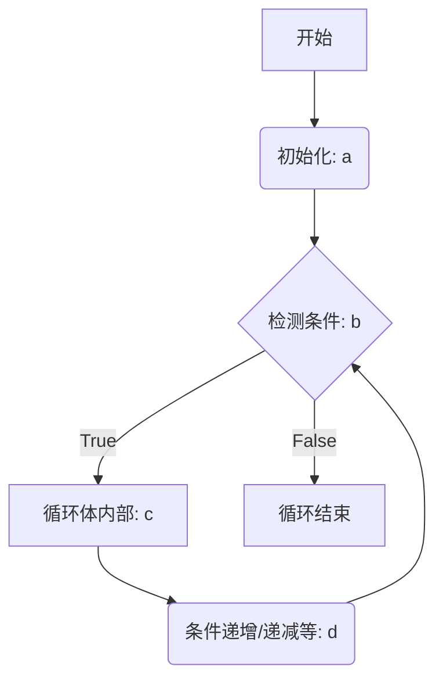

# 基础语法

## for循环

### for循环执行顺序

```cpp
for(a;b;d)
{ 
   std::cout<<"hello world"<<"step c"<<std::endl;
}
```

执行顺序如下


```mermaid
graph TD
	A[开始] --> B(初始化: a);
	B --> C{检测条件: b};
	C -- True --> D[循环体内部: c];
	D --> E(条件递增/递减等: d);
	E --> C;
	C -- False --> F[循环结束];
```