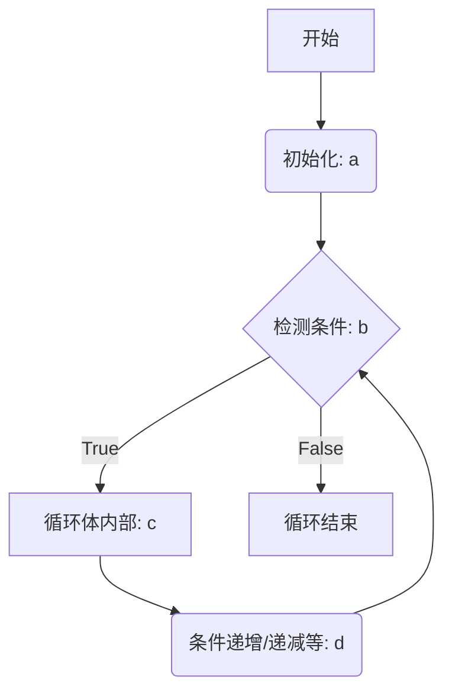

# 基础语法

## for循环

### for循环执行顺序

```cpp
for(a;b;d)
{ 
   std::cout<<"hello world"<<"step c"<<std::endl;
}
```

执行顺序如下



# 常见io处理

好的，我们来解释一下这段加速 I/O 的代码以及 C++ 中常见的处理输入的方法和函数。

## 加速 I/O 代码解释

```cpp
// ...existing code...
int main() {
    // 加速 C++ IO
    std::ios_base::sync_with_stdio(false);
    std::cin.tie(NULL);

    std::string line;
    std::getline(std::cin, line); // 读取整行输入

    ParsedInput input = parseInput(line);
// ...existing code...
```

1.  **`std::ios_base::sync_with_stdio(false);`**
    *   **作用**：这条语句用来解除 C++ 标准流 (`std::cin`, `std::cout` 等) 与 C 标准流 (`stdio` 系列函数如 `scanf`, `printf` 等) 之间的同步。
    *   **背景**：默认情况下，为了兼容性，C++ 的 I/O 流与 C 的 I/O 流是同步的。这意味着每次 C++ 流进行操作时，它可能会刷新 C 流的缓冲区，反之亦然。这种同步会带来额外的开销，尤其是在大量输入输出操作时，会显著降低程序速度。
    *   **效果**：将其设置为 `false` 后，C++ 流将使用自己独立的缓冲区，不再与 C 流同步，从而提高 I/O 效率。
    *   **注意**：一旦调用了 `std::ios_base::sync_with_stdio(false);`，就不应该再混合使用 C++ 流 (`cin`/`cout`) 和 C 风格的 I/O (`scanf`/`printf`)。如果混合使用，可能会导致输出顺序混乱或输入读取不正确。在竞赛编程中，通常只使用一种风格的 I/O。

2.  **`std::cin.tie(NULL);`** (或者 `std::cin.tie(nullptr);`)
    *   **作用**：这条语句用来解除 `std::cin` 与 `std::cout` 之间的绑定。
    *   **背景**：默认情况下，`std::cin` 是与 `std::cout` 绑定的。这意味着在每次执行输入操作 (例如使用 `std::cin >> variable;`) 之前，`std::cout` 的缓冲区会被自动刷新 (flush)。这样做是为了确保在用户输入之前，所有程序已经产生的提示信息（例如 "请输入一个数字："）都已经被显示出来，这在交互式程序中是很有用的。
    *   **效果**：将其设置为 `NULL` (或 `nullptr`) 后，`std::cin` 不再强制刷新 `std::cout`。在非交互式、需要大量快速 I/O 的场景（如竞赛编程），这种自动刷新是不必要的开销。解除绑定可以避免这些不必要的刷新，从而提高速度。
    *   **注意**：如果你的程序确实需要在输入前确保某些输出已经被显示（例如，打印提示信息后等待用户输入），那么解除绑定后，你可能需要手动调用 `std::cout << std::flush;` 或在输出后使用 `std::endl` (它除了换行也会刷新缓冲区) 来确保输出及时显示。但在竞赛中，通常输出是一次性的，或者对实时交互性要求不高。

**总结**：这两行代码是竞赛编程中常用的优化手段，用于在处理大量输入输出时显著提升程序的运行速度。

## 常见的处理输入的方法以及函数

C++ 提供了多种处理输入的方式，主要通过 `<iostream>` 头文件中的 `std::cin` 对象。

1.  **使用 `>>` 操作符 (提取操作符)**
    *   **用法**：`std::cin >> variable1 >> variable2 >> ...;`
    *   **特点**：
        *   这是最常用的读取格式化输入的方法。
        *   它会跳过输入流中开头的空白字符（空格、制表符、换行符等）。
        *   然后根据变量的类型读取并转换数据。
        *   当遇到不符合变量类型的数据或下一个空白字符时，读取停止。
    *   **示例**：
        ```cpp
        int age;
        double salary;
        std::string name;
        std::cout << "请输入年龄、薪水和名字 (用空格分隔): ";
        std::cin >> age >> salary >> name; 
        // 输入: 25 5000.50 Alice
        // age 会是 25, salary 会是 5000.5, name 会是 "Alice"
        ```
    *   **读取单个字符**：`char ch; std::cin >> ch;` (会跳过空白)
    *   **读取字符串**：`std::string s; std::cin >> s;` (会以空白字符为分隔符，只读取一个单词)

2.  **`std::getline(std::istream& is, std::string& str, char delim = '\n')`**
    *   **用法**：`std::getline(std::cin, line_string);` 或 `std::getline(std::cin, line_string, delimiter_char);`
    *   **特点**：
        *   用于读取一整行输入，直到遇到换行符 `\n` (默认) 或指定的分隔符 `delim`。
        *   换行符或分隔符会从输入流中被读取并丢弃，但不会存储在 `str` 中。
        *   它不会跳过行首的空白字符。
    *   **示例**：
        ```cpp
        std::string fullName;
        std::cout << "请输入全名: ";
        std::getline(std::cin, fullName); 
        // 输入: John Doe Smith
        // fullName 会是 "John Doe Smith"

        std::string data;
        std::cout << "请输入以逗号分隔的数据: ";
        std::getline(std::cin, data, ','); 
        // 输入: part1,part2,rest
        // 第一次调用后 data 会是 "part1"
        ```
    *   **与 `std::cin >> std::string` 的区别**：`std::cin >> s;` 只读取到第一个空白字符，而 `std::getline` 读取一整行或直到指定分隔符。
    *   **常见陷阱**：如果在 `std::cin >> some_variable;` 之后立即使用 `std::getline(std::cin, line);`，可能会遇到问题。因为 `>>` 操作符会把换行符留在输入缓冲区中，`std::getline` 读到的第一个字符就是这个换行符，导致读到空行。解决方法是在两者之间使用 `std::cin.ignore()` 来清除缓冲区中残留的换行符：
        ```cpp
        int num;
        std::cin >> num;
        std::cin.ignore(std::numeric_limits<std::streamsize>::max(), '\n'); // 忽略掉 num 后面的换行符
        std::string line_after_num;
        std::getline(std::cin, line_after_num);
        ```

3.  **`std::cin.get()` 系列函数**
    *   **`int std::cin.get()`**: 读取单个字符（包括空白字符），并将其作为 `int` 返回。如果到达文件末尾，返回 `EOF`。
        ```cpp
        char c1 = std::cin.get(); 
        ```
    *   **`std::istream& std::cin.get(char& ch)`**: 读取单个字符（包括空白字符）并存入 `ch`。返回对 `std::cin` 的引用。
        ```cpp
        char c2;
        std::cin.get(c2);
        ```
    *   **`std::istream& std::cin.get(char* s, std::streamsize n, char delim = '\n')`**: 读取最多 `n-1` 个字符到字符数组 `s` 中，或者直到遇到分隔符 `delim`。分隔符不会被读取到 `s` 中，但会留在输入流中。会在 `s` 的末尾添加空字符 `\0`。
        ```cpp
        char buffer[100];
        std::cin.get(buffer, 100); // 读取一行到 buffer，最多99个字符
        ```

4.  **`std::cin.read(char* s, std::streamsize n)`**
    *   **用法**：`std::cin.read(buffer, count);`
    *   **特点**：用于读取固定数量 `n` 个字符到字符数组 `s` 中，不关心内容是否是空白或分隔符，也不会自动添加空终止符。主要用于二进制输入或需要精确控制读取字节数的场景。
    *   可以通过 `std::cin.gcount()` 获取实际读取的字符数。

5.  **检查输入状态**
    *   `std::cin.good()`: 如果流处于良好状态，返回 `true`。
    *   `std::cin.fail()`: 如果发生可恢复的错误（如格式不匹配），返回 `true`。流仍然可用，但需要清除错误状态 (`std::cin.clear()`) 并可能忽略错误输入 (`std::cin.ignore()`)。
    *   `std::cin.bad()`: 如果发生不可恢复的错误（如读取错误），返回 `true`。
    *   `std::cin.eof()`: 如果到达文件末尾，返回 `true`。
    *   可以直接在条件语句中使用 `std::cin` 对象本身来判断状态：`if (std::cin)` 等价于 `if (!std::cin.fail())`。
        ```cpp
        int val;
        while (std::cin >> val) { // 当输入成功时循环
            // 处理 val
        }
        // 循环结束可能是因为到达文件末尾或输入了非整数
        if (std::cin.eof()) {
            // 到达文件末尾
        } else if (std::cin.fail()) {
            std::cout << "输入错误!\n";
            std::cin.clear(); // 清除错误标志
            std::cin.ignore(std::numeric_limits<std::streamsize>::max(), '\n'); // 忽略错误行
        }
        ```

在你的代码中，`std::getline(std::cin, line);` 用于读取包含字符串和整数 `k` 的整行输入，这是合适的，因为输入格式是 `"string_val",int_val`，其中 `string_val` 本身不包含逗号，但整行输入作为一个单元进行解析更方便。

你提出的问题非常好，涉及到 C++ I/O 流中缓冲区的刷新机制和流操纵符 (manipulators) 的概念。

### `std::endl` 是什么操作？

`std::endl` 是一个定义在 `<ostream>` 头文件中的**流操纵符 (manipulator)**。当你执行 `std::cout << std::endl;` 时，它会执行两个操作：

1.  **插入一个换行符 (`\n`)**：它向输出流 `std::cout` 中写入一个换行符，使得后续的输出会从新的一行开始。
2.  **刷新输出缓冲区 (Flush the buffer)**：它会强制将与 `std::cout`关联的输出缓冲区中的所有内容立即发送到最终的目的地（通常是控制台屏幕）。

**示例：**
```cpp
std::cout << "第一行";
std::cout << std::endl; // 输出 "第一行"，然后换行，并刷新缓冲区
std::cout << "第二行";
```
输出：
```
第一行
第二行
```

### `std::flush` 是什么操作？

`std::flush` 也是一个定义在 `<ostream>` 头文件中的**流操纵符 (manipulator)**。当你执行 `std::cout << std::flush;` 时，它只执行一个操作：

1.  **刷新输出缓冲区 (Flush the buffer)**：它会强制将与 `std::cout` 关联的输出缓冲区中的所有内容立即发送到最终的目的地。它**不会**插入换行符。

**示例：**
```cpp
std::cout << "正在处理... "; // 输出 "正在处理... "，但不换行
std::cout << std::flush;    // 确保 "正在处理... " 立即显示出来
// ... 假设这里有一些耗时操作 ...
std::cout << "完成！\n";    // 输出 "完成！" 并换行
```
输出可能是（"正在处理..." 会立即出现，然后过一段时间出现 "完成！"）：
```
正在处理... 完成！
```
如果省略 `std::cout << std::flush;`，并且后续没有 `std::endl` 或其他刷新操作，那么 "正在处理... " 可能会一直留在缓冲区中，直到程序结束或缓冲区满了才显示，这在需要实时反馈的场景下是不希望看到的。

## 标准库的io函数介绍
### 为什么 `std::flush` (和 `std::endl`) 是“传入”到 `std::cout` 中的？(流操纵符的工作原理)

`std::flush` 和 `std::endl` 看起来像是被“传入”到 `std::cout`，这是因为它们是**流操纵符 (manipulators)**，并且 C++ 的 `<<` (输出操作符或插入操作符) 被重载以接受这些操纵符。

**工作原理简述：**

1.  **函数指针或函数对象**：像 `std::endl` 和 `std::flush` 这样的操纵符，实际上是特殊类型的函数（或者更准确地说，它们是返回特定函数指针的函数，或者本身就是可以被流调用的函数对象）。这些函数接受一个输出流对象 (如 `std::ostream&`) 作为参数，并返回该流对象的引用。

2.  **操作符重载**：`std::ostream` 类 (`std::cout` 是其实例) 重载了 `operator<<`，使其可以接受这种特定签名的函数指针或函数对象。

3.  **调用机制**：当你写 `std::cout << std::flush;` 时：
    *   `std::flush` (作为一个操纵符) 被传递给 `operator<<`。
    *   重载的 `operator<<` 内部会调用与 `std::flush` 关联的那个特殊函数，并将 `std::cout` 自身作为参数传递给这个函数。
    *   这个特殊函数接着对 `std::cout` 执行其预定的操作（对于 `std::flush`，就是调用 `std::cout.flush()` 方法）。
    *   最后，这个特殊函数返回对 `std::cout` 的引用，使得链式操作成为可能 (例如 `std::cout << "Hello" << std::flush << " World";`)。

**可以这样理解：**
`std::cout << std::flush;` 实际上是一种语法糖，它等效于更底层的操作，比如直接调用流对象的成员函数 `std::cout.flush();`。

**`std::endl` 的实现（概念上）：**
```cpp
// 这是一个简化的概念性表示，实际实现更复杂
namespace std {
    template <class CharT, class Traits>
    inline basic_ostream<CharT, Traits>& endl(basic_ostream<CharT, Traits>& os) {
        os.put(os.widen('\n')); // 插入换行符
        os.flush();             // 刷新缓冲区
        return os;
    }

    template <class CharT, class Traits>
    inline basic_ostream<CharT, Traits>& flush(basic_ostream<CharT, Traits>& os) {
        os.flush();             // 刷新缓冲区
        return os;
    }
}
```
当你写 `std::cout << std::endl;` 时，编译器会找到一个合适的 `operator<<` 重载，这个重载会调用 `std::endl(std::cout);`。

**总结：**

*   `std::endl` = 换行 + 刷新。
*   `std::flush` = 仅刷新。
*   它们被称为流操纵符，通过 `operator<<` 的重载机制作用于流对象，以一种简洁的方式执行特定的流操作。
*   当你使用 `std::cin.tie(NULL);` 解除了 `cin` 和 `cout` 的绑定后，`cout` 不会在每次 `cin` 操作前自动刷新。在这种情况下，如果你需要确保某些输出立即显示（例如在等待用户输入之前打印提示，或者在程序的不同阶段显示进度），你就需要显式使用 `std::endl` (如果也需要换行) 或 `std::cout << std::flush;` (如果不需要换行) 来强制刷新缓冲区。