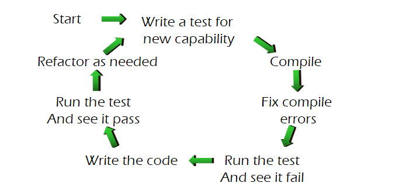

# 内容概览

1. Black-box and white-box testing, and related test case generation（黑盒、白盒以及测试用例的生成）
2. Testing team and testing documentation（测试团队和测试文档）
3. Tools for software testing（软件测试的工具）
4. Performance testing basics（性能测试基准）
5. Testing in the Software Process（对软件过程的测试）
   
# Introduction to Software Testing

1. Why do we test software?  
2. What is software?  
3. What is bug?  
4. Fault, Error and Failure  
5. Adverse Effects of Faulty Software  
6. The theory of Testing  
7. Verification and Validation  
8. Goals of Testing Software  
   
# Chapter 1 Introduction

1. 为什么做软件测试
	1. 什么是软件
	2. 什么是bug
	3. 区分Fault, Error and Failure
2. 测试理论
	1. Verification（验证） and Validation（确认） 
	2. 软件测试的目标

## 为什么做软件测试

### 什么是软件

一个软件系统通常由以下几个部分组成：

1. **程序中的指令**：分散在各个程序中的指令-当执行这些指令时，可以实现某些期望的功能。

2. **数据结构**：这些结构使程序能够适当地操作和处理信息。

3. **配置文件**：这些文件用于设置和配置程序的运行环境。

4. **系统文档**：这些文档描述了系统的结构，包括其组成部分和工作原理。

5. **用户文档**：这些文档解释了如何使用系统，并可能包括用户可以下载最新产品信息的网站。
   
### 软件的早期

### 什么是BUG

Bug是一个非正式使用的术语，通常指软件中的缺陷或问题。

## Fault, Error and Failure

### Fault

软件中的静态缺陷（比如代码编码错误）

1. 算法错误
2. 语法错误
3. 文档不完全或者正确
4. stress

### Error

不正确的内部状态，是某fault的具体体现

### Failure

软件外部行为不符合需求或预期行为的情况。（输出不符合预期）

### PIE Model

#### 执行/可达性（Execution/Reachability）

**解释**：测试可能不会执行到故障所在的位置。

**要求**：程序中包含faults的位置必须是是可以到达的

#### 感染（Infection）

**解释**：即使测试执行到了故障，程序状态也可能不会变得不正确。

**要求**：执行故障后，程序的状态必须变得不正确。这意味着故障必须对程序的内部状态产生影响，导致错误的状态。

#### 传播（Propagation）

**解释**：错误可能不会传播到程序的输出

**要求**：被感染的状态必须传播，导致程序的某些输出不正确。

## 测试理论

### Validation (验证) 和Verification（确认）

IV&V 是 “independent verification and validation”的缩写

#### Verification（验证）

用于确定软件开发过程某个阶段的产物是否满足在**前一阶段设定的要求**的过程。

软件是否满足需求？

#### Validation（确认）

确认是一个过程，用于在**软件开发结束时**评估软件，以确保其符合预期的使用要求。

软件需求是否满足预期使用

### 软件测试公理

1. 不可能完全测试一个程序：输入、输出、路径说明书存在解释空间（有歧义）。
2. 软测是基于风险的活动：根据风险评估决定哪一个部分需要更加深入的测试，有效利用资源。需要在bug发现量和测试成本之间做一个权衡，取最优点。
3. 测试不能证明没有BUGs：只能说明bugs的出现
4. 发现的bug越多，可能存在的bug也越多。当出现一个的时候，可能发现更多：
	1. 程序员可能状态不佳
	2. 程序员往往会犯相同的错误
	3. 有些bug只是冰山一角
5. 不是所有的bug会被修复
	1. 时间不充分
	2. 其实并不是一个bug
	3. 修复bug风险太高
	4. 不值得这样做
		1. 为什么不在下一个版本中收取bug修复费用？
		2. 边缘功能的bug修复需要等待修复
6. 很难定义一个bug确实是一个bug，需要严格判断
	1. 如果没有人发现，那么算是一个bug吗
	2. 未被发现的bug是属于潜在bug
7. 规格说明书没有最终版本。会随着需求变化、时间和变化，测试人员需要进行适应。
	1. 基于“移动目标”规格构建产品是软件开发中特有的现象。
		- 竞争激烈
		- 发布周期非常快
		- 软件“容易”改变
	2. 例如，布鲁克林大桥一旦开始建造，就无法调整以允许火车通过。
8. 测试者不是项目中最受欢迎的成员
	1. 尽早发现bugs
	2. 以专业方式进行汇报
	3. 不要只汇报坏消息
9. 软件测试是一个纪律严明且技术性强的职业。以往，测试人员往往未经培训，测试也不是以系统的方法进行的。现在，构建有缺陷的软件代价太高。因此，测试已经发展成为一门成熟的学科。
    - 复杂的技术
    - 工具支持
    - 有前途的职业发展

### 软件测试者的目标

1. 找到bugs
2. 尽可能早地发现bugs
3. 确保bugs被修复

#  Chapter 2 Testing in the Software Process

1. Waterfall Model
2. Spiral Model 
3. V Model 
4. W Model 
5. Agile Model - XP

## 瀑布模型

1. 所有的计划在一开始就确定，一旦确定就不会更改
2. 在任何一个子阶段都没有交叉重叠
3. 通常在测试完成后，才是第一次**看到**程序：在瀑布模型中，软件的实际功能通常在开发的最后阶段（即测试阶段）才会被完整地展示出来。这意味着在项目的早期阶段，利益相关者和用户可能无法看到软件的任何部分，直到测试完成。这可能导致在项目后期发现重大问题时，修复成本较高。

## Spiral Model（螺旋模型）

1. 风险驱动的发展过程
2. 结合瀑布模型和快速原型迭代模型
3. 以**设计目标**为始，以客户**评审**进展结束

| 优点                       | 缺点                        |
| ------------------------ | ------------------------- |
| 可以在后期添加额外功能或进行更改         | 存在无法按计划或预算完成的风险           |
| 由于原型构建是分小块进行的，因此成本估算变得容易 | 螺旋开发仅适用于大型项目，并且需要风险评估专业知识 |
| 持续或重复开发有助于风险管理           | 为了顺利运行，必须严格遵循螺旋模型协议       |
| 开发速度快，功能以系统化的方式添加        | 文档较多，因为有中间阶段              |
| 始终有客户反馈的空间               | 螺旋软件开发不建议用于小型项目，因为可能成本过高  |

这种表格格式可以帮助更清晰地比较螺旋模型的优缺点。

## V Model（V模型）

1. **瀑布模型的扩展**：

    - 这种扩展版本在传统瀑布模型的基础上，增加了对验证和确认的关注。它强调在每个开发阶段都要进行相应的测试活动，以确保每个阶段的输出符合预期。

2. **测试的开始**：

    - 在代码实现完成后，测试过程正式开始。这意味着开发和测试是分阶段进行的，测试在开发完成后才开始。

3. **测试的层次**：

    - 测试从最基本的单元测试开始，逐步进行更高级别的测试，如集成测试、系统测试，最终到达验收测试阶段。每个测试阶段都旨在验证和确认软件的不同方面，以确保最终产品符合需求和规格。

| 优点                    | 缺点                             |     |
| --------------------- | ------------------------------ | --- |
| 由于模型的严格性，简单且易于管理      | 像瀑布模型一样，在**生命周期的后期**才会产生可工作的软件 |     |
| 鼓励在所有阶段进行验证和确认        | 不适用于需求有**中等到高风险变化**的情况         |     |
| 每个阶段都有特定的**交付物和评审过程** | 被认为不适合长时间、复杂和面向对象的项目           |     |
| 在开发过程中给予测试同等的重视       |                                |     |
## W Model（W模型）

- V模型的扩展/双V模型
- 测试不是在代码实现之后进行的。
- 测试过程与开发过程并行进行。
- 开发和测试之间的合作。
- 测试不仅仅是测试用例的构建、执行和评估。

## Agile Model - XP（敏捷模型 - 极限编程）

敏捷方法与其他增量开发方法一样，强调在**短时间**内构建可发布的软件。

- 然而，敏捷开发与其他开发模型的不同之处在于其时间周期**以周为单位**，而不是月，并且工作是在高度协作的方式下进行的。

为了有效的测试：

- 当开发人员与客户“协商”即将到来的迭代需求时，测试人员必须充分参与这些对话。
- 测试人员立即将这些对话中商定的需求转化为测试用例。
- 当需求发生变化时，测试人员立即参与，因为测试用例必须相应地更改。

### 极限编程

**极限编程**（XP）是敏捷软件开发理念的一个子集。  

- 它强调代码审查、持续集成和自动化测试，以及非常**短的迭代周期**。  
- 它倾向于**持续的设计改进（或重构）**，而不是一个大型的初始设计阶段，保持当前**实现尽可能简单。**  
- 它更倾向于实时沟通，最好是**面对面**的，而不是撰写文档，并且将**可工作的软件**视为进度的主要衡量标准。  
- 该方法还强调**团队合作**。管理者、客户和开发人员都是致力于交付高质量软件的团队的一部分。  
- **程序员**负责测试自己的工作；**测试人员**则专注于帮助客户选择和编写功能测试，并定期运行这些测试。

**极限编程的价值**：

- **沟通**：XP 程序员与客户和其他程序员沟通。
- **简单性**：保持设计简单和干净。
- **反馈**：从一开始就通过软件测试获取反馈。
- **勇气**：尽早将系统交付给客户；根据建议实施更改，勇敢地应对不断变化的需求。

### TDD - Test-Driven Development

开发人员在编写代码之前先编写测试用例。开发过程遵循“红-绿-重构”循环：首先编写一个失败的测试（红），然后编写代码使测试通过（绿），最后重构代码以优化设计

### User Stories and Story Card

**User Story**是用户使用一两句日常使用的句子描述软件系统需要完成的一个方面。

按一定顺序书写在纸上就是**Story Card**

#  Chapter 3 Principles of Software Testing

## Static and Dynamic Verification

静态验证不需要执行代码，但是动态验证需要执行代码。

### 静态验证（Static Verification）

静态验证是一种在不执行程序代码的情况下检查软件正确性的方法。它通常包括以下两种方法：

1. **符号执行（Symbolic Execution）**：这是一种数学方法，通过符号而不是实际值来执行程序。符号执行可以帮助识别程序中的潜在错误和逻辑缺陷。
2. **形式化（符号）验证（Formal Verification）**： 这是一种验证规格说明和源代码之间翻译正确性的正式方法。形式化验证可以确保程序在所有可能的输入情况下都符合其规格说明。

### 动态验证（Dynamic Verification）

动态验证是指在程序执行时进行的验证活动，包括黑盒测试和白盒测试。它通过运行软件并观察其行为来验证软件的正确性。

**动态验证**：通过执行代码来进行验证，包括黑盒测试和白盒测试。

## Black and White Box Testing

- **黑盒测试（Black-box Testing）**：关注软件的功能，而不考虑内部实现。测试人员根据**规格说明来设计测试用例**，验证软件是否按预期工作。黑盒测试通常被认为是动态验证的一部分，因为它涉及执行程序并观察其输出。
- **白盒测试（White-box Testing）**：关注软件的**内部结构和实现**。测试人员需要了解代码的内部逻辑，以设计测试用例来覆盖代码的不同路径。白盒测试也属于动态验证，因为它需要执行代码来验证其行为。

#  Chapter 4 BlackBox Testing

1. Equivalence Partitioning 
2. Boundary Value Analysis 
3. Combinational Testing
4. Random Testing and Error Guessing
5. Scenario Testing

### Equivalence Partitioning

**等价类-Equivalence Partition, EP**是指对于某个参数，其规格说明指出等效处理的一组值范围。

**等价类划分**是通过系统地减少大量（或无限）的可能测试用例集为一个小而有同样有效的测试用例集的过程。

等价类形成一个集合的划分-**Partition**。划分(**Partition**)：一组互不相交的子集的集合。

- **有效等价类**：
    - 输入字段中的一组有意义的数据。
    - 用于验证系统功能和性能的正确实现。
- **无效等价类**：
    - 输入字段中的一组无意义的数据。
    - 用于测试系统的容错能力。

#### 识别测试用例的步骤

1. **从规格说明中识别输入/输出**：
   - 例如，表单中的输入字段、命令行程序的输入、输出消息、计算结果等。
2. **为识别的输入/输出确定等价类**：
   - 对于一个范围，确定1个有效类（在范围内）和2个无效类（范围两端之外的各一个）。
   - 如果输入是一组有效值，确定1个有效类（来自集合内）和1个无效类（集合外）。
   - 如果输入是一组值且程序对输入值有不同处理，为每个允许的输入确定1个有效类，并确定1个无效类（所有不允许的输入的集合）。
   - 对于布尔值，确定1个有效类（true）和1个无效类（false）。
   - 对于必填输入，确定空（无效）和有效输入。
   - 如果输入必须遵循规则，确定1个有效类（符合规则）和若干无效类（以不同方式违反规则）。

将每个输入划分为等价类，并形成等价类表，为每个等价类指定一个唯一的ID。

### Boundary Value Analysis

#### 边界条件

边界条件是指**软件计划操作限制的边缘情况**。例如，从负数到零再到正数，超过表单输入字段的长度等。

1. 在制定等价类时，选择位于边界上的输入数据。
2. 测试边界内的有效数据。
3. 测试最后一个可能的有效数据。
4. 测试边界外的无效数据。

#### 边界值分析

- **等价类**：外部点和内部点。
- **选择边界值**：
  1. 每个参数在每个等价类的顶部和底部都有一个边界值。
  2. 对于连续数据类型，一个分区顶部值的后继值必须是下一个分区的底部值。
  3. 参数的自然范围提供了最终的最大值和最小值。

#### 常见边界值

- 循环结构中的 0、1 和最后一次循环。
- 数组的第一个和最后一个元素。
- 变量类型允许的最大值和最小值。
- 链表的第一个和最后一个节点。
- 可接受字符的最大和最小数量，例如用户名和密码。
- 表格/报告的第一行、第一列、最后一行和最后一列。

通常，软件测试涉及多种类型的边界检查：数字、字符、位置、重量、大小、速度、方向、维度、空间等。

相应地，上述类型的边界值应包括：最大/最小、第一/最后、上/下、最快/最慢、最高/最低、最短/最长、空/满等。

### Combinational Testing

- **技术**：有多种不同的技术用于识别相关的组合，例如**因果图、决策表和真值表**。
    
- **组合分析**：组合分析涉及识别软件**输入原因（causes）** 的所有不同组合及其相关的**输出效果-effects**。
    
- **原因和效果**：原因和效果被描述为**逻辑语句（或谓词）**，基于软件的规格说明。这些表达式指定了特定变量导致特定效果所需的条件。
#### Decision Tables

- **关联条件与要执行的动作**：将条件与需要执行的动作相关联。
    
- **优雅地关联多个独立条件与多个动作**：可以以一种优雅的方式将许多独立的条件与多个动作相关联。

### Random Testing和Error Guessing

#### Random Testing

- **随机数生成器**：测试数据是使用随机数生成器生成的。分布可以是均匀的，或者在统计意义上选择模拟程序在实际使用中将接收到的输入类型。

- **规格说明**：如果规格说明写得清晰且全面，那么应该可以找到可能输入值的集合。

- **目标**：目标是基于输入参数的分布，实现对每个输入参数可能值的“合理”覆盖。这可以通过启发式方法确定（例如，使用10个随机值），或者基于从所需覆盖置信度中确定的统计样本大小来确定。

#### Error Guessing

这是一种基于**直觉和经验**的即兴方法。

**测试数据选择**：选择可能暴露代码中错误的测试数据。以下是一些可能导致问题的典型输入示例：

  - 空或 null 字符串、数组、列表和类引用。这些可能会发现代码在使用之前没有检查空值或非 null 值。
  - 零作为值，或作为实例或事件的计数。这些可能会发现除以零的错误。
  - 字符串中的空格或 null 字符。这可能会发现代码未正确处理字符串或在尝试从字符串中提取数据之前未修剪空白。
  - 负数。这些可能会发现代码中只期望接收正数的错误。

**目标**：目标是覆盖尽可能多的值，这些值**根据测试人员的经验**可能会暴露代码中的错误。

### Scenario Testing

**定义**：场景测试是一种软件测试技术，它使用**场景（即假设的故事）** 来帮助测试人员解决复杂问题或测试系统。

**目的**：场景测试的目的是确保软件的**端到端功能和所有流程**都能正常工作。

**场景测试目标**：
- 模拟用户完成正常功能和核心业务逻辑的操作，以验证软件功能的正确性。
- 模拟用户操作中的主要错误，以验证软件的异常错误处理能力。

**方法**：在场景测试中，测试人员将自己**假设为最终用户**，并寻找最终用户可能在软件上执行的**真实场景或用例**。

#### Basic flow and Alternative flow

##### Basic Flow

- 最简单的用例路径，即没有任何错误，程序直接从过程的开始到结束。
- 大多数用户使用的操作过程，反映软件的主要功能和流程。
- 一个业务只有一个基本流程，并且基本流程只有一个开始和一个结束。

##### Alternative Flow

- 从基本流程开始，在特定条件下执行，然后重新加入基本流程（例如，替代流程1和3）。
- 或者从另一个替代流程开始（例如，替代流程2）。
- 用例也可以在不加入基本流程的情况下终止（例如，替代流程2和4）。
- **反映各种异常和错误条件。**

#### Scenario Testing Steps

替代流程，如程序执行路径，会导致**场景爆炸**。需要选择典型场景进行测试。

1. 只有一个场景包含基本流程；
2. 最小场景数量=基本流程和替代流程的总和；
3. 对于一个替代流程：至少一个场景覆盖它，尽量避免覆盖其他替代流程。

**测试步骤**:

1. 根据规格说明，描述被测软件的**基本流程和替代流程**。
2. **构建不同的场景**以满足测试的完整性和无冗余性要求。
3. 为每个场景**设计相应的测试用例**。
4. 重新检查所有生成的测试用例并删除冗余的测试用例。在确定测试用例后，为每个测试用例**确定测试数据值**。

## 黑盒测试策略总结

1. **针对特定功能页面的特定输入字段**，使用等价类和边界值进行精细测试；使用静态测试检查按钮、链接、内容、图像等。
2. **如果功能描述包含输入条件的组合且业务逻辑复杂**，可以使用决策表。
3. **在任何情况下都应考虑边界值分析**，因为它是发现软件缺陷的最有效方法之一。
4. **可以通过错误猜测法扩展测试用例**，并强调测试工程师的宝贵经验。
5. **对于业务流程明确的系统**，可以在整个测试过程中使用场景测试。

# Chapter 5 White-Box Testing

Control Flow Testing

- **定义**：控制流测试是一种结构化测试策略，它使用程序的控制流作为模型。
- **要求**：要求测试人员对程序的逻辑结构有清晰的理解，甚至能够掌握源程序的所有细节。
- **适用性**：最适用于新软件的单元测试。

1. Statement Coverage 
2. Decision Coverage 
3. Condition Coverage 
4. Decision Condition Coverage 
5. Condition Combination Coverage 
6. Path Coverage 
7. Basis Path Testing

## Statement Coverage

**设计测试用例**：设计测试用例并确定所需的输入值，以确保每个源代码语句都被执行。

**别名**：也称为点覆盖。

**覆盖强度**：这是最弱的逻辑覆盖，应与其他测试方法交互使用。

## Decision Coverage (Branch Coverage)

**设计测试用例**：设计测试用例并确定所需的输入值，以确保每个源代码分支都被执行。

**执行要求**：程序的每个真和假分支至少被执行一次。

**别名**：也称为边覆盖。

## Condition Coverage

**复杂决策**：复杂决策由多个（布尔）条件组成。

**扩展分支覆盖**：条件覆盖通过确保在复杂决策中，每个条件的真值和假值都被测试来扩展分支覆盖。

**注意事项**：不要求决策本身必须取真值和假值！

**测试数据选择**：选择测试数据以确保每个决策中的每个条件都取真值和假值。

## Decision/Condition Coverage

- **生成测试数据**：生成测试数据，以便在一个决策中的所有条件（如果可能）至少取一次两种结果，并执行每个决策的真和假结果。
    
    - 每个决策都有真和假的测试用例。
    - 此外，决策中的每个条件都有真和假的测试用例（如果可能）。

- **组合**：这是条件覆盖和分支测试的组合。它使用与条件覆盖相同的测试数据，但必须额外确保每个分支或决策取真或假结果。
    
    - 单一条件决策：2个测试用例。
    - 2个条件的决策：2个以上的测试用例。

## Condition Combination Coverage 

**生成测试**：生成测试以导致每个决策的条件的每种可能组合被测试。

**目标**：实现每个决策的100%覆盖和每个条件的100%覆盖。

**方法**：真值表是识别所有可能值组合的最佳方法。

## Control Flow Graphs (CFGs)

能够创建控制流图对于路径测试技术至关重要。

- **有向图 G(V, E)**：
    
    - V 是顶点的集合。
    - E 是边的集合，E = V*V。
- **表示控制流**：
    
    - 每个节点代表一个或多个语句。
    - 每条边代表一个“跳转”或“分支”。
    - 两个出口表示一个决策（真或假）。

## Path Coverage 

- **生成测试数据**：生成测试数据以执行程序中的所有不同路径。这被称为“路径覆盖”。
- **路径覆盖**：路径覆盖要求在测试执行期间，从程序的入口到出口的每一条可能路径都被执行。
- **目标**：实现代码中每条从开始到结束路径的100%覆盖。
- **路径迭代**：通过循环进行 i 次迭代的路径与进行 i+1 次迭代的路径是不同的，即使在两次迭代中访问的是相同的节点。因此，在某些程序中可能存在无限多的路径！

### 限制路径数量

- **选择路径的等价类**：需要限制路径的数量，选择路径的等价类。
- **等价路径**：如果两条路径仅在循环迭代次数上有所不同，则它们被视为等价，形成两类循环：
    - 一类是0次迭代
    - 一类是n次迭代（n > 0）
- **其他等价路径**：如果需要，也可以选择其他等价路径。

- **CFG描述**：程序的控制流图可以用正则表达式描述，使用以下操作：
    - `.` 表示节点序列的连接
    - `+` 表示图中的**决策**（即if语句）
    - `*` 表示迭代（0次或多次，例如while语句）
## Basis Path Testing

- **定义**：基本路径测试是一种白盒测试方法，其中测试用例是基于程序中可以采取的流或逻辑路径定义的。
- **目标**：基本路径测试的目标是**定义独立路径的数量**，以便明确需要的测试用例数量，从而最大化测试覆盖率。
- **执行**：基本路径测试涉及执行程序中的所有可能块，并以最少的测试用例实现最大路径覆盖。

### 基本路径测试步骤

1. **绘制控制流图**：确定不同的程序路径。
2. **计算圈复杂度**：用来确定独立路径的数量的度量。
	- **三种计算方法**：
	    - V(G) = E - N + 2，E = 边的数量，N = 节点的数量
	    - V(G) = P + 1，P = 决策节点的数量（包含条件的节点）
	    - V(G) = R，R = 区域的数量
3. **找到基本路径集**。
4. **生成测试用例**：执行每条路径。

### 复合条件分解

- **分解复合条件**：如果包含复合条件，则应将其分解为几个简单条件。
- **简单条件**：每个简单条件对应于流程图中的一个节点。

# Chapter 6: Static Testing

- Code Review
- Static Program Analysis

静态测试是在不执行软件的情况下，仔细而系统地审查和分析软件以查找错误的过程。

- **代码审查**
- **静态程序分析**

这种测试形式非常有价值，相较于基于执行的测试具有优势。经验表明，使用静态测试可以发现大量的错误。

- **成本和生产力的好处**：因为错误在早期被发现（并纠正），并且基于执行的测试所需的时间更少。

## 静态程序分析

**自动化工具**：静态程序分析通常使用自动化工具来检查代码。这些工具可以扫描代码以查找潜在的错误、代码风格问题、安全漏洞和性能问题。
## Code Review

### 代码审查的基本要素

- **识别问题**：查找软件中的问题，如遗漏项、错误等。
- **遵循规则**：规定要审查的代码量、花费的时间等。
- **准备**：每个参与者都应准备好以便为审查做出贡献。
- **撰写报告**：总结审查结果，并将报告提供给开发团队。

### 非正式代码审查

- **同行评审**：
    
    - 一个非正式的小组，由程序员和/或测试人员担任审查者。
    - 即使审查是非正式的，参与者也应遵循4个基本要素。

- **走查**（walkthrough）：
    
    - 一个更正式的过程，**代码作者**正式向一小组程序员和/或测试人员展示代码。
    - 作者逐行阅读代码并解释其功能，审查者倾听并提问。
    - 参与者应遵循4个基本要素。

### 正式代码检查

- **检查比走查更全面**：
    
    - 代码展示者不是代码的作者。
    - 其他参与者是检查员。
    - 有一位主持人确保规则被遵循，会议顺利进行。

- **检查后**：撰写报告。程序员然后进行更改，并在必要时进行重新检查。
    
- **正式代码检查**：在发现代码和设计中的错误方面非常有效，并且越来越受欢迎。

# Chapter 7: Test Plan and Test Case

- Test Plan 
	- Process for planning 
	- Test plan components 
- Test Case

## Test Plan

### 测试计划

测试计划是描述**软件测试范围和活动的文档**。它是正式测试项目中任何软件/产品的基础。

- **内容**：包括预期测试活动的范围、方法、资源和时间表。

### 主测试计划

- **定义**：一个项目/产品的单一高级测试计划，用于统一所有其他测试计划。

### 测试级别

  - 单元测试计划
  - 集成测试计划
  - 系统测试计划
  - 验收测试计划

### 测试类型

**测试计划**：针对特定类型测试的测试计划，如性能测试计划和安全测试计划。

### Test Planning Process

1. Define test strategy 
2. Define test system 
3. Estimate test effort 
4. Prepare and review test plan

