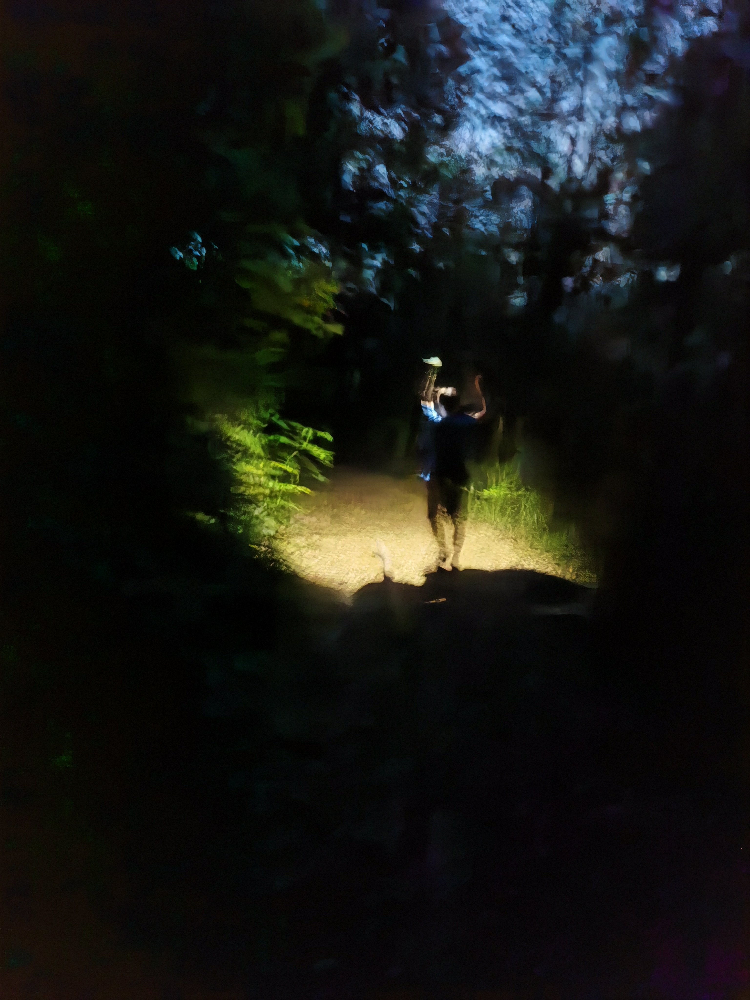
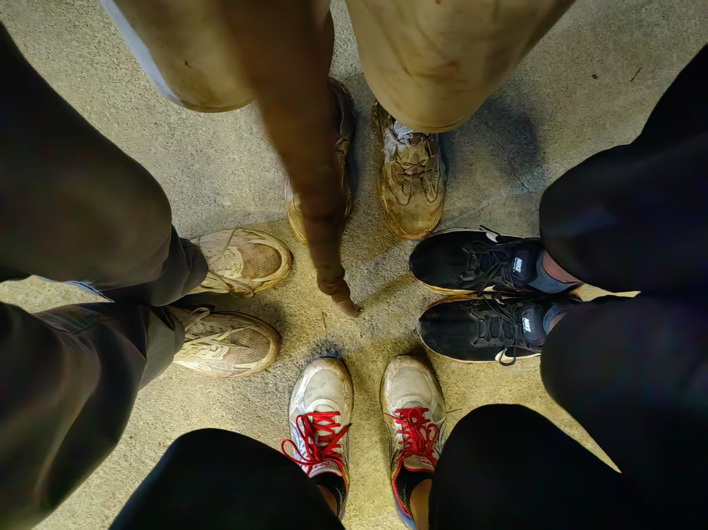

# 起笔

此时此刻，2025年5月3日，6点19分，在此起笔记录我的一次登山旅行。问我为什么起这么早？因为我早睡早起、作息良好——好吧，其实是我失眠了。躺下之后，脑子里还是登山的时候的一些无法掌控的记忆片段在心里、脑中窜来窜去，我被动地进行复盘、自省，难以停止，是压力吗？是太兴奋了吗？两者都有。我最终还是从床上爬起来，打开了电脑，起了一份草稿，开始码字记录。

# 成员

一共四人，A(大家并未明言但默认的领队)，B（我本人），C（我的帅气伙计室友，手动滑稽），D（学习、素质、形体兼优的多金八块腹肌男大），这是我们四个人的成分，其它信息就不多说了哈哈。

# 前奏

## 因

身为经常混在一起，出身相同，会经常聚在一起玩，最近的上一次是计划徒步攀爬广州**从化十登**之一的天堂顶，但是未遂。因为我们没有经验，输入“天堂顶”目的地，然后缺德地图给我们导航（自驾）到了天堂顶旁边的国家森林公园，最终我们在上面走来走去，游山玩水，路平坦，景宜人，无意外，主打一个闲适，终安全下山。

但是上次的未遂略有不甘，我们本次出行决定选择，十之二的**鸡枕山**，并且从攻略中找到绝对正确的徒步登山口目的地。

出发！！！

## 正式启程的“准备”

问我标题的”**准备**“二字为什么加引号？因为我们基本是毫无准备。四个楞头青，带了吃的喝的，会开车（租的），知道山名和登山起点，然后就上去了。

你可能会想**鸡枕山**这么有名头的景点，应该没有什么太需要准备的吧，应该一路指引、阶梯和路人陪伴——我们也是这样想的。但实际此山是无线接近野山，所谓的路线，单纯是**走的人多了，也便成了路**；所谓的指引，只是系在竹子、树枝上的塑料绳带；所谓的阶梯，只是前人挖出来的、踩出来的一个个小坑；不多的安全措施，只有总长不超15米的两根麻绳和山顶的应急信号塔。加上一些塑料瓶子等垃圾（人类扣大分）就是全部的人为痕迹。

以路上遇到的其他社会人士为借鉴，应该准备的内容如下：

1. 登山鞋、长袖上衣、长裤
2. 水、食物
3. 手表-定位联系
4. 便携照明
5. 登山镐、登山杖、登山背包
6. 应急物品
7. 足电的手机、充电宝
8. 离线地图

其次，此时广州受台风影响，天气不稳定，随时会有降雨，所以还需要雨具。

我们就这样，满怀憧憬，无经验、无地图、无装备（短袖、运动短/长裤、跑鞋），爬上了好像“随便拿捏”的**雨后鸡枕山**。

# 登山ing

这部分分为两个版本进行记录，**晴**版是记录纯粹的美好，比如取美景、愉身心、遇佳人，**阴**版记录旅途的凶险、暗线和我们（我）的心路历程。

## 晴

开着新款的摩托罗拉，飞驰在免费的高速，追着降雨前行但是登山8小时却阳光明媚，最终四个人安全下山，及时回到了宿舍小窝，皆大欢喜的包饺子结局！

### 400

停车时，当地人好心指引免费的停车位（其实就是一个摊子和饭店中间的空地），并告诉我们正确的登山口。

### 700

起点海拔约380米，我们在起点吃饱喝足，东鹏特饮、大鸡腿猛猛炫，然后就正式启动了，一路上都是葱葱绿绿的，好多青翠的竹子、绿色的石头、在微润的土壤中穿插的根系，空气也是异常的清新，每一步都是高质量有氧，站在几处崖边远望，眼中是云雾缭绕的草原，和大学城一对比，绝对是属于**久在樊笼里，复得返自然**。

我们有说有笑，轮流背着物资背包，不停地端起尼康相机取景，或是虫子、或是奇竹异木、或是天然的构图，就像山路一样，我们的心情是向上的，充满能量。

在海拔700米处，因为**派蒙**-前人沿着路线系的塑料短带短暂的消失，我们在错误方向爬升了约100米，走入了歧途，还好及时止损，并且偶遇一家5口（2个大人+3小只）舒缓了我们这一次错误决策带来的心里压力，及时补充了精神能量。主要是，那几个小孩不过刚过我们的肚皮的高度，我们四个侧身扶着坡试探前行，谨慎得要死，那三小只却能偶在我们眼中的险要路段蹦来蹦去，直接一波视觉刺激，加上是第一次遇到这么有活力的队伍，直接四个人士气大振，之前走错路的阴霾一扫而空。

### 1000

我们经过绳索索降山谷，陡坡**爬（趴）行**，来到了环线的转折点，一侧是山尖尖的攀岩路段，可以继续登高，一侧是顺着环线，开始下山，这里可以说是广义的登顶。到这里，C和D体力不支，甚至抽筋，难以继续登高，不过遇到了两位好人大哥，给我们介绍了两侧的路况，并且告诉我们怎么下载使用离线地图，最最最后，他们同意陪同C和D下山。稍事休息后，A和我继续登顶，C和D顺着环线下山返回。

### 1174

A和我一同结伴登顶，互相照应。

在奔向山尖尖的路途中，视野越来越广，相应的可支持路面也越来越少，主要是稀疏的竹子和大块石头，我们一脚支撑、一脚试探，互相照应鼓励彼此，在接近下午5点的时间成功登顶，站在不到10方的顶部，展望远方，群峰皆在脚下，直面阳光，看着海拔提示牌和飘扬的国旗，心里的喜悦难以掩饰。

我把眼镜一摘，扔在地上，我给他拍，他给我拍，一起合拍，可惜都是眯眯眼，哈哈哈！

### 1174速降

登顶之后，吃一些士力架，喝一些饮料补充体力，我们立马下山，体力足够，时间略有压力，回到环线顶部平台，然后进入主路，大部分是缓坡下山，天色较暗，但依然可见路上物体形状时我们进入竹林，海拔约680米，路面湿滑，我们有一段路是**滑滑梯**，坐着就下去了，屁股都是糊着泥巴，期间收到了C和D安全回到出发点的消息，我们心里愈发轻松。

伸手不见五指的时候，约7点，我们抵达了几乎平路的环山S型路段，我们打着手机的手电照明，有说有笑，虽说路长，但好在平坦，摸黑不太可能出事（：其实还是因为小坑扭了一下脚踝，我们两个都中招了，但是脚踝够硬，没有拉伤。

最后于8点多，F4齐聚山脚，相拥而泣。

