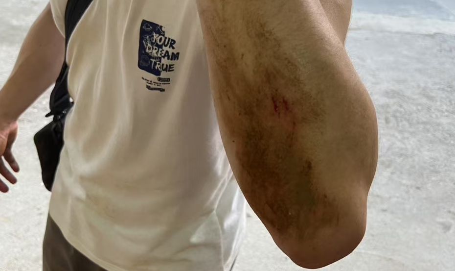

# 起笔

此时此刻，2025年5月3日，6点19分，在此起笔记录我的一次登山旅行。问我为什么起这么早？因为我早睡早起、作息良好——好吧，其实是我失眠了。躺下之后，脑子里还是登山的时候的一些无法掌控的记忆片段在心里、脑中窜来窜去，我被动地进行复盘、自省，难以停止，是压力吗？是太兴奋了吗？两者都有。我最终还是从床上爬起来，打开了电脑，起了一份草稿，开始码字记录。

# 成员

一共四人，A(大家并未明言但默认的领队)，B（我本人），C（我的帅气伙计室友，手动滑稽），D（学习、素质、形体兼优的多金八块腹肌男大），这是我们四个人的成分，其它信息就不多说了哈哈。

# 前奏

## 因

身为经常混在一起，出身相同，会经常聚在一起玩，最近的上一次是计划徒步攀爬广州**从化十登**之一的天堂顶，但是未遂。因为我们没有经验，输入“天堂顶”目的地，然后缺德地图给我们导航（自驾）到了天堂顶旁边的国家森林公园，最终我们在上面走来走去，游山玩水，路平坦，景宜人，无意外，主打一个闲适，终安全下山。

但是上次的未遂略有不甘，我们本次出行决定选择，十之二的**鸡枕山**，并且从攻略中找到绝对正确的徒步登山口目的地。

出发！！！

## 正式启程的“准备”

问我标题的”**准备**“二字为什么加引号？因为我们基本是毫无准备。四个楞头青，带了吃的喝的，会开车（租的），知道山名和登山起点，然后就上去了。

你可能会想**鸡枕山**这么有名头的景点，应该没有什么太需要准备的吧，应该一路指引、阶梯和路人陪伴——我们也是这样想的。但实际此山是无线接近野山，所谓的路线，单纯是**走的人多了，也便成了路**；所谓的指引，只是系在竹子、树枝上的塑料绳带；所谓的阶梯，只是前人挖出来的、踩出来的一个个小坑；不多的安全措施，只有总长不超15米的两根麻绳和山顶的应急信号塔。加上一些塑料瓶子等垃圾（人类扣大分）就是全部的人为痕迹。

以路上遇到的其他社会人士为借鉴，应该准备的内容如下：

1. 登山鞋、长袖上衣、长裤
2. 水、食物
3. 手表-定位联系
4. 便携照明
5. 登山镐、登山杖、登山背包
6. 应急物品
7. 足电的手机、充电宝
8. 离线地图

其次，此时广州受台风影响，天气不稳定，随时会有降雨，所以还需要雨具。

我们就这样，满怀憧憬，无经验、无地图、无装备（短袖、运动短/长裤、跑鞋），爬上了好像“随便拿捏”的**雨后鸡枕山**。

# 登山ing

这部分分为两个版本进行记录，**晴**版是记录纯粹的美好，比如取美景、愉身心、遇佳人，**阴**版记录旅途的凶险、暗线和我们（我）的心路历程。

## 晴

开着新款的摩托罗拉，飞驰在免费的高速，追着降雨前行但是登山8小时却阳光明媚，最终四个人安全下山，及时回到了宿舍小窝，皆大欢喜的包饺子结局！

### 400

停车时，当地人好心指引免费的停车位（其实就是一个摊子和饭店中间的空地），并告诉我们正确的登山口。

### 700

起点海拔约380米，我们在起点吃饱喝足，东鹏特饮、大鸡腿猛猛炫，然后就正式启动了，一路上都是葱葱绿绿的，好多青翠的竹子、绿色的石头、在微润的土壤中穿插的根系，空气也是异常的清新，每一步都是高质量有氧，站在几处崖边远望，眼中是云雾缭绕的草原，和大学城一对比，绝对是属于**久在樊笼里，复得返自然**。

我们有说有笑，轮流背着物资背包，不停地端起尼康相机取景，或是虫子、或是奇竹异木、或是天然的构图，就像山路一样，我们的心情是向上的，充满能量。

在海拔700米处，因为**派蒙**-前人沿着路线系的塑料短带短暂的消失，我们在错误方向爬升了约100米，走入了歧途，还好及时止损，并且偶遇一家5口（2个大人+3小只）舒缓了我们这一次错误决策带来的心里压力，及时补充了精神能量。主要是，那几个小孩不过刚过我们的肚皮的高度，我们四个侧身扶着坡试探前行，谨慎得要死，那三小只却能偶在我们眼中的险要路段蹦来蹦去，直接一波视觉刺激，加上是第一次遇到这么有活力的队伍，直接四个人士气大振，之前走错路的阴霾一扫而空。

### 1000

我们经过绳索索降山谷，陡坡**爬（趴）行**，来到了环线的转折点，一侧是山尖尖的攀岩路段，可以继续登高，一侧是顺着环线，开始下山，这里可以说是广义的登顶。到这里，C和D体力不支，甚至抽筋，难以继续登高，不过遇到了两位好人大哥，给我们介绍了两侧的路况，并且告诉我们怎么下载使用离线地图，最最最后，他们同意陪同C和D下山。稍事休息后，A和我继续登顶，C和D顺着环线下山返回。

### 1175-登顶

A和我一同结伴登顶，互相照应。

在奔向山尖尖的路途中，视野越来越广，相应的可支持路面也越来越少，主要是稀疏的竹子和大块石头，我们一脚支撑、一脚试探，互相照应鼓励彼此，在接近下午5点的时间成功登顶，站在不到10方的顶部，展望远方，群峰皆在脚下，直面阳光，看着海拔提示牌和飘扬的国旗，心里的喜悦难以掩饰。

我把眼镜一摘，扔在地上，我给他拍，他给我拍，一起合拍，可惜都是眯眯眼，哈哈哈！

### 1175-速降下山

登顶之后，吃一些士力架，喝一些饮料补充体力，我们立马下山，体力足够，时间略有压力，回到环线顶部平台，然后进入主路，大部分是缓坡下山，天色较暗，但依然可见路上物体形状时我们进入竹林，海拔约680米，路面湿滑，我们有一段路是**滑滑梯**，坐着就下去了，屁股都是糊着泥巴，期间收到了C和D安全回到出发点的消息，我们心里愈发轻松。

伸手不见五指的时候，约7点，我们抵达了几乎平路的环山S型路段，我们打着手机的手电照明，有说有笑，虽说路长，但好在平坦，摸黑不太可能出事（：其实还是因为小坑扭了一下脚踝，我们两个都中招了，但是脚踝够硬，没有拉伤。

最后于8点多，F4齐聚山脚，相拥而泣，衣角微脏~

## 阴

### 摘要

山路长达八个小时，4个人没有做任何有效准备，一路上顺风顺水显示不太可能，当然从结局来看我们确实是被运气眷顾，下面我会以我的视角介绍**山路**和我们**心路**的崎岖。

### 400

在到达目的地的路上，一路上外来游客并不多，并且村庄的开发情况并不太好，没有柏油马路，也没有景区里常见的路牌和地图，大概率不是一个开发完善的景区，山多半是一个野山，但山脚下的我们四个人还没有觉察这个伏笔，依然保持乐观。

### 700

一路追着**派蒙**，走着走着发现，脚下没有了人踩过的脚印，全是落叶层，并且路越来越难走，我们突然疑心是路走岔了（：确实是走错了，此时已经爬到的海拔800米，探讨半天，A和D向两侧前进一小节路，发现无路可走，我们只好迅速折返，因为此时没有地图，一旦迷失，就很可能回不去了（严肃.jpg）。

最终我们折返回700米处，四个人脑子里一合计，白瞎200米的体力，距离登顶还有一大截距离，C和D此时体力略有不支，在折返的决策过程中，其实是有一点负面言论和情绪产生的，并且之后的路难度骤升，压力骤升（：特别是领队A。

其实这里我的心里有一点隐忧，但是我的体力充足，始终处于动态有氧平衡，心里面比较淡定，但是负面言论还是让我觉得不太妙，哈哈，没忍住还是压力了一下“后悔”的来源-C，我想着让大家有一点积极的心里暗示，负面的话可能会让情况更糟-墨菲定律（**墨菲定律是由美国的一名工程师爱德华·墨菲在1992年提出的。主要内容为任何事都没有表面看起来那么简单；所有的事都会比预计的时间长；会出错的事总会出错；如果担心某种情况发生，那么它就更有可能发生。通俗点就是，怕什么来什么，如果一件事情有可能会向着不好的方向发展，那么不管这个可能性有多小，总会发生。它与“帕金森定律”“彼得原理”并称为20世纪西方文化三大发现。**）但是转念一想，没有客观情况的改善，好像说几句话意义不大（：毕竟我自己也不是什么权威专家。

插一句题外话：可能受体力影响、路线错误和实际和预期的偏差太多，心情烦躁需要宣泄也合理，还是为自己的压力发言道个歉，**鞠躬to同志C**。

但是好在，一家子（2+3个小孩）充满活力的样子给我们提振了一下士气，直接四个人猛猛爬！

### 1000

这个高度是环线的转折点，是一个较为宽阔的平台，D到这里肌肉一直在抽筋，已经寸步难行，我们一直帮他揉捏缓解疼痛，但还是解决不了问题，但是依旧是路线未知，下山方向未定，并且之前打电话到山下，建议我们原路返回，我们四个人当即说到：**不可能！绝对不可能！**

好在遇到两位准备充分的大哥，从顶峰下来，看到我们情况不对，聊了几句，建议我们下载离线地图——没错，到这里我们才以上帝视角知道路线情况，并且直接点明我们四人的准备极其不充分。二位大哥，也补充道天色不早，登顶路段非常困难-几乎是攀岩，建议我们下山，也愿意陪同（：其实后来还是半路给甩没了，不过还是要**感谢二位大哥**。

盘一下现状：C和D体力不支，A想登顶，B也就是我体力尚可，时间约4点半，我们上山花费4小时，即使从这里立刻顺着环线以同等速度下山，还是极可能摸黑前行，比较危险，但是，已经是1000米，距离顶部的1175其实不远。

当时我的内心：C和D最好的安排是顺着环线，跟着两位路人大哥下山，但是萍水相逢，我还是不太放心C和D被两个陌生人牵着走，我想拉着A一起下山；但是A想独自登顶，不想就此放弃，登顶再下山，必然会走夜路，一个人，体力和心里压力都应该会很大，也不安全，我也想陪同（有点想直接细胞分裂成两个人，滑稽.jpg）。

最后还是两两分开，A和我继续登顶，C和D顺着环线下山，食物配重由我和A携带，留了电话报平安。

### 1175-登顶

登顶之路确实接近攀岩，顶部有稀疏的竹子，其余都是石块和杂草，死去的高中地理——不同海拔的植被分布在攻击我。

A比较大胆，体力明显比我更足——领队还是有实力的，在上山中，他在前面探路接应我，一路上趴在石头上，踩着小于半脚掌宽的天然小坑，艰难前行，随便一个脚滑都可能直接来一波**1000米速降滚动下山**。

我们二人实力够硬（鞋够防滑），于5点左右站在了山尖的国家应急信号塔的旁边，阳光很刺眼，我和A被扎得睁不开眼哈哈，拍照也是不停地找角度。

之后就是简简单单地吃了一些东西——士力架打钱！我们在山顶为你打广告！

### 1175-速降下山

幸好是夏季，太阳下山较晚，我们（可能）有足够的时间下山，不用踩着乌漆嘛黑往下走——这是山顶的乐观预期，最后在7点半左右，伸手不见五指，还是打着灯，盯着脚下，谨慎前行。

从山尖尖下来的反攀岩路段也有一段插曲，我们**又又又走错路了**，不过好在A大喊一声，远处有小孩哥的回应，有了回应，我们循着声音来源方向，也是找寻着人在土上遗留的脚印，好不容易从一条小道回到了1000米处的环线平台。

因为是雨后，土壤比较潮湿，石头也比较湿滑，A在下山途中不停打滑，每一次听到打滑的声音，我都心头一紧，因此有一段路是我走在前面，到了竹林阶段，黑暗（蓝调）笼罩，其实路面已经只依稀看到形状，二人只能蹲下滑着走，滑滑梯阶段结束后，我们大概是在600米的海拔。

也是在600米左右，我们接收到C和D安全下山的消息，心里顿时松了一口气，最坏的情况——C、D被甩下，困在山上，并没有发生。如果摸黑，我们四个人在有2人体力不支的情况下很难做到互相照应。

也是在600米，A和我不久后开启了照明，同时也走在了熟悉的沙石路上，路平而宽，那也不可能没有转折——有塌方路段。不少小坑在埋伏我们，好在我们有钢铁般的脚踝，在各自中招之后，依然不影响行动，最最最最后也是看到属于村落的灯火，不不不，应该是称之为灯塔！又持续了小半个小时之后，我们遇到了狗叫和鸡棚，也看到了车边站着的C和D，我们下山了！！！

# end
## 感谢

感谢上天，在广州全境都是雷雨预警的情况下，在山上的八个小时始终是晴天，一滴雨都没有，但凡有一点雨水，直接119+120。

感谢好人，如果路上没有小孩一家人，我们可能就止步700米处了，然后进退两难，直接119+120；
如果1000米没有两位大哥，我们的登山依旧是等同于**探险**，也不会有人护送C和D下山，A和我也没机会登顶了；C和D下山途中，**第一批大哥**太快了，给C和D甩了，但是好在又有**第二批大哥**出现了，并且提供了一些食物（1000米分开的时候没有给C和D留一些食物，属实失误了），并且为C现场找了趁手的登山杖（补充：C的鞋子，是我们四双不适合登山的鞋子中的最不适合的那一双，全程都在滑），也是最后保驾护航，安全下山。

特别安利：大家去报考**广东某农大学**，第二批大哥和该高校关系不浅（：

感谢好的decision：

1. 选择合适的登山口，我们来之前都不知道从哪里登山，但是靠着询问本地人，我们最后在适合攀爬的路线上山，在适合下山的路线下山，如果**反过来——119+120套餐**；
2. 其实，一路上每一个决策都是盲猜，包括700米处走错路然后又折返，其实发现路线不对我们并没有太多可靠信息来源，我们都**没有离线地图**，哈哈，只能说感觉不对，然后就折返了；
3. 1000米处，选择**两两分开**，既让体力不支的CD安全下山，也让我和A满足心愿，成功登顶，没有比这更加好的选择和安排；
4. A和我选择顺着环线下山，当时我们有两个选择 **1. 原路返回，路况已知 2. 顺着环线下山，路况未知**，C和D顺着环线下山，是因为大哥的陪同引导，我和A可没人牵引，但是脑瓜一转，来时路虽然已知，但实在太险要，顺着环线虽然未知，但是前面的大哥走这个下山，那我们跟着说不定会好走不少，结果证明顺着环线的路线是最适合下山了，路况较为（**只是相对上山，不是说真的很平坦**）平坦。

## 吐槽

投诉某书！网络诈骗！哪里easy？哪里easy？Looking My Eyes！Why？Baby！Why？差点死在山上（泪流满面）。

C和D的衣服已经被染了土色，挂彩较多，我和A也挂了一点小彩，A下山腿都在抖，我抖了吗？没有，绝对没有（嘴硬.jpg）。

战损如下（来自C和D）（：（：心疼

