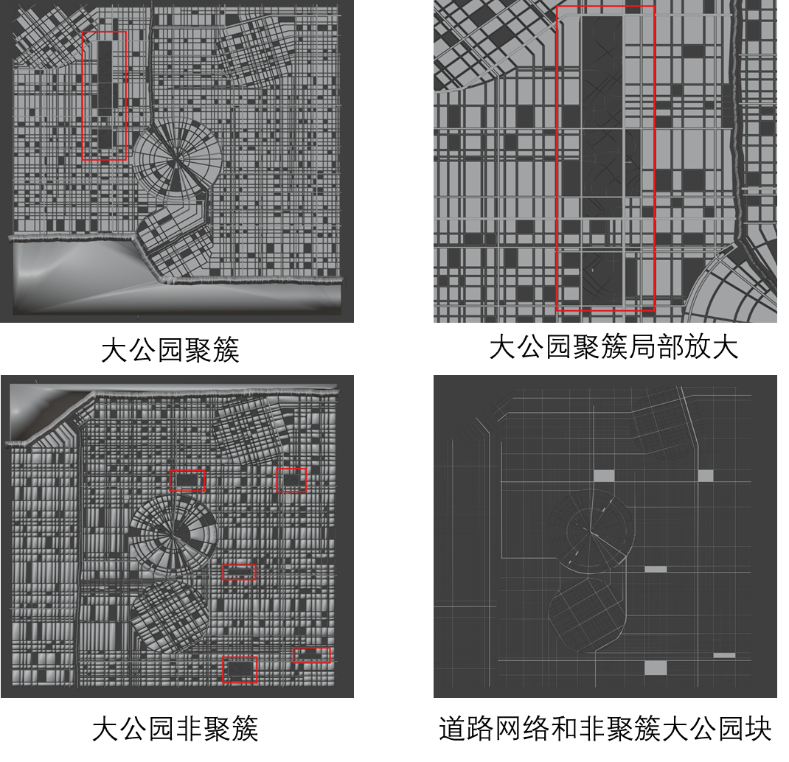

# 一、概述

## 1、项目背景与目标

本项目旨在探索和实现一套**程序化2D风格街区生成算法**。其核心目标是能够根据用户定义的参数和规则，自动创建具有特定视觉风格和合理布局的多样化街区地图。这种技术在城市规划概念设计、游戏场景快速原型、虚拟环境构建、以及艺术创作等领域具有广泛的应用前景。项目致力于解决如何在程序化生成中平衡**风格化、可控性与多样性**的挑战，生成既符合逻辑又具有美学价值的街区。

## 2、风格街区定义

**风格街区 (Styled Street Block)** 是指在程序化生成的地图中，具有以下特征的区域：

1.  **特定视觉风格**: 街区整体呈现出一种预设或可配置的视觉风格，例如是规整的网格状、有机的自然生长状、复古的历史街区风貌，或是未来科技感等。这种风格体现在道路的走向、建筑的排布、开放空间的形态等多个方面。
2.  **结构化布局**: 街区由一系列相互关联的城市元素（如道路、地块、建筑、水体、公园等）构成，这些元素遵循一定的空间组织规则和约束。
3.  **功能与美学的统一**: 生成的街区不仅要满足基本的空间逻辑（如连通性、可达性），还要追求视觉上的和谐与美感。
4.  **参数化驱动**: 街区的具体形态和特征可以通过一组参数进行控制和调整，从而实现多样化的输出结果。

风格街区是一个由算法生成的、具有特定美学特征和内部结构一致性的城市局部区域。

## 3、典型风格街区

如下为使用400*400的画布大小进行生成的结果，海洋区域分别位于右侧和底部，并且包含河流、道路、公园等对象。


## 4、核心街区对象

构成一个风格街区的核心对象（或元素）包括：

1.  **道路网络(Road Network)**:
    *   **定义**: 连接街区内不同区域的路径，是布局的基础骨架。
    *   **层级**: 分为不同等级的道路-主干道 (Main Roads)、主要道路 (Major Roads)、次要道路 (Minor Roads/Streets)。基于张量场引导的流线生成，通过数值积分（如欧拉法或龙格库塔法）和碰撞检测、几何简化（道格拉斯-普克算法）形成。
    *   **作用**: 定义了交通流线、地块的边界以及街区的整体走向。
2.  **规划地块/土地包裹 (Planning Plots/Land Parcels)**:
    *   **定义**: 由道路网络自然分割形成的闭合区域。
    *   **作用**: 作为进一步细分和土地利用分配的基础单元，例如用于建设建筑或开辟公园。
3.  **建筑地块/建筑基底 (Building Lots/Footprints)**:
    *   **定义**: 在规划地块中，排除公园和水域后，根据参数（如最小面积、最大边长、收缩间距）进一步细分和优化得到。
    *   **特征**: 通常具有特定的形状、大小限制，并遵循一定的退线和间距规则。
4.  **建筑物 (Buildings)**:
    *   **定义**: 占据建筑地块的实体结构。在2D风格化生成中，主要关注其**二维占地轮廓 (footprint)**，也可能暗示其高度或层数。
    *   **风格**: 建筑物的轮廓形状、大小、密集程度等共同构成了街区的建筑风貌。
5.  **水体 (Water Bodies)**:
    *   **定义**: 如河流、海洋和临近的海岸线等。水域的生成依赖于流线算法，并通过噪声叠加和几何变换（如多边形缓冲）形成最终的海岸线和河流形态。
    *   **作用**: 对街区的形态、布局产生重要影响，并增加自然景观元素。
6.  **开放空间/公园 (Open Spaces/Parks)**:
    *   **定义**: 街区内的非建筑区域，如绿地、广场、小型公园等。在规划地块中根据参数（如数量、大小、聚集性）生成，大公园内部步道施加额外的旋转扭曲变换。
    *   **作用**: 提供视觉缓冲、休闲功能，并影响街区的整体密度和观感。

这些核心对象通过算法的协同作用，共同构成了具有特定风格的街区。

# 二、生成算法

## 1、关键全局参数

全局参数列表，说明参数意义及合理的取值范围（实验探索）。参数体系通过Pydantic模型（`ALLParams`）进行强类型校验和管理，支持从JSON文件加载。具体参数涵盖世界维度、缩放、张量场配置、地图元素（水体、道路、公园、建筑）生成细节、样式及下载选项等。

参数体系通过Pydantic模型（如 `ALLParams`）进行强类型校验和管理，支持从JSON文件加载。具体参数涵盖世界维度、缩放、张量场配置、地图元素（水体、道路、公园、建筑）生成细节、样式及下载选项等。

### 1.1、基础配置 (Top-level)

1.   **`world_dimensions`: `[400, 400]`**
    1.   **意义**: 定义生成地图的世界或画布的宽度和高度。单位可以是任意的，但后续所有与尺寸相关的参数都将基于此单位。
    2.   **合理取值范围**: 正整数数组，例如 `[100, 100]` 到 `[2000, 2000]`。取决于期望的地图大小和计算资源。
2.   **`origin`: `[0, 0]`**
    1.   **意义**: 定义世界坐标系的原点，通常是左下角。
    2.   **合理取值范围**: 通常为 `[0, 0]`。如果需要偏移，可以是任意浮点数或整数。
### 1.2、张量场配置 (`tensor_field`)

用于控制影响地图特征（如道路走向）的基础力场或方向场。

1.   **`smooth`: `true`**
    1.   **意义**: 是否对最终的张量场进行平滑处理，使场的变化更连续、自然。
    2.   **合理取值范围**: `true` 或 `false`。
2.   **`set_recommended`: `true`**
    1.   **意义**: 可能表示是否启用一组预设的或推荐的张量场参数组合或调整逻辑。
    2.   **合理取值范围**: `true` 或 `false`。
3.   **`grids`: `[...]`** (列表，每个元素是一个网格场对象)
    1.   **意义**: 定义基于网格的基础张量场组件。每个网格场在特定区域施加一个主要方向影响。
    2.   **子参数**:
        1.   `x`, `y`: (浮点数/整数) 网格场的中心X, Y坐标。应在 `world_dimensions` 范围内。
        2.   `size`: (浮点数/整数, >0) 网格场的影响范围或半径。
        3.   `decay`: (浮点数/整数, >=0) 影响力随距离衰减的速率。值越大衰减越快。
        4.   `theta`: (浮点数/整数, 0-360) 网格场的主要方向角度（度数）。
4.   **`radials`: `[...]`** (列表，每个元素是一个径向场对象)
    1.   **意义**: 定义径向基础张量场组件。每个径向场在特定区域施加一个指向中心或背离中心的影响。
    2.   **子参数**:
        1.   `x`, `y`: (浮点数/整数) 径向场的中心X, Y坐标。应在 `world_dimensions` 范围内。
        2.   `size`: (浮点数/整数, >0) 径向场的影响范围或半径。
        3.   `decay`: (浮点数/整数, >=0) 影响力随距离衰减的速率。	
### 1.3、地图元素生成配置 (`map`)

**`water` (水体生成)**

水体（如河流、海岸线）的生成主要遵循以下原则：

1.  **初始轮廓定义**:
    1. **流线播种与生长**: 在地图边界或预定区域，依据张量场的引导，通过流线算法（Streamline）生成水体的中心线或初始边界。此过程考虑了与其他地理特征的避让，确保水流的自然合理。
    2. **连接与闭合**: 对生成的流线进行处理，确保形成连续、闭合的水域轮廓。
2.  **形态细化与风格化**:
    1. **宽度与岸线**: 基于核心参数（如 `river_size`, `river_bank_size`），通过几何缓冲技术，从中心线扩展出具有指定宽度的河流和河岸。
    2. **自然化处理**: 可选地对水体边缘施加程序化噪声（通过 `noise_enabled`, `noise_size`, `noise_angle` 等参数控制），以模拟更自然的海岸线和河岸形态。
    3. **简化与优化**: 使用几何简化算法（如道格拉斯-普克，受 `simplify_tolerance` 参数影响），去除冗余细节，优化水体多边形的顶点数量，同时保持其宏观特征。

这些过程共同确保了水体元素的生成既遵循宏观布局引导，又具备自然的细节和可控的复杂度。关键控制参数包括流线生成阶段的 `dsep`, `dtest`, `path_iterations`，以及形态调整阶段的 `river_size`, `noise_enabled`, `simplify_tolerance` 等。

**`main` (主干道生成参数)**
1.   `dsep`: `80` (浮点数/整数, >0) 主干道间的最小分离距离。通常较大，以形成稀疏的主干网络。
2.   `dtest`: `2` (浮点数/整数, >0)
3.   `dev_params`:
    1.   `path_iterations`: `400`
    2.   `seed_tries`: `20`
    3.   `dstep`: `1`
    4.   `dlookahead`: `25`
    5.   `dcirclejoin`: `1`
    6.   `joinangle`: `0.1`
    7.   `simplify_tolerance`: `0.05`
    8.   `collide_early`: `0` (布尔型或整数0/1) 是否启用早期碰撞检测优化。

**`major` (主要道路生成参数)**

1.   `dsep`: `20` (浮点数/整数, >0) 主要道路间的最小分离距离。应小于主干道的`dsep`。
2.   `dtest`: `2`
3.   `dev_params`: (参数意义同上)
    1.   `path_iterations`: `400`
    2.   `seed_tries`: `20`
    3.   `dstep`: `1`
    4.   `dlookahead`: `10`
    5.   `dcirclejoin`: `1`
    6.   `joinangle`: `0.1`
    7.   `simplify_tolerance`: `0.05`
    8.   `collide_early`: `0`

**`minor` (次要道路生成参数)**
1.   `dsep`: `4` (浮点数/整数, >0) 次要道路间的最小分离距离。通常最小，形成最密集的道路网络。
2.   `dtest`: `1`
3.   `dev_params`: (参数意义同上)
    1.   `path_iterations`: `400`
    2.   `seed_tries`: `40`
    3.   `dstep`: `0.5`
    4.   `dlookahead`: `2`
    5.   `dcirclejoin`: `1`
    6.   `joinangle`: `0.1`
    7.   `simplify_tolerance`: `0.05`
    8.   `collide_early`: `0`

**`parks` (公园生成参数)**
1.   `cluster_big_parks`: `true` 是否倾向于将大公园聚集在一起。
2.   `num_big_parks`: `9` (整数, >=0) 生成的大公园数量。
3.   `num_small_parks`: `10` (整数, >=0) 生成的小公园数量。

**`buildings` (建筑物生成参数)**
1.   `min_area`: `0.04` (浮点数, >0) 单个建筑物地块的最小面积。
2.   `max_length`: `50` (浮点数, >0) 建筑物地块一边的最大长度（用于控制分割）。
3.   `shrink_spacing`: `1` (浮点数, >=0) 建筑物地块从其父规划地块边界向内收缩的间距。
4.   `chance_no_divide`: `0.05` (浮点数, 0-1) 一个满足分割条件的地块不被进一步分割的概率。

### 1.4、公园内部地块参数 (`park_polygons`)

用于细化公园内部的子区域或结构。

1.   **`max_length`: `40`** (浮点数, >0) 公园内部子区域一边的最大长度。
2.   **`min_area`: `1`** (浮点数, >0) 公园内部子区域的最小面积。
3.   **`shrink_spacing`: `3`** (浮点数, >=0) 子区域从其父公园边界向内收缩的间距。
4.   **`chance_no_divide`: `1`** (浮点数, 0-1) 公园地块不被进一步分割成子区域的概率。`1` 表示完全不分割。

## 2、核心算法及数学原理

### 2.1、张量场生成 (Tensor Field Generation)

#### 核心思想

项目的布局基础是二维正交张量场。该场通过多个基础场（如网格场、径向场）的加权叠加，并可选地加入旋转噪声（如Simplex噪声），共同决定了地图中如道路等元素的总体布局和走向。张量在每个点 $ p $ 描述了该点的局部方向和强度。

#### 生成原理

张量场的生成主要包含以下步骤：

1.  **定义基础场**: 用户可以配置多种基础方向场，主要包括：
    1.   **网格场 (Grid Fields)**: 在指定区域施加一个统一的主要方向影响，由中心点、影响范围、衰减速率和主导角度控制。
    2.   **径向场 (Radial Fields)**: 在特定区域产生指向或背离某中心点的影响力，由中心点、影响范围和衰减速率控制。
2.  **加权叠加**: 系统会根据每个基础场在空间中不同位置的影响力（权重，受范围和衰减参数影响），将这些基础场的方向性进行叠加，形成一个初步的组合场。
3.  **噪声扰动 (可选)**: 为了增加自然感和不规则性，可以向组合场中引入可控的旋转噪声（例如基于Simplex噪声）。这会使场的方向在局部发生平滑的随机偏转。
4.  **平滑处理 (可选)**: 对最终生成的张量场进行平滑，确保方向变化更加连续和自然。

最终得到的张量场是一个在整个地图空间中连续定义的向量场（更准确地说是张量场），它为后续的道路、水体等元素的生成提供了主要的走向和形态指引。其关键控制参数已在“张量场配置”部分列出，允许用户调整基础场的类型、数量、位置、强度以及噪声特性，从而塑造多样的城市肌理。

### 2.2、 流线与相交（Streamline & Intersection）

#### 核心思想

在预先计算或按需采样的二维张量场的引导下，通过数值积分方法（如欧拉法或龙格库塔法）生成一系列称为“流线”的曲线。这些流线模拟了地图中如道路、河流等线性特征的自然走向。流线在生成过程中会进行碰撞检测，避免与自身或其他已存在的流线过于接近。生成的流线会进一步简化以去除冗余顶点，并检测它们之间的相交点。这些相交点构成了道路网络（或水系网络）的节点，而流线段则成为网络的边。

#### 算法伪代码

##### 输入参数

主要来自 `StreamlineParams` 类, `NoiseStreamlineParams`, 以及全局参数如 `world_dimensions`, `tensor_field`)

1.  **张量场 (`tensor_field`)**: `TensorField` 对象，用于在任意点采样方向。
2.  **世界边界 (`world_dimensions`, `origin`)**: 定义流线生成的有效区域。
3.  **种子点策略**:
    1.   初始种子点列表 (可选, `candidateSeedsMajor`, `candidateSeedsMinor`)。
    2.   种子点尝试次数 (`seed_tries`): 尝试寻找有效起始点的最大次数。
4.  **积分参数**:
    1.   积分步长 (`dstep` 或 $\Delta t$): 数值积分的每一步长度。
    2.   最大迭代次数 (`path_iterations`): 单条流线允许的最大积分步数（控制最大长度）。
5.  **碰撞与分离参数**:
    1.   种子点分离距离 (`dsep`): 新种子点与现有流线/障碍物的最小允许距离。
    2.   积分分离距离 (`dtest`): 流线在积分过程中，新点与现有流线/障碍物的最小允许距离。
    3.   提前碰撞检测 (`collide_early`): 布尔值，是否在积分早期进行更频繁的碰撞检测。
6.  **连接与闭合参数**:
    1.   圆连接搜索距离 (`dcirclejoin`): 尝试连接流线端点或闭合流线时的搜索半径。
    2.   连接角度阈值 (`joinangle`): 连接流线时允许的最大角度差。
7.  **简化参数**:
    1.   简化容差 (`simplify_tolerance`): 道格拉斯-普克算法的容差，控制简化程度。
8.  **前向探测参数**:
    1.   前向探测距离 (`dlookahead`): 在积分时向前看一定距离以调整方向或避免早期碰撞。
9.  **噪声参数** (如果流线生成需要叠加噪声，如水体):
    1.   `noise_enabled`: 布尔值。
    2.   `noise_size`: 噪声位移幅度 $\delta r$。
    3.   `noise_angle`: 噪声角度扰动幅度 $\delta \theta$。
10.  **空间索引 (`grid_storage`)**: `GridStorage` 对象，用于快速碰撞检测。

##### 算法步骤过程

1. **播种与生长 (流线生成)**:
	   1. **起点 (种子点)**: 算法首先在地图上选择一些起始点（“种子”）。这些种子点可以是预设的，也可以是随机选取的。
	   2. **方向引导 (张量场)**: 地图上预先存在一个“方向场”（即张量场），它告诉每个点“最自然”的延伸方向是什么。
	   3. **逐步延伸 (积分)**: 从每个种子点开始，算法沿着方向场指示的方向，一小步一小步地画出一条线（“流线”）。这个过程就像小溪顺着地势流动一样。流线会向种子点的两个方向同时延伸。
	   4. **避免碰撞**: 在画线的过程中，算法会不断检查新画的点是否离已有的线太近，或者是否超出了地图边界。如果太近或越界，这个方向的延伸就停止。
	   5. **平滑处理 (简化)**: 画好一条完整的线后，算法会去掉一些不必要的弯折点，让线条看起来更平滑自然。
	   6. **新的起点**: 每条新生成的线的端点，如果合适，又可以作为新的“种子点”，继续生成更多的流线。
	   7. 这个过程不断重复，直到地图上布满符合要求的流线。
2. **连接成网 (相交检测与图构建)**:
	   1. **找出交叉点**: 当所有的流线都画好后，算法会仔细检查所有这些线段，找出它们之间所有的交叉点。
	   2. **建立网络**: 以这些交叉点和原始流线的端点作为“节点”，以流线段作为连接节点的“边”，就构成了一个网络图。这个网络图清晰地展示了所有路径是如何连接和相交的。

##### 输出数据结构及存储

1.  **流线列表 (`all_streamlines`)**: `List[List[Vector]]`，每个内部列表代表一条流线的顶点序列。这些是简化后的流线。
2.  **空间索引 (`grid_storage`)**: `GridStorage` 对象，内部存储了所有已生成流线的离散点，用于快速查询。
3.  **图结构 (`Graph` 对象)**:
    1.   节点列表 (`graph.nodes`): `List[Node]`，每个 `Node` 代表一个流线端点或交点。
    2.   交点列表 (`graph.intersections`): `List[Vector]`，所有检测到的交点坐标。
    3.   (隐式) 边: `Node` 对象内部通过 `segments` 和 `neighbors` 属性维护与线段和邻近节点的连接。
##### 算法步骤涉及的数学原理

1.   **数值积分**:
    1.   **欧拉法 (Euler Method)**:
    2.   **二阶龙格库塔法 (RK2)**:
2.   **方向更新**:
    1.   $v_k = \text{normalize}(\text{TensorField.samplePoint}(p_k).\text{getMajor}())$。
    2.   结合前一步方向进行平滑，或加入噪声。
3.   **碰撞检测**:
    1.   基于距离: 检查新点 $p_{new}$ 与 `GridStorage` 中查询到的邻近点 $p_{existing}$ 之间的距离。
    2.   使用距离平方避免开方: $\|p_{new} - p_{existing}\|^2 < d_{test}^2$ (或 $d_{sep}^2$) (如 `vector_far_from_vectors` 中使用平方范数)。
    3.   `GridStorage` 通过将空间划分为单元格，将查询范围限制在少数几个单元格内，实现 $O(1)$ 的平均查询复杂度。
4.   **几何简化 (道格拉斯-普克算法 - Ramer-Douglas-Peucker)**:(Streamlines.py 中 `simplify_streamline` 的公式 $d = \frac{|(y_2-y_1)x_0 - (x_2-x_1)y_0 + x_2y_1 - y_2x_1|}{\sqrt{(x_2-x_1)^2 + (y_2-y_1)^2}}$)。该公式计算点 $(x_0, y_0)$ 到由点 $(x_1, y_1)$ 和 $(x_2, y_2)$ 定义的线段的垂直距离。算法递归地简化折线：
    1.  连接折线的首尾两点形成一条线段。
    2.  找到距离该线段最远的点。
    3.  如果该最大距离小于容差 `simplify_tolerance`，则移除首尾之间的所有点。
    4.  否则，以此最远点为界，将折线分为两段，分别递归处理。
5.   **线段交点检测**:
    1.   参数方程法：两条线段 $P_1P_2$ 和 $P_3P_4$ 分别表示为 $P(t) = P_1 + t(P_2-P_1)$ 和 $Q(u) = P_3 + u(P_4-P_3)$，其中 $0 \le t, u \le 1$。
    2.   求解线性方程组 $P_1 + t(P_2-P_1) = P_3 + u(P_4-P_3)$ 得到 $t$ 和 $u$。
    3.   如果 $0 \le t \le 1$ 且 $0 \le t \le 1$，则线段相交。
    4.   **R树优化**: `Graph.find_intersections` 提及使用R树。R树是一种空间索引结构，能快速查询相交的线段对，避免对所有线段对进行暴力比较。
6.   **向量夹角计算** (用于 `get_best_next_point` 或连接逻辑):
    (如  Streamlines.py 中 `get_best_next_point` 的公式 $\theta = \arccos(\frac{v_1 \cdot v_2}{\|v_1\| \|v_2\|})$)
    $$ \theta = \operatorname{atan2}(v_{2y}, v_{2x}) - \operatorname{atan2}(v_{1y}, v_{1x}) $$
    或者使用点积公式:
    $$ \cos \theta = \frac{v_1 \cdot v_2}{\|v_1\| \|v_2\|} \implies \theta = \operatorname{acos}\left(\frac{v_1 \cdot v_2}{\|v_1\| \|v_2\|}\right) $$

#### 算法案例

1.   **调参说明**:
	1.   `dstep`: 积分步长。较小的值使流线更平滑，但计算量更大；较大的值会导致流线“跳跃”或不准确。
	2.   `path_iterations`: 控制流线的最大长度。
	3.   `dsep` vs `dtest`: `dsep` 控制整体流线密度（种子点间距），`dtest` 控制单条流线内部或流线间的紧密程度。通常 `dsep >= dtest`。如果 `dsep` 过小，会导致流线生成困难或过密。如果 `dtest` 过小，流线可能过于靠近甚至自交（尽管简化步骤会尝试处理）。
	4.   `seed_tries`: 影响找到有效起始点的能力。如果张量场复杂或空间已被大量流线占据，可能需要更高的尝试次数。
	5.   `simplify_tolerance`: 控制流线的平滑程度。值越大，简化越多，细节越少，但也可能丢失重要转折。
	6.   `dlookahead`: 影响流线对前方张量场变化的响应。较大的值可能使流线更早地适应远处的场变化，但也会导致震荡。
	7.   `joinangle`, `dcirclejoin`: 控制流线端点连接的积极性。
2.   **输出结果可视化**:
    1.  **流线绘制**: 将 `all_streamlines` 中的每条流线（顶点列表）作为折线绘制在2D画布上。不同等级的道路（main, major, minor）可以使用不同的颜色或线宽。
    2.  **张量场叠加**: 在背景中可视化张量场（如2.1节所述），以观察流线是否符合场的引导。
    3.  **交点标记**: 将 `graph.intersections` 中的交点以特殊符号（如圆点）标记出来。
    4.  **空间索引可视化 (调试用)**: 可以将 `GridStorage` 的网格单元和其中包含的点绘制出来，以检查碰撞检测的有效性。
3.   **案例场景**:
        1.   **不同张量场**: 在简单的网格场、径向场以及复杂叠加场中生成流线，观察流线如何跟随场的主方向。
        2.   **参数调整**:
            1.   改变 `dsep`：观察流线网络的密度变化。`dsep` 减小，密度增加。
            2.   改变 `dstep` 和 `simplify_tolerance`：观察流线的平滑度和细节保留。
            3.   在有障碍物（预先定义的区域或已生成的其他流线）的环境中生成流线，观察碰撞检测和 `dtest` 的作用。
        3.   **道路等级**: 生成不同等级的道路（main, major, minor），它们通常使用不同的 `StreamlineParams`（特别是 `dsep` 和 `dtest`），形成层次化的道路网络。主干道稀疏，次要道路密集。
        4.   **交点网络**: 可视化最终形成的图结构，突出显示节点和连接，展示道路网络的拓扑结构。
### 2.3、水域生成（Water Generation）

#### 核心思想

水域（如海岸线、河流）的边界主要通过流线生成算法来创建，与道路生成类似，它们也受到张量场的引导。然而，为了使水体形态看起来更自然、有机，会在流线生成过程中或张量场采样时叠加程序化噪声（如Simplex噪声）。生成的初始流线（代表海岸线或河中心线）会经过进一步的几何处理，如通过多边形缓冲操作形成具有一定宽度的河流区域和河岸区域，或者与世界边界求交形成海洋多边形。

#### 算法伪代码

##### 输入参数

主要来自 `MapWaterParams`, `WaterDevParams`, `RiverCoastlineParams` (作为 `coast_noise` 和 `river_noise` 的类型), 以及全局参数如 `world_dimensions`, `tensor_field`, `grid_storage`:

1.  **张量场 (`tensor_field`)**: `TensorField` 对象。
2.  **世界边界 (`world_dimensions`, `origin`)**: 定义生成区域。
3.  **空间索引 (`grid_storage`)**: `GridStorage` 对象，用于碰撞检测。
4.  **水体流线参数 (`dev_params` 类型为 `WaterDevParams`)**:
    *   `dsep`, `dtest`, `path_iterations`, `seed_tries`, `dstep`, `dlookahead`, `dcirclejoin`, `joinangle`: 这些参数与道路流线生成中的同名参数意义类似，但可能取值不同以适应水体的特性。
5.  **海岸线噪声参数 (`coastline` 类型为 `RiverCoastlineParams`)**:
    *   `noise_enabled`: 布尔值，是否为海岸线流线添加噪声。
    *   `noise_size`: 噪声造成的最大位移幅度 $\delta r$。
    *   `noise_angle`: 噪声造成的最大角度扰动 $\delta \theta$。
6.  **河流噪声参数 (`river` 类型为 `RiverCoastlineParams`)**:
    *   与海岸线噪声参数类似，但应用于河流中心线的生成。
7.  **水体尺寸参数**:
    *   `river_bank_size`: 河岸的宽度 $w_{bank}$。
    *   `river_size`: 河流本身的宽度 $w_{river}$。
8.  **几何处理参数**:
    *   `simplify_tolerance`: 简化水体边界多边形时的容差。

##### 算法步骤过程

1.  **线性水体特征生成 (海岸线与河流中心线)**:此阶段采用与道路网络生成类似的流线生成机制，但针对水体特性调整参数并引入噪声以增强自然感。
    1.  **海岸线生成**:利用流线生成算法，在张量场的引导下创建代表海岸线的初始曲线。关键在于，在流线积分的每一步，若启用了海岸线噪声，则会对从张量场获取的引导方向叠加一个随机扰动向量。此扰动可以直接修改引导方向的角度和长度，或在张量场采样层面引入噪声（如文档中公式 $T_{total} = \sum w_i R(\theta_i) B_i + T_{noise}$ 所示）。
    2.  生成的原始海岸线流线会经过**后处理**：首先，确保其端点能延伸至并恰当终止于世界边界（通过 `extend_streamline` 实现，沿末端切线或张量场方向延长）；其次，对流线进行细分（通过 `complexify_streamline`，在现有线段间插入额外顶点），以提高后续几何操作（如多边形缓冲）的精度和平滑度。
    3.  **河流中心线生成**:采用与海岸线生成相同的流线生成及后处理流程（包括端点扩展和细分），但使用针对河流形态定制的噪声参数集。
2.  **面状水体区域构建 (海洋、河流及河岸)**:基于第一阶段生成的线性特征，通过几何运算构建具有面积的水体多边形。
    1.  **海洋区域构建**:若已生成海岸线，则将这些海岸线流线与世界地图的边界线段进行组合与求交（如通过 `PolygonUtil.line_rectangle_polygon_intersection`），以界定出闭合的陆地区域。随后，通过布尔运算（如世界矩形减去陆地区域）或直接从海岸线和边界构造，得到代表海洋的多边形。此海洋多边形可选择性地进行几何简化以优化顶点数量。
    2.  **河流及河岸区域构建**:对于每一条生成的河流中心线流线：首先，对其进行双向缓冲操作（如利用 `PolygonUtil.resize_geometry`，内部调用Shapely的`buffer`），缓冲距离为预设河流宽度的一半（`river_size / 2`），从而形成代表河流本身区域的多边形。
    3.  随后，对此河流区域多边形再次进行双向缓冲，缓冲距离为预设的河岸宽度（`river_bank_size`），得到一个同时包含河流和河岸的总区域多边形。河岸区域本身可以通过从这个总区域中减去河流区域（集合差运算）来精确获得。生成的河流及河岸多边形同样可以选择性地进行几何简化。

##### 输出数据结构及存储

1.  **海岸线流线**: `List[List[Vector]]`。
2.  **河流中心线流线**: `List[List[Vector]]`。
3.  **海洋多边形**: `List[Vector]` 或 Shapely `Polygon` 对象。
4.  **河流区域多边形列表**: `List[List[Vector]]` 或 `List[Polygon]`。
5.  **河岸区域多边形列表**: `List[List[Vector]]` 或 `List[Polygon]`。
6.  **存储:** 这些几何对象通常存储在 `WaterGenerator` 类的内部属性中，或返回给调用者。

##### 算法步骤涉及的数学原理

1.   **带噪声的流线生成**:
    1.   流线积分本身使用2.2节中的数值积分方法 (欧拉法/RK2)。
    2.   **噪声叠加方式**:
        1.  **张量场层面噪声** (如  WaterGenerator.py 中 `create_coast` 的公式):
            1. $$ T_{total}(p) = \sum_{i} w_i(p) R(\theta_i) B_i(p) + \alpha \cdot R(\text{Simplex}(p/\sigma) \cdot \theta_{max}) $$
            2. 这里 $T_{noise} = \alpha \cdot R(\text{Simplex}(p/\sigma) \cdot \theta_{max})$ 是一个旋转噪声张量，它直接修改了采样点 $p$ 处的引导方向。流线积分时直接使用 $T_{total}(p)$ 的主方向。
        2.  **方向向量层面噪声** (如果 `NoiseStreamlineParams` 的 `noise_size` 和 `noise_angle` 用于直接扰动从无噪声张量场获取的方向向量 $v_{tensor}$):
            1.   角度扰动: $\theta_{new} = \theta_{v_{tensor}} + \text{random}(-\delta\theta, \delta\theta)$
            2.   位置扰动 (垂直于当前方向): $p_{perturbed} = p + \text{random}(-\delta r, \delta r) \cdot \text{perpendicular}(v_{tensor})$
            3. (具体实现取决于 `NoiseStreamlineParams` 如何被 `StreamlineGenerator` 使用)
2.   **流线扩展 (`extend_streamline`)**:
    1. (如  WaterGenerator.py 中 `extend_streamline` 的公式 $p' = p_0 \pm (p_1-p_0).\text{normalize}() \cdot 5 \cdot \text{dstep}$)
    2. 如果流线 $L = \{p_0, p_1, ..., p_n\}$ 的端点 $p_n$ 未在边界，则计算其末端方向 $v_{end} = \text{normalize}(p_n - p_{n-1})$ (或从张量场获取 $p_n$ 处的方向)。
    3. 新的端点 $p_{n+1} = p_n + v_{end} \cdot \text{extension\_length}$。`extension_length` 可以是固定值 (如 $5 \cdot \text{dstep}$)，或积分直到边界。
3.   **流线细分 (`complexify_streamline`)**:
    1. (如  WaterGenerator.py 中 `complexify_streamline` 的公式 $p(t) = p_0 + t(p_1-p_0), t \in [0,1]$)
    2. 对于流线上的每条线段 $(p_i, p_{i+1})$，如果其长度大于某个阈值，则在其间插入一个或多个点。例如，插入中点 $p_{mid} = p_i + 0.5 \cdot (p_{i+1} - p_i)$。
4.   **多边形化与几何处理**:
    1.   **与世界边界求交 (`PolygonUtil.line_rectangle_polygon_intersection`)**: 将开放的海岸线流线与世界矩形的四条边进行线段求交，找到所有交点。然后将这些交点和原始流线顶点按顺序组合，形成闭合的“大陆”或“海洋”多边形。
    2.   **多边形缓冲 (Buffer Operation)** (`PolygonUtil.resize_geometry`):
        1. (如 WaterGenerator.py 中 `get_sea_polygon` 的公式 $A' = \text{buffer}(A, \delta)$ 和 `多边形缓冲公式` $A' = \{p | d(p, \partial A) \le \delta\}$)
        2. 给定一个多边形（或折线） $A$ 和一个距离 $\delta$ (例如 `river_size / 2` 或 `river_bank_size`)，缓冲操作会生成一个新的多边形 $A'$，该多边形包含了所有与 $A$ 的距离小于或等于 $\delta$ 的点。这在数学上等同于计算 $A$ 与一个半径为 $\delta$ 的圆盘 $D(\delta)$ 的闵可夫斯基和 (Minkowski sum):
        3. $$ A' = A \oplus D(\delta) = \{ a+d \mid a \in A, d \in D(\delta) \} $$
        4. 对于折线，这会產生一個兩邊“加粗”的效果。對於多邊形，正 $\delta$ 值是外擴，負 $\delta$ 值是內縮。此操作通常依賴於幾何庫如 Shapely。
5.   **多边形简化**: 使用道格拉斯-普克算法（见2.2节）。

#### 算法案例

1.   **调参说明**:
    1.   **基础场参数**:
        1.   `x, y` (中心): 改变场影响的核心位置。
        2.   `size`: 控制单个基础场的影响范围。较大会产生更广泛、平缓的过渡；较小则影响更局部。
        3.   `decay`: 控制影响力随距离衰减的速度。值越大，影响范围越集中在中心附近。
        4.   `theta` (网格场): 直接设定该网格场的方向。多个网格场以不同角度和位置叠加可形成复杂流向。
    2.   **噪声参数**:
        1.   `α` (噪声强度): 控制噪声对主方向场的扰动程度。值越大，方向变化越随机和剧烈。
        2.   `σ` (噪声尺度): 控制Simplex噪声的频率。值越大，噪声模式越平缓和拉伸；值越小，噪声变化越细碎和频繁。
        3.   `θ_max` (最大旋转角): 限制噪声能产生的最大方向偏转。
    3.   `smooth` (平滑参数): 改变权重计算方式，影响场之间的过渡是平滑还是更线性。


### 2.2、 流线与相交（Streamline & Intersection）

#### 核心思想

在预先计算或按需采样的二维张量场的引导下，通过数值积分方法（如欧拉法或龙格库塔法）生成一系列称为“流线”的曲线。这些流线模拟了地图中如道路、河流等线性特征的自然走向。流线在生成过程中会进行碰撞检测，避免与自身或其他已存在的流线过于接近。生成的流线会进一步简化以去除冗余顶点，并检测它们之间的相交点。这些相交点构成了道路网络（或水系网络）的节点，而流线段则成为网络的边。

#### 算法伪代码

##### 输入参数

主要来自 `StreamlineParams` 类, `NoiseStreamlineParams`, 以及全局参数如 `world_dimensions`, `tensor_field`)

1.  **张量场 (`tensor_field`)**: `TensorField` 对象，用于在任意点采样方向。
2.  **世界边界 (`world_dimensions`, `origin`)**: 定义流线生成的有效区域。
3.  **种子点策略**:
    1.   初始种子点列表 (可选, `candidateSeedsMajor`, `candidateSeedsMinor`)。
    2.   种子点尝试次数 (`seed_tries`): 尝试寻找有效起始点的最大次数。
4.  **积分参数**:
    1.   积分步长 (`dstep` 或 $\Delta t$): 数值积分的每一步长度。
    2.   最大迭代次数 (`path_iterations`): 单条流线允许的最大积分步数（控制最大长度）。
5.  **碰撞与分离参数**:
    1.   种子点分离距离 (`dsep`): 新种子点与现有流线/障碍物的最小允许距离。
    2.   积分分离距离 (`dtest`): 流线在积分过程中，新点与现有流线/障碍物的最小允许距离。
    3.   提前碰撞检测 (`collide_early`): 布尔值，是否在积分早期进行更频繁的碰撞检测。
6.  **连接与闭合参数**:
    1.   圆连接搜索距离 (`dcirclejoin`): 尝试连接流线端点或闭合流线时的搜索半径。
    2.   连接角度阈值 (`joinangle`): 连接流线时允许的最大角度差。
7.  **简化参数**:
    1.   简化容差 (`simplify_tolerance`): 道格拉斯-普克算法的容差，控制简化程度。
8.  **前向探测参数**:
    1.   前向探测距离 (`dlookahead`): 在积分时向前看一定距离以调整方向或避免早期碰撞。
9.  **噪声参数** (如果流线生成需要叠加噪声，如水体):
    1.   `noise_enabled`: 布尔值。
    2.   `noise_size`: 噪声位移幅度 $\delta r$。
    3.   `noise_angle`: 噪声角度扰动幅度 $\delta \theta$。
10.  **空间索引 (`grid_storage`)**: `GridStorage` 对象，用于快速碰撞检测。

##### 算法步骤过程

1. **播种与生长 (流线生成)**:
	1. **起点 (种子点)**: 算法首先在地图上选择一些起始点（“种子”）。这些种子点可以是预设的，也可以是随机选取的。
	2. **方向引导 (张量场)**: 地图上预先存在一个“方向场”（即张量场），它告诉每个点“最自然”的延伸方向是什么。
	3. **逐步延伸 (积分)**: 从每个种子点开始，算法沿着方向场指示的方向，一小步一小步地画出一条线（“流线”）。这个过程就像小溪顺着地势流动一样。流线会向种子点的两个方向同时延伸。
	4. **避免碰撞**: 在画线的过程中，算法会不断检查新画的点是否离已有的线太近，或者是否超出了地图边界。如果太近或越界，这个方向的延伸就停止。
	5. **平滑处理 (简化)**: 画好一条完整的线后，算法会去掉一些不必要的弯折点，让线条看起来更平滑自然。
	6. **新的起点**: 每条新生成的线的端点，如果合适，又可以作为新的“种子点”，继续生成更多的流线。
	7. 这个过程不断重复，直到地图上布满符合要求的流线。
2. **连接成网 (相交检测与图构建)**:
	1. **找出交叉点**: 当所有的流线都画好后，算法会仔细检查所有这些线段，找出它们之间所有的交叉点。
	2. **建立网络**: 以这些交叉点和原始流线的端点作为“节点”，以流线段作为连接节点的“边”，就构成了一个网络图。这个网络图清晰地展示了所有路径是如何连接和相交的。

##### 输出数据结构及存储

1.  **流线列表 (`all_streamlines`)**: `List[List[Vector]]`，每个内部列表代表一条流线的顶点序列。这些是简化后的流线。
2.  **空间索引 (`grid_storage`)**: `GridStorage` 对象，内部存储了所有已生成流线的离散点，用于快速查询。
3.  **图结构 (`Graph` 对象)**:
	1.   节点列表 (`graph.nodes`): `List[Node]`，每个 `Node` 代表一个流线端点或交点。
	2.   交点列表 (`graph.intersections`): `List[Vector]`，所有检测到的交点坐标。
	3.   (隐式) 边: `Node` 对象内部通过 `segments` 和 `neighbors` 属性维护与线段和邻近节点的连接。

##### 算法步骤涉及的数学原理

1.   **数值积分**:
    1.   **欧拉法 (Euler Method)**:
    2.   **二阶龙格库塔法 (RK2)**:
2.   **方向更新**:
    1.   $v_k = \text{normalize}(\text{TensorField.samplePoint}(p_k).\text{getMajor}())$。
    2.   可能结合前一步方向进行平滑，或加入噪声。
3.   **碰撞检测**:
    1.   基于距离: 检查新点 $p_{new}$ 与 `GridStorage` 中查询到的邻近点 $p_{existing}$ 之间的距离。
    2.   使用距离平方避免开方: $\|p_{new} - p_{existing}\|^2 < d_{test}^2$ (或 $d_{sep}^2$) (如 `vector_far_from_vectors` 中使用平方范数)。
    3.   `GridStorage` 通过将空间划分为单元格，将查询范围限制在少数几个单元格内，实现 $O(1)$ 的平均查询复杂度。
4.   **几何简化 (道格拉斯-普克算法 - Ramer-Douglas-Peucker)**:
    1. (如 Streamlines.py 中 `simplify_streamline` 的公式 $d = \frac{|(y_2-y_1)x_0 - (x_2-x_1)y_0 + x_2y_1 - y_2x_1|}{\sqrt{(x_2-x_1)^2 + (y_2-y_1)^2}}$)
    2. 该公式计算点 $(x_0, y_0)$ 到由点 $(x_1, y_1)$ 和 $(x_2, y_2)$ 定义的线段的垂直距离。算法递归地简化折线：
    3.  连接折线的首尾两点形成一条线段。
    4.  找到距离该线段最远的点。
    5.  如果该最大距离小于容差 `simplify_tolerance`，则移除首尾之间的所有点。
    6.  否则，以此最远点为界，将折线分为两段，分别递归处理。
5.   **线段交点检测**:
    1.   参数方程法：两条线段 $P_1P_2$ 和 $P_3P_4$ 分别表示为 $P(t) = P_1 + t(P_2-P_1)$ 和 $Q(u) = P_3 + u(P_4-P_3)$，其中 $0 \le t, u \le 1$。
    2.   求解线性方程组 $P_1 + t(P_2-P_1) = P_3 + u(P_4-P_3)$ 得到 $t$ 和 $u$。
    3.   如果 $0 \le t \le 1$ 且 $0 \le t \le 1$，则线段相交。
    4.   **R树优化**: `Graph.find_intersections` 提及使用R树。R树是一种空间索引结构，能快速查询可能相交的线段对，避免对所有线段对进行暴力比较。
6.   **向量夹角计算**

#### 算法案例

1.   **调参说明**:
    1.   `dstep`: 积分步长。较小的值使流线更平滑，但计算量更大；较大的值可能导致流线“跳跃”或不准确。
    2.   `path_iterations`: 控制流线的最大长度。
    3.   `dsep` vs `dtest`: `dsep` 控制整体流线密度（种子点间距），`dtest` 控制单条流线内部或流线间的紧密程度。通常 `dsep >= dtest`。如果 `dsep` 过小，可能导致流线生成困难或过密。如果 `dtest` 过小，流线可能过于靠近甚至自交（尽管简化步骤会尝试处理）。
    4.   `seed_tries`: 影响找到有效起始点的能力。如果张量场复杂或空间已被大量流线占据，可能需要更高的尝试次数。
    5.   `simplify_tolerance`: 控制流线的平滑程度。值越大，简化越多，细节越少，但也可能丢失重要转折。
    6.   `dlookahead`: 影响流线对前方张量场变化的响应。较大的值可能使流线更早地适应远处的场变化，但也可能导致震荡。
    7.   `joinangle`, `dcirclejoin`: 控制流线端点连接的积极性。

### 2.3、水域生成（Water Generation）

#### 核心思想

水域（如海岸线、河流）的边界主要通过流线生成算法来创建，与道路生成类似，它们也受到张量场的引导。然而，为了使水体形态看起来更自然、有机，会在流线生成过程中或张量场采样时叠加程序化噪声（如Simplex噪声）。生成的初始流线（代表海岸线或河中心线）会经过进一步的几何处理，如通过多边形缓冲操作形成具有一定宽度的河流区域和河岸区域，或者与世界边界求交形成海洋多边形。

#### 算法伪代码

##### 输入参数

主要来自 `MapWaterParams`, `WaterDevParams`, `RiverCoastlineParams` (作为 `coast_noise` 和 `river_noise` 的类型), 以及全局参数如 `world_dimensions`, `tensor_field`, `grid_storage`:

1.  **张量场 (`tensor_field`)**: `TensorField` 对象。
2.  **世界边界 (`world_dimensions`, `origin`)**: 定义生成区域。
3.  **空间索引 (`grid_storage`)**: `GridStorage` 对象，用于碰撞检测。
4.  **水体流线参数 (`dev_params` 类型为 `WaterDevParams`)**:
    1.   `dsep`, `dtest`, `path_iterations`, `seed_tries`, `dstep`, `dlookahead`, `dcirclejoin`, `joinangle`: 这些参数与道路流线生成中的同名参数意义类似，但可能取值不同以适应水体的特性。
5.  **海岸线噪声参数 (`coastline` 类型为 `RiverCoastlineParams`)**:
    1.   `noise_enabled`: 布尔值，是否为海岸线流线添加噪声。
    2.   `noise_size`: 噪声造成的最大位移幅度 $\delta r$。
    3.   `noise_angle`: 噪声造成的最大角度扰动 $\delta \theta$。
6.  **河流噪声参数 (`river` 类型为 `RiverCoastlineParams`)**:
    1.   与海岸线噪声参数类似，但应用于河流中心线的生成。
7.  **水体尺寸参数**:
    1.   `river_bank_size`: 河岸的宽度 $w_{bank}$。
    2.   `river_size`: 河流本身的宽度 $w_{river}$。
8.  **几何处理参数**:
    1.   `simplify_tolerance`: 简化水体边界多边形时的容差。

##### 算法步骤过程

 1. **线性水体特征生成 (海岸线与河流中心线)**:此阶段采用与道路网络生成类似的流线生成机制，但针对水体特性调整参数并引入噪声以增强自然感。
     1. **海岸线生成**:利用流线生成算法，在张量场的引导下创建代表海岸线的初始曲线。关键在于，在流线积分的每一步，若启用了海岸线噪声，则会对从张量场获取的引导方向叠加一个随机扰动向量。此扰动可以直接修改引导方向的角度和长度，或在张量场采样层面引入噪声（如文档中公式 $T_{total} = \sum w_i R(\theta_i) B_i + T_{noise}$ 所示）。
     2. 生成的原始海岸线流线会经过**后处理**：首先，确保其端点能延伸至并恰当终止于世界边界（通过 `extend_streamline` 实现，沿末端切线或张量场方向延长）；其次，对流线进行细分（通过 `complexify_streamline`，在现有线段间插入额外顶点），以提高后续几何操作（如多边形缓冲）的精度和平滑度。
     3. **河流中心线生成**:采用与海岸线生成相同的流线生成及后处理流程（包括端点扩展和细分），但使用针对河流形态定制的噪声参数集。
 2. **面状水体区域构建 (海洋、河流及河岸)**:基于第一阶段生成的线性特征，通过几何运算构建具有面积的水体多边形。
     1. **海洋区域构建**:若已生成海岸线，则将这些海岸线流线与世界地图的边界线段进行组合与求交（如通过 `PolygonUtil.line_rectangle_polygon_intersection`），以界定出闭合的陆地区域。随后，通过布尔运算（如世界矩形减去陆地区域）或直接从海岸线和边界构造，得到代表海洋的多边形。此海洋多边形可选择性地进行几何简化以优化顶点数量。
     2. **河流及河岸区域构建**:对于每一条生成的河流中心线流线：首先，对其进行双向缓冲操作（如利用 `PolygonUtil.resize_geometry`，内部调用Shapely的`buffer`），缓冲距离为预设河流宽度的一半（`river_size / 2`），从而形成代表河流本身区域的多边形。
     3. 随后，对此河流区域多边形再次进行双向缓冲，缓冲距离为预设的河岸宽度（`river_bank_size`），得到一个同时包含河流和河岸的总区域多边形。河岸区域本身可以通过从这个总区域中减去河流区域（集合差运算）来精确获得。生成的河流及河岸多边形同样可以选择性地进行几何简化。

##### 输出数据结构及存储

1.  **海岸线流线**: `List[List[Vector]]。
2.  **河流中心线流线**: `List[List[Vector]]`。
3.  **海洋多边形**: `List[Vector]` 或 Shapely `Polygon` 对象。
4.  **河流区域多边形列表**: `List[List[Vector]]` 或 `List[Polygon]`。
5.  **河岸区域多边形列表**: `List[List[Vector]]` 或 `List[Polygon]`。

存储: 这些几何对象通常存储在 `WaterGenerator` 类的内部属性中，或返回给调用者（如 `Generator` 主类）。

##### 算法步骤涉及的数学原理

1.   **带噪声的流线生成**:
    1.   流线积分本身遵循2.2节中的数值积分方法 (欧拉法/RK2)。
    2.   **噪声叠加方式**:
        1.  **张量场层面噪声** (如  WaterGenerator.py 中 `create_coast` 的公式):
            1. $$ T_{total}(p) = \sum_{i} w_i(p) R(\theta_i) B_i(p) + \alpha \cdot R(\text{Simplex}(p/\sigma) \cdot \theta_{max}) $$
            2. 这里 $T_{noise} = \alpha \cdot R(\text{Simplex}(p/\sigma) \cdot \theta_{max})$ 是一个旋转噪声张量，它直接修改了采样点 $p$ 处的引导方向。流线积分时直接使用 $T_{total}(p)$ 的主方向。
        2.  **方向向量层面噪声** (如果 `NoiseStreamlineParams` 的 `noise_size` 和 `noise_angle` 用于直接扰动从无噪声张量场获取的方向向量 $v_{tensor}$):
            1.   角度扰动: $\theta_{new} = \theta_{v_{tensor}} + \text{random}(-\delta\theta, \delta\theta)$
            2.   位置扰动 (垂直于当前方向): $p_{perturbed} = p + \text{random}(-\delta r, \delta r) \cdot \text{perpendicular}(v_{tensor})$
            3. (具体实现取决于 `NoiseStreamlineParams` 如何被 `StreamlineGenerator` 使用)
    
2.   **流线扩展 (`extend_streamline`)**:
	1. (如  WaterGenerator.py 中 `extend_streamline` 的公式 $p' = p_0 \pm (p_1-p_0).\text{normalize}() \cdot 5 \cdot \text{dstep}$)
	2. 如果流线 $L = \{p_0, p_1, ..., p_n\}$ 的端点 $p_n$ 未在边界，则计算其末端方向 $v_{end} = \text{normalize}(p_n - p_{n-1})$ (或从张量场获取 $p_n$ 处的方向)。
	3. 新的端点 $p_{n+1} = p_n + v_{end} \cdot \text{extension\_length}$。`extension_length` 可以是固定值 (如 $5 \cdot \text{dstep}$)，或积分直到边界。
    
6.   **流线细分 (`complexify_streamline`)**:
    1. (如  WaterGenerator.py 中 `complexify_streamline` 的公式 $p(t) = p_0 + t(p_1-p_0), t \in [0,1]$)
    2. 对于流线上的每条线段 $(p_i, p_{i+1})$，如果其长度大于某个阈值，则在其间插入一个或多个点。例如，插入中点 $p_{mid} = p_i + 0.5 \cdot (p_{i+1} - p_i)$。
    
7.   **多边形化与几何处理**:
    1.   **与世界边界求交 (`PolygonUtil.line_rectangle_polygon_intersection`)**: 将开放的海岸线流线与世界矩形的四条边进行线段求交，找到所有交点。然后将这些交点和原始流线顶点按顺序组合，形成闭合的“大陆”或“海洋”多边形。
    2.   **多边形缓冲 (Buffer Operation)** (`PolygonUtil.resize_geometry`):
        1. (如  WaterGenerator.py 中 `get_sea_polygon` 的公式 $A' = \text{buffer}(A, \delta)$ 和 `多边形缓冲公式` $A' = \{p | d(p, \partial A) \le \delta\}$)
        2. 给定一个多边形（或折线） $A$ 和一个距离 $\delta$ (例如 `river_size / 2` 或 `river_bank_size`)，缓冲操作会生成一个新的多边形 $A'$，该多边形包含了所有与 $A$ 的距离小于或等于 $\delta$ 的点。这在数学上等同于计算 $A$ 与一个半径为 $\delta$ 的圆盘 $D(\delta)$ 的闵可夫斯基和 (Minkowski sum):
        3. $$ A' = A \oplus D(\delta) = \{ a+d \mid a \in A, d \in D(\delta) \} $$
        4. 对于折线，这会產生一個兩邊“加粗”的效果。對於多邊形，正 $\delta$ 值是外擴，負 $\delta$ 值是內縮。此操作通常依賴於幾何庫如 Shapely。
    
8.   **多边形简化**: 使用道格拉斯-普克算法（见2.2节）。

#### 算法案例

1.   **调参说明**:
    1.   `dev_params` : 调整水体流线生成的基础行为。
    2.   `coastline.noise_enabled`, `river.noise_enabled`: 控制是否激活噪声。
    3.   `noise_size`: 噪声幅度。值越大，海岸线/河流边界的随机凹凸越明显。
    4.   `noise_angle`: 噪声角度。影响噪声模式的频率或方向性。
    5.   `river_size`: 直接控制河流的宽度。
    6.   `river_bank_size`: 控制河岸的宽度。
    7.   `simplify_tolerance`: 影响最终水体多边形的平滑度。值太大会丢失细节，太小则保留过多不必要的顶点。


### 2.4、多边形定位（Polygon Finding）

#### 核心思想

在由流线（代表道路）及其交点构成的图结构基础上，通过图遍历算法识别出所有闭合的最小多边形区域。这些多边形在城市生成语境下通常代表了潜在的规划地块（如街区、建筑地块）。算法采用一种类似“右手法则”（或左手法则）的策略，在每个节点处选择最靠右（或最左）的未访问边进行遍历，直到回到起始节点形成一个闭合环路。找到的多边形会经过进一步的过滤，例如移除完全位于已知水域内的多边形。

#### 算法伪代码

##### 输入参数

1.  **道路网络图 (`graph`)**: 一个 `Graph` 对象，包含 `Node` (节点，即流线端点或交点) 和 `Segment` (边，即流线段) 的集合，以及它们之间的邻接关系。
2.  **张量场 (`tensor_field`)** (可选，用于水域过滤): `TensorField` 对象，控制存储了地形信息（如水陆）。
3.  **已知水域多边形列表 (`water_polygons`)** (可选，用于水域过滤): `List[List[Vector]]` 或 `List[Polygon]`。
4.  (隐式) 世界边界，用于判断多边形是否有效或进行裁剪。

##### 算法步骤过程

1. **准备工作**:
	1. 初始化一个列表，用来存放找到的地块。
	2. 准备记录工具，标记哪些路段已经被用来构成地块，避免重复使用。
2. **“沿路探索”寻找封闭区域**:
	1. 算法会从道路网络中的每一个节点出发，尝试沿着每一条路段开始“行走”。
	2. **行走规则 (如“右手法则”)**: 在每个交叉口（节点），算法会选择最靠右（或最靠左，取决于约定）的那条尚未走过的路段继续前进。
	3. **形成闭环**: 如果按照这个规则一直走下去，最终能够回到出发的节点，那么所经过的路径就围成了一个封闭的多边形（一个地块）。这个地块就会被记录下来。
	4. 算法会系统地从所有节点和所有可能的起始路段出发进行探索，确保找到所有可能的最小地块。
3. **过滤无效地块**:
	1. 找到所有的地块后，还需要进行筛选。
	2. 例如，如果某个地块完全位于已知的水域（如湖泊或海洋）之内，那么它就不是一个有效的陆地地块，会被移除。

##### 输出数据结构及存储

 1. **原始多边形列表 (`_polygons` 或通过属性访问器 `polygons` 返回)**: `List[List[Vector]]`，每个内部列表代表一个找到并经过水域过滤的规划地块的顶点序列。
 2. **存储**: 这些多边形顶点列表存储在 `PolygonFinder` 对象的内部属性中。
##### 算法步骤涉及的数学原理

1.   **图的表示**: 节点 (`Node`) 存储坐标 (`Vector`) 和邻接关系 (`neighbors`, `segments`)。边 (`Segment`) 连接两个节点。
2.   **图遍历**: 算法的核心是一种修改版的深度优先搜索 (DFS)。`recursive_walk` 探索图的路径。
3.   **右手法则/左手法则 (Angle Calculation for Turning)**:
    1. (如  PolygonFinder.py 中 `get_rightmost_node` 的描述和数学原理部分)
    2.  **向量计算**:
        1.   进入当前节点 `curr` 的向量: $v_{in} = \vec{prev \to curr}$
        2.   从当前节点 `curr` 到潜在下一个节点 `next` 的向量: $v_{out} = \vec{curr \to next}$
    3.  **角度计算**:
        1.   使用 `atan2(y, x)` 计算每个向量相对于正X轴的角度: $\alpha_{in} = \operatorname{atan2}(v_{in,y}, v_{in,x})$，$\alpha_{out} = \operatorname{atan2}(v_{out,y}, v_{out,x})$。
        2.   计算 $v_{out}$ 相对于 $v_{in}$ 的转角 $\Delta\alpha = \alpha_{out} - \alpha_{in}$。
        3.   将 $\Delta\alpha$ 归一化到 $[0, 2\pi)$ 或 $(-\pi, \pi]$ 范围。例如，如果 $\Delta\alpha < 0$，则 $\Delta\alpha += 2\pi$ (确保是顺时针角度)。
    4.  **选择**: 选择使归一化后的 $\Delta\alpha$ 最小（最靠右的转弯）或最大（最靠左的转弯，取决于实现）的 `next_node`。
4.   **点在多边形内测试 (Point-in-Polygon Test)** (用于水域过滤，如果采样内部点):
    1.   **射线法 (Ray Casting Algorithm)**: 从待测点向任意固定方向（如正X轴）发射一条射线，计算射线与多边形边的交点数量。如果交点数为奇数，则点在多边形内；如果为偶数，则点在多边形外。需要处理水平边和顶点相交的特殊情况。
    2. (如  PolygonUtil.py 中 `inside_polygon` 的描述)
5.   **多边形相交/重叠 (Polygon Intersection/Overlap)** ：用于水域过滤，如果与水域多边形比较， 依赖于几何库 (如 Shapely) 来计算两个多边形的交集,如果交集多边形的面积大于某个阈值，则认为它们重叠。
6.   **多边形几何中心/平均点 (`PolygonUtil.average_point`)**:
    1. 如  PolygonUtil.py 中 `average_point` 的公式 $c = (\sum v_i)/n$
     $$ C_x = \frac{1}{N} \sum_{i=0}^{N-1} v_{i,x}, \quad C_y = \frac{1}{N} \sum_{i=0}^{N-1} v_{i,y} $$
    2. 其中 $(v_{i,x}, v_{i,y})$ 是多边形的第 $i$ 个顶点，$N$ 是顶点总数。这计算的是顶点的算术平均值，对于非凸或自相交多边形不是严格的质心。

#### 算法案例

1.   **调参说明**:
    1.   此算法的核心逻辑通常没有太多直接可调的数值参数，其行为主要取决于输入的图结构。
    2.   **水域过滤阈值**: 如果使用与已知水域多边形求交的方法，那么判断重叠的面积比例阈值是一个可调参数。阈值越高，只有大部分在水中的地块才会被过滤。
    3.   **图构建的容差**: `Graph` 在构建时（如 `fuzzy_add_to_nodes`）用容差来合并非常接近的节点。这个容差会影响图的拓扑，进而影响找到的多边形。


### 2.5、建筑底面轮廓构建（Building lot Generation）

#### 核心思想

在找到的规划地块（多边形）基础上，通过收缩、分割等操作生成最终的建筑地块。
#### 算法伪代码

##### 输入参数

1.  **规划地块列表 (`initial_polygons`)**: `List[List[Vector]]`，由 `PolygonFinder` 生成的、经过水域过滤的原始地块多边形。
2.  **建筑参数 (`building_params` 类型为 `MapBuildingsParams`)**:
    1.   `shrink_spacing`: (浮点数, $\ge 0$) 地块向内收缩的距离 $d_{shrink}$。
    2.   `min_area`: (浮点数, $> 0$) 单个建筑地块允许的最小面积 $A_{min}$。
    3.   `max_length`: (浮点数, $> 0$) 建筑地块（或用于判断是否分割的父地块）允许的最大边长 $L_{max}$。
    4.   `chance_no_divide`: (浮点数, $0-1$) 一个满足分割条件的地块不被进一步分割的概率 $P_{no\_divide}$。
3.  **公园多边形列表 (`park_polygons`)** (可选，用于过滤): `List[List[Vector]]` 或 `List[Polygon]`，由公园生成模块提供。
4.  (隐式) `PolygonUtil` 类，提供几何运算支持。

##### 算法步骤过程

1.  **获取基础地块**:
    1. 首先，从之前步骤生成的道路网络中，识别出所有由道路围合而成的封闭区域，这些是原始的“规划地块”。
2.  **塑造与细化建筑地块**:算法会逐个处理这些原始规划地块，将其转化为适合建造建筑的“建筑地块”。
    1. **留出间距 (地块收缩)**:每个原始规划地块的边界会向内收缩一定的距离。这就像在建筑红线内再退一步，确保建筑物与道路或其他地块之间有足够的空间（如人行道或绿化带）。如果收缩后地块变得过小或无效，则放弃该地块。
    2. **合理切分 (地块分割)**:收缩后的地块如果仍然太大（例如，面积超过上限，或者某条边太长），就需要被切分成更小的部分。这个切分过程会持续进行，直到所有小地块都达到预设的尺寸标准（如最小面积、最大边长），或者根据一个设定的随机概率决定不再继续切分（允许保留一些较大的地块以增加多样性）。
    3. **最终检验 (地块筛选)**:所有经过收缩和分割得到的小地块，在成为最终的建筑地块之前，还需要通过几项检查：
    4.  **避让公园**: 确保地块没有侵占到已规划的公园区域。
    5.  **面积下限**: 确保地块的面积不能小于一个预设的最小值，避免产生无法利用的零碎空间。
3.  **收集成果**:
    1. 所有通过上述步骤处理和检验合格的地块，就被认定为最终的建筑地块，可以用于后续放置建筑物模型。

##### 输出数据结构及存储

 1. **建筑地块列表 (`lots` 属性 of `Buildings` class)**: `List[List[Vector]]`，每个内部列表代表一个最终生成的建筑地块的顶点序列。
 2. **存储**: 这些建筑地块多边形存储在 `Buildings` 对象的内部属性 (如 `_divided_polygons` 经过 `PolygonFinder` 传递，或直接在 `Buildings` 类中累积)。
##### 算法步骤涉及的数学原理

1.   **多边形收缩/偏移 (Polygon Shrinking/Offsetting)**:
    1.   与2.3节中的多边形缓冲类似，但使用负的缓冲距离 $\delta = -d_{shrink}$。
    2.   $A_{shrunk} = A_{original} \oplus D(-d_{shrink})$。这通常通过几何库 (Shapely) 的 `buffer` 方法实现。
    3.    PolygonFinder.py 中 `step_shrink` 描述为“等距离偏移”，数学上是计算多边形每条边向内平移 $d_{shrink}$ 距离后形成的新边界。需要处理顶点处连接方式（圆角、尖角、截角）和产生的自相交。
2.   **多边形分割 (Polygon Subdivision)**:
    1.   **面积计算**: 鞋带公式 (Shoelace formula) 用于计算多边形面积 $A$:
        1. $$ A = \frac{1}{2} \left| \sum_{i=0}^{N-1} (x_i y_{i+1} - x_{i+1} y_i) \right| $$
        2. 其中 $(x_N, y_N) = (x_0, y_0)$。
    2.   **最长边查找**: 遍历多边形所有边，计算其长度 $\|v_{i+1} - v_i\|$，找到最大值。
    3.   **分割线确定**:
        1.   如果沿最长边中点分割，设最长边为 $P_1P_2$，中点 $M = (P_1+P_2)/2$。分割线从 $M$ 垂直于 $P_1P_2$ 画出，或者连接到对面的某个顶点/边的中点。
        2.   `PolygonUtil.subdivide_polygon` 提及“基于最长边中点分割，使用形状指数控制”。形状指数（如紧凑度 $4\pi A / P^2$，其中 $P$ 是周长）可以帮助判断多边形是否“瘦长”，从而决定分割方向是沿长轴还是短轴。
    4.   分割操作本身依赖于计算几何算法，将一个多边形切割成两个或多个子多边形。涉及到找到分割线与多边形其他边的交点，并重新构建新的顶点列表。
3.   **多边形与多边形相交/重叠检查** (用于公园过滤)：使用几何库 (Shapely) 的 `intersects()` 或 `intersection()` 方法。如果 `lot.intersection(park_polygon).area > 0` (或大于某个小阈值)，则认为重叠。
4.   **随机数生成**: 用于 `chance_no_divide` 的概率判断: 生成一个 $[0,1)$ 范围内的随机数 $r_{rand}$，如果 $r_{rand} < P_{no\_divide}$，则不分割。

#### 算法案例

1.   **调参说明**:
    1.   `shrink_spacing`: 控制建筑物与道路/地块边界的间距。值越大，间距越大，可用建筑面积越小。
    2.   `min_area`: 决定了最小建筑地块的大小。值太小会产生不切实际的微小地块。
    3.   `max_length`: 与 `min_area` 共同控制地块的分割程度。较小的值会导致更频繁的分割，地块更趋向于方形或小尺寸。
    4.   `chance_no_divide`: 引入随机性，允许一些即使满足分割条件的大地块也保持完整，可以增加地块尺寸的多样性。值接近1时，分割会很少发生。

### 2.6、公园及其步道生成（Park & Trail Generation）

#### 核心思想

在城市地图中，公园是重要的开放空间和休闲区域。此模块负责在未被建筑地块占用的、由道路网络围合的规划地块中，根据用户定义的参数（如公园数量、大小偏好、是否聚集等）选择一部分作为公园区域。选定的公园地块本身还会经历内部的几何处理，例如形状优化或基于特定参数的内部细分（类似建筑地块的处理，但参数集不同）。此外，为了增强公园的真实感和功能性，还可以在公园多边形内部进一步生成步行路径（Trails），这些

#### 算法伪代码

##### 输入参数

1.  **剩余规划地块列表 (`available_lots`)**: `List[List[Vector]]`，这些是经过道路网络分割、水域过滤、且未被选作建筑地块的原始规划地块。
2.  **公园参数 (`park_params` 类型为 `MapParksParams`)**:
    1.   `num_big_parks`: (整数, $\ge 0$) 希望生成的大公园数量 $N_{big}$。
    2.   `num_small_parks`: (整数, $\ge 0$) 希望生成的小公园数量 $N_{small}$。
    3.   `cluster_big_parks`: (布尔值) 是否倾向于将大公园聚集在一起，或者更分散地放置。
3.  **公园内部地块参数 (`park_polygon_params` 类型为 `PolygonParams`, 来自 `ALLParams.park_polygons`)**:
    1.   `max_length`: (浮点数, $> 0$) 公园内部子区域（如果进行细分）的最大边长。
    2.   `min_area`: (浮点数, $> 0$) 公园内部子区域的最小面积。
    3.   `shrink_spacing`: (浮点数, $\ge 0$) 公园内部子区域从其父公园边界向内收缩的间距。
    4.   `chance_no_divide`: (浮点数, $0-1$) 公园地块不被进一步分割成子区域的概率。
4.  **张量场 (`tensor_field`)** : `TensorField` 对象，全局公用场。
5.  **步道流线参数 (`trail_streamline_params`)** (可选，如果用流线生成步道): 类似 `StreamlineParams`，但为步道定制。
6.  **世界边界 (`world_dimensions`)**。

##### 算法步骤过程

1. **公园选址与确定**:
	1. 首先，在地图上那些未被建筑占用的、由道路围合的“空闲地块”中挑选合适的区域作为公园。
	2. 挑选时会考虑预设的公园数量（如需要多少个大公园、多少个小公园）。
	3. 对于大公园，还可以选择让它们倾向于聚集在一起，形成公园群，或者更分散地分布。
2. **公园地块内部形态调整 (可选)**:
	1. 选定的公园地块本身还可以进行一些内部的形状调整。
	2. 例如，公园的实际可用边界会向内收缩一点，留出边缘空间。
3. **公园内部步道生成 (可选)**:
	1. 为了让公园更实用和美观，可以在公园内部生成步行小路。
	2. 这些小路的生成可以再次利用“流线算法”，但使用专门为公园设计的、更柔和或更自然的引导力（张量场），或者也可以采用其他路径规划方法，如随机游走或连接特定景点的算法。
	3. 最终生成的路径会被记录下来。

##### 输出数据结构及存储

1.  **公园多边形列表 (`park_polygons_final`)**: `List[List[Vector]]`，每个内部列表代表一个最终确定的公园区域的顶点序列。
2.  **公园步道列表 (`park_trails`)**: `List[List[Vector]]` (可选)，每个内部列表代表公园内一条步行路径的顶点序列。
3.  **存储**: 这些几何对象通常由一个专门的 `ParkGenerator` 类管理，或直接返回给主生成器。
##### 算法步骤涉及的数学原理

1.   **公园选址**:
    1.   **面积计算**: 鞋带公式 (见2.5节)。
    2.   **距离计算**: 用于 `cluster_big_parks`，计算地块中心点之间的距离 $\|c_1 - c_2\|$。
2.   **公园地块内部处理**:
    1.   **多边形收缩与分割**: 与2.5节建筑地块处理的数学原理相同，但使用 `park_polygon_params`。
3.   **公园内部步道生成**:
    1.   **基于流线**:
        1.   张量场采样、数值积分 (欧拉/RK2)、碰撞检测、几何简化等，均与2.2节原理相同，但参数和引导场不同。
        2.   **点在多边形内测试**: 确保流线积分始终在公园多边形内部进行。每生成一个新点，都需要检查其是否仍在 `final_park_poly` 内。
    2.   **随机游走**:
        1.   在每一步，从当前点 $p_k$ 出发，选择一个随机方向 $\theta_{rand}$ 和随机步长 $s_{rand}$ (在一定范围内)。
        2.   $p_{k+1} = p_k + (\cos\theta_{rand}, \sin\theta_{rand}) \cdot s_{rand}$。
        3.   同样需要点在多边形内测试。
    3.   **多边形骨架化 (Medial Axis Transform)**:
        1.   一个多边形的骨架是其内部所有与多边形边界至少有两个等距最近点的点的集合。这是一个复杂的计算几何问题。

#### 算法案例

1.   **调参说明**:
    1.   `num_big_parks`, `num_small_parks`: 直接控制公园的数量。
    2.   `cluster_big_parks`: `true` 会使大公园倾向于连片或靠近，`false` 则更分散。
    3.   `park_polygon_params` (如 `shrink_spacing`, `min_area` for park sub-regions): 控制公园内部是否以及如何进行细化。如果希望公园是单一的、自然的开放空间，这些参数可以设置得不那么积极（例如，`chance_no_divide = 1`）。
    4.   **步道生成参数**:
        1.   如果用流线：`trail_streamline_params` (如 `dstep`, `dtest`, `simplify_tolerance`) 会显著影响步道的形状、密度和平滑度。引导步道的张量场的设计至关重要。



# 三、街区生成技术具体案例


## 1、水域生成

给定点，要求水域经过这些点，用于指定水域的位置，并且调节宽度
### 输入参数

```json
"water": {

      "river_bank_size": 1,

      "river_size": 2,

      "coastline": {

        "noise_enabled": true,

        "noise_size": 2,

        "noise_angle": 20

      },

      "river": {

        "noise_enabled": true,

        "noise_size": 2,

        "noise_angle": 20

      },

      "simplify_tolerance": 0.5,

      "dev_params": {

        "dsep": 1,

        "dtest": 1,

        "path_iterations": 400,

        "seed_tries": 300,

        "dstep": 1,

        "dlookahead": 2,

        "dcirclejoin": 1,

        "joinangle": 0.1

      }

    }
```

### 图例


## 2、道路网络以及公园生成

### 输入参数

```json
 "main": {

      "dsep": 80,

      "dtest": 2,

      "dev_params": {

        "path_iterations": 400,

        "seed_tries": 20,

        "dstep": 1,

        "dlookahead": 25,

        "dcirclejoin": 1,

        "joinangle": 0.1,

        "simplify_tolerance": 0.05,

        "collide_early": 0

      }

    },

    "major": {

      "dsep": 20,

      "dtest": 2,

      "dev_params": {

        "path_iterations": 400,

        "seed_tries": 20,

        "dstep": 1,

        "dlookahead": 10,

        "dcirclejoin": 1,

        "joinangle": 0.1,

        "simplify_tolerance": 0.05,

        "collide_early": 0

      }

    },

    "minor": {

      "dsep": 4,

      "dtest": 1,

      "dev_params": {

        "path_iterations": 400,

        "seed_tries": 40,

        "dstep": 0.5,

        "dlookahead": 2,

        "dcirclejoin": 1,

        "joinangle": 0.1,

        "simplify_tolerance": 0.05,

        "collide_early": 0

      }

    },

    "parks": {

      "cluster_big_parks": true,

      "num_big_parks": 9,

      "num_small_parks": 10

    }
```

### 图例


## 3、地块划分与建筑生成

### 输入参数

```json
 "buildings": {

      "min_area": 0.04,

      "max_length": 50,

      "shrink_spacing": 1,

      "chance_no_divide": 0.05

    }
```
### 图例


# 四、代码实现

## 1、tensor.py

1.   **全局作用**：实现二维张量数学运算，支持场叠加、旋转和方向计算。张量表示为2×2对称矩阵 `[cos(2θ), sin(2θ)]`，用于描述向量场的局部方向和强度。
2.   **核心类**：`Tensor`
    1.   **属性**：`r` (模长), `matrix` (矩阵数据 `[cos(2θ), sin(2θ)]`), `_theta` (主方向角)。
    2.   **工厂方法**：`from_angle`, `from_vector`, `zero`。
    3.   **运算**：`add` (张量叠加 `T = r₁T₁ + r₂T₂`), `scale`, `rotate`。
    4.   **方向计算**：`get_major` (主方向向量 `(cos θ, sin θ)`), `get_minor` (次方向向量), `_calculate_theta` (`θ = atan2(T₁₂, T₁₁)/2`)。

## 2、basis_field.py

1.   **全局作用**：实现张量场基础结构，提供网格场和径向场的数学建模。
2.   **核心类**：
    1.   `BasisField` (抽象类)：定义场中心 `_center`、作用范围 `_size`、衰减系数 `_decay`。核心方法有抽象的 `get_tensor`，以及 `get_weighted_tensor` (计算 `T(p) = w(p)·T₀(p)`) 和 `_get_tensor_weight` (计算权重 `w(p)` )。
    2.   `Grid` (继承`BasisField`)：实现固定方向的网格场，额外属性 `_theta` (旋转角度)。`get_tensor` 返回 `[cos(2θ), sin(2θ)]`。
    3.   `Radial` (继承`BasisField`)：实现径向场。`get_tensor` 返回 `[(y²-x²), -2xy]` (基于相对位移)。

## 3、streamline_interface.py & streamlines.py

1.   **全局作用**：实现流线生成的核心接口、参数配置和具体算法。
2.   **核心类**：
    1.   `StreamlineIntegration`：表示单条流线的积分过程，属性包括种子点、初始方向、流线点列表等。
    2.   `StreamlineParams`：流线生成的控制参数，如`dsep`, `dtest`, `dstep`, `joinangle`, `simplify_tolerance`等。
    3.   `NoiseStreamlineParams`：流线噪声控制参数。
    4.   `WaterParams`：水体特有的流线参数。
    5.   `StreamlineGenerator`：负责实际的流线积分（`integrate_streamline`使用龙格库塔法或欧拉法），几何简化（`simplify_streamline`使用道格拉斯-普克算法），碰撞检测（`is_valid_sample`利用`GridStorage`），以及种子点管理（`get_seed`）。

## 4、grid_storage.py

1.   **全局作用**：实现高效的空间索引数据结构（笛卡尔网格），用于加速近邻点查询。
2.   **核心类**：`GridStorage`
3.   **属性**：世界维度、原点、分离距离 `dsep`（决定网格单元大小）、网格数据（三维列表）。
4.   **方法**：坐标转换（`world_to_grid`等），样本添加（`add_sample`, `add_polyline`），空间查询（`is_valid_sample`检查最小距离，`get_nearby_points`）。通过将空间离散化为网格单元，实现近乎O(1)的点查询。

## 5、graph.py

1.   **全局作用**：实现道路网络的图结构构建和管理。
2.   **核心类**：
    1.   `Segment`：表示线段。
    2.   `Intersection`：表示线段交点。
    3.   `Node`：表示网络节点，管理邻接关系。
    4.   `Graph`：构建和管理图结构，核心方法 `find_intersections`（使用R树空间索引优化），`fuzzy_add_to_nodes`（处理节点位置容差）。

## 6、polygon_finder.py

1.   **全局作用**：实现多边形查找和处理系统。
2.   **核心类**：`PolygonFinder`
3.   **属性**：节点列表、多边形参数、张量场引用、内部存储的原始/收缩/分割多边形。
4.   **方法**：`find_polygons`（右手法则遍历图结构），`recursive_walk`，`filter_polygons_by_water`，`shrink`（边界内移），`divide`（面积阈值分割）。

## 7、polygon_util.py

1.   **全局作用**：提供多边形处理的核心工具。
2.   **核心类**：`PolygonUtil` (静态方法类)
3.   **方法**：矩形处理（`slice_rectangle`），多边形变换（`subdivide_polygon`基于最长边中点分割，`resize_geometry`使用buffer操作），空间计算（`calc_polygon_area`，`inside_polygon`射线法），三维建模（`polygon_to_mesh`三角剖分+挤出，`polygon_to_shape_to_mesh`使用trimesh）。

## 8、buildings.py

1.   **全局作用**：建筑生成系统的主类，负责建筑物的查找、创建和整体管理。
2.   **核心类**：
    1.   `BuildingModel`：表示单个3D建筑模型，属性包括高度、底面轮廓（世界/屏幕坐标）、屋顶、侧面。
    2.   `BuildingModels`：管理多个`BuildingModel`的集合。
    3.   `Buildings`：主类，集成`PolygonFinder`，管理建筑图结构、张量场、流线数据。核心方法`generate`（调用多边形创建、收缩、分割、模型创建），`get_blocks`。

## 9、water_generator.py

1.   **全局作用**：整合折线生成系统，生成海岸线与河流。
2.   **核心类**：`WaterGenerator`
3.   **方法**：`create_coast`和`create_river`（基于流线生成并叠加噪声），`extend_streamline`，`complexify_streamline`，`get_sea_polygon`（多边形缓冲操作）。

## 10、params.py

1.   **全局作用**：定义项目参数验证体系，采用Pydantic模型。
2.   **核心类**：`ALLParams` (主配置类，实现单例模式，从JSON加载)，以及各模块的具体参数类如 `MapWaterParams`, `MainMajorMinorParams`, `MapBuildingsParams`, `TensorFieldParams` 等，均继承自Pydantic的`BaseModel`，实现类型检查、默认值和序列化。

